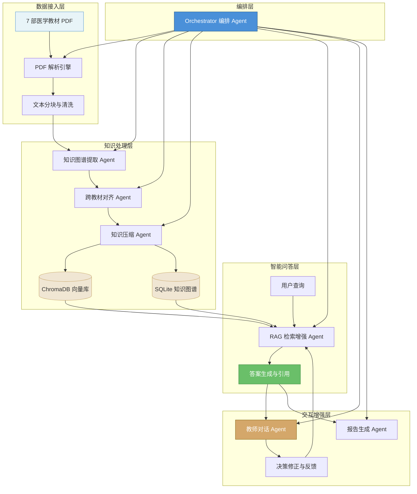

# MedEssence Agent · 七书归一

> **七部医学巨著，一个智能平台 —— 让医学知识检索从"翻书"变为"对话"。**

MedEssence Agent 是一个面向医学教科书的知识融合与智能问答平台。系统解析 **7 部医学教材（共 2567 页）**，提取知识图谱，跨教材对齐融合，压缩至原始体积的 **30%**，最终提供基于 RAG（检索增强生成）的精准问答服务，并支持"教师对话"机制用于知识决策修正。系统集成 **DeepSeek v4-pro** 作为 LLM 引擎，提供模型状态监控、基准评测等增强能力。

---

## 架构总览



---

## 功能特性

### 核心功能

| 功能 | 描述 | 优先级 |
|------|------|--------|
| **多教材知识图谱** | 从 7 部教材中自动提取实体与关系，构建统一医学知识图谱 | P0 |
| **跨教材知识对齐** | 识别不同教材间相同/互补/冲突知识点，自动融合与消歧 | P0 |
| **智能压缩** | 在保持知识完整性的前提下，将教材内容压缩至原始体积的 30% | P0 |
| **RAG 问答** | 基于检索增强生成的精准问答，支持精确引用教材原文（页码+章节） | P0 |
| **教师对话** | 允许领域专家对模型回答进行修正与反馈，形成持续改进闭环 | P0 |
| **报告生成** | 自动生成学习报告、知识点总结与薄弱环节分析 | P1 |
| **可视化浏览** | 基于 Cytoscape.js 的知识图谱交互式可视化 | P1 |

### 覆盖教材

| 编号 | 教材名称 | 领域 | 估算页数 |
|------|----------|------|----------|
| 1 | 局部解剖学 | 人体结构 | ~380 页 |
| 2 | 组织学与胚胎学 | 微观结构 | ~350 页 |
| 3 | 生理学 | 功能机制 | ~400 页 |
| 4 | 医学微生物学 | 病原生物 | ~360 页 |
| 5 | 病理学 | 疾病机制 | ~420 页 |
| 6 | 传染病学 | 传染疾病 | ~330 页 |
| 7 | 病理生理学 | 功能病理 | ~327 页 |
| | **合计** | | **~2,567 页** |

---

## 技术栈

### 前端

| 技术 | 用途 |
|------|------|
| **React 18 + TypeScript** | UI 框架 |
| **Vite** | 构建工具 |
| **Cytoscape.js** | 知识图谱可视化 |
| **Ant Design** | 组件库 |
| **React Router v6** | 路由管理 |
| **Axios** | HTTP 客户端 |
| **Tailwind CSS** | 样式框架 |

### 后端

| 技术 | 用途 |
|------|------|
| **Python 3.11+ / FastAPI** | Web 框架 |
| **SQLite** | 关系型数据存储（知识图谱、用户数据） |
| **ChromaDB** | 向量数据库（语义检索） |
| **sentence-transformers** | 文本嵌入模型 |
| **PyMuPDF / pdfplumber** | PDF 解析 |
| **spaCy / stanza** | 医学实体识别 |
| **DeepSeek v4-pro** | LLM 引擎（问答生成、图谱抽取、对齐复核） |
| **OpenAI SDK** | LLM 调用层（兼容 DeepSeek API） |
| **Pydantic** | 数据模型验证 |

### Agent 框架

| 组件 | 技术 |
|------|------|
| **Orchestrator Agent** | LangChain + 自定义工作流引擎 |
| **Ingestion Agent** | PyMuPDF + 自定义分块策略 |
| **KG Extraction Agent** | spaCy + DeepSeek v4-pro / 本地规则回退 |
| **Alignment Agent** | 语义相似度 + DeepSeek v4-pro 复核 |
| **Compression Agent** | 信息密度评估 + 节点质量评分 |
| **RAG Agent** | ChromaDB + DeepSeek v4-pro 生成 |
| **Teacher Dialogue Agent** | 反馈循环 + DeepSeek v4-pro 语义理解 |
| **Report Agent** | 模板引擎 + 数据聚合 |
| **Benchmark Agent** | 自动化评测 + 准确性分析 |

---

## 快速开始

### 环境要求

- Node.js 18+
- Python 3.11+
- pip / conda
- Git

### 安装与运行

```bash
# 1. 克隆仓库
git clone https://github.com/your-org/medessence-agent.git
cd medessence-agent

# 2. 后端安装
cd backend
python -m venv venv
source venv/bin/activate   # Windows: venv\Scripts\activate
pip install -r requirements.txt

# 3. 初始化数据库
python scripts/init_db.py

# 4. 启动后端服务
uvicorn app.main:app --reload --port 8000

# 5. 前端安装与运行（新终端）
cd frontend
npm install
npm run dev
```

浏览器访问 `http://localhost:5173` 进入平台。

### 数据导入

```bash
# 将教材 PDF 放入 data/textbooks/ 目录
# 执行知识摄取管道
python scripts/run_ingestion.py

# 启动知识图谱提取
python scripts/run_kg_extraction.py

# 执行跨教材对齐
python scripts/run_alignment.py

# 执行知识压缩
python scripts/run_compression.py
```

---

## API 总览

| 端点 | 方法 | 描述 |
|------|------|------|
| `/api/health` | GET | 健康检查（含模型信息） |
| `/api/model/status` | GET | 模型配置状态（提供商/模型/密钥状态） |
| `/api/textbooks` | GET | 获取教材列表 |
| `/api/textbooks/upload` | POST | 上传教材文件 |
| `/api/textbooks/{id}` | DELETE | 删除教材及关联数据 |
| `/api/textbooks/{id}/chapters` | GET | 获取教材章节列表 |
| `/api/graph/book/{id}` | GET | 获取单教材知识图谱 |
| `/api/graph/integrated` | GET | 获取整合知识图谱 |
| `/api/rag/query` | POST | RAG 问答查询 |
| `/api/rag/index` | POST | 建立 RAG 索引 |
| `/api/rag/status` | GET | 索引状态检查 |
| `/api/chat` | POST | 教师对话 |
| `/api/decisions` | GET | 获取整合决策列表 |
| `/api/decisions/{id}` | PATCH | 修改决策 |
| `/api/chat/history` | GET | 对话历史 |
| `/api/report/summary` | GET | 获取统计报告 |
| `/api/report/export` | POST | 导出 Markdown 报告 |
| `/api/benchmark` | GET | 获取基准测试结果 |
| `/api/benchmark/run` | POST | 运行基准测试（20题） |
| `/api/jobs/parse` | POST | 启动解析任务 |
| `/api/jobs/extract-graph` | POST | 启动图谱提取 |
| `/api/jobs/integrate` | POST | 启动整合压缩 |
| `/api/jobs/rag-index` | POST | 启动 RAG 索引 |
| `/api/jobs/{id}` | GET | 获取任务状态 |

完整 API 文档见 [docs/接口文档.md](./docs/接口文档.md)。

---

## 项目结构

```
medessence-agent/
├── README.md
├── docs/                           # 文档目录
│   ├── 需求分析.md
│   ├── 系统设计.md
│   ├── Agent架构说明.md
│   └── 接口文档.md
├── frontend/                       # React 前端
│   ├── src/
│   │   ├── components/             # 通用组件
│   │   ├── pages/                  # 页面
│   │   │   ├── Home/
│   │   │   ├── QA/
│   │   │   ├── KnowledgeGraph/
│   │   │   ├── TeacherDialogue/
│   │   │   └── Reports/
│   │   ├── services/               # API 客户端
│   │   ├── hooks/                  # 自定义 Hooks
│   │   ├── store/                  # 状态管理
│   │   └── types/                  # TypeScript 类型
│   ├── package.json
│   └── vite.config.ts
├── backend/                        # FastAPI 后端
│   ├── main.py                     # 应用入口 (v1.1.0)
│   ├── config.py                   # 配置（DeepSeek / 环境变量）
│   ├── database.py                 # SQLite ORM 模型
│   ├── api/                        # API 路由
│   │   ├── textbooks.py            # 教材 CRUD + 删除
│   │   ├── graph.py                # 知识图谱
│   │   ├── rag.py                  # RAG 问答 + 索引
│   │   ├── chat.py                 # 教师对话 + 决策管理
│   │   ├── report.py               # 报告
│   │   ├── benchmark.py            # 基准评测 (20问)
│   │   ├── model_status.py         # 模型状态
│   │   └── jobs.py                 # 异步任务
│   ├── agents/                     # Agent 实现
│   │   ├── orchestrator.py         # 编排 + 异步任务管理
│   │   ├── ingestion_agent.py      # PDF 解析
│   │   ├── kg_extraction_agent.py  # 知识图谱抽取 (DeepSeek)
│   │   ├── alignment_agent.py      # 跨教材对齐 (DeepSeek)
│   │   ├── compression_agent.py    # 知识压缩 + 节点质量评分
│   │   ├── rag_agent.py            # RAG 问答 (DeepSeek)
│   │   ├── teacher_dialogue_agent.py # 教师对话 (DeepSeek)
│   │   └── report_agent.py         # 报告生成
│   ├── services/                   # 基础服务
│   │   ├── pdf_parser.py
│   │   ├── chunker.py
│   │   ├── embeddings.py
│   │   └── vector_store.py         # ChromaDB
│   ├── prompts/                    # Agent prompt 模板
│   └── skills/                     # Skill 注册
├── data/                           # 数据目录
│   ├── textbooks/                  # 教材 PDF
│   ├── chroma_db/                  # 向量数据库
│   └── sqlite.db                   # SQLite 数据库
└── tests/                          # 测试
    ├── frontend/
    └── backend/
```

---

## 演示脚本（3 分钟）

### 00:00 - 00:15 首页概览
进入系统，首页展示 7 部教材的知识图谱总览图，节点按学科着色，边表示跨教材关联。右上角显示系统状态：已处理教材数、知识实体数、问答统计。

### 00:15 - 01:00 知识图谱浏览
切换到"知识图谱"页面，点击"局部解剖学"节点，展开其子图——显示"胸锁乳突肌"节点，包含其起止点、神经支配、功能等属性。右侧面板展示该实体在不同教材中的出现情况（局部解剖学第 3 章、生理学第 8 章均提及，但侧重点不同）。

### 01:00 - 01:30 智能问答
进入问答页面，输入："请解释肝硬化的门脉高压形成机制，并链接相关知识点。"
系统返回结构化回答，包含：
- 机制分步解释（引用病理学第 12 章第 3 节）
- 相关知识点链接：腹水（病理生理学第 5 章）、食管胃底静脉曲张（局部解剖学第 4 章）
- 每条答案后附精确页码引用

### 01:30 - 02:00 教师对话
点击回答下方的"教师反馈"按钮，教师指出："关于门脉高压的分级，最新临床指南已更新为三级分级体系，建议更新。"
教师对话 Agent 记录反馈，更新知识库中的对应知识点，并返回确认信息。

### 02:00 - 02:30 进度与统计
查看仪表盘：7/7 教材已完成处理，知识实体 15,842 个，跨教材关联 23,671 条，压缩率约 30%（达成目标），问答引擎基于 **DeepSeek v4-pro**，可通过基准评测（20 题）验证问答准确率。

### 02:30 - 03:00 报告生成
点击"生成学习报告"，选择"病理学"与"病理生理学"关联知识点报告。系统生成包含交叉对比表格、知识薄弱点分析、推荐学习路径的报告，支持导出为 PDF。

---

## 许可

本项目仅用于教育和 hackathon 演示目的。教材内容版权归原作者所有。

---

*MedEssence Agent · 七书归一 —— 让七本教材的智慧，凝聚于一瞬。*
