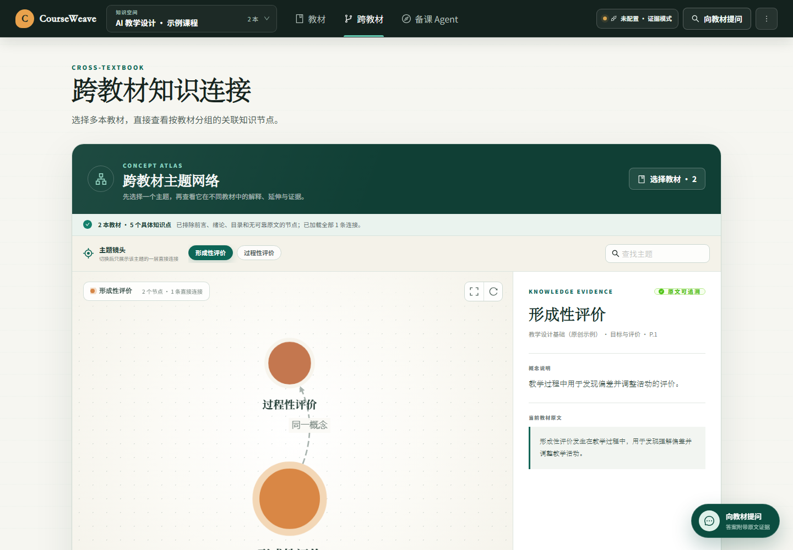
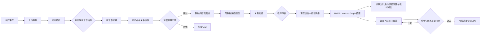
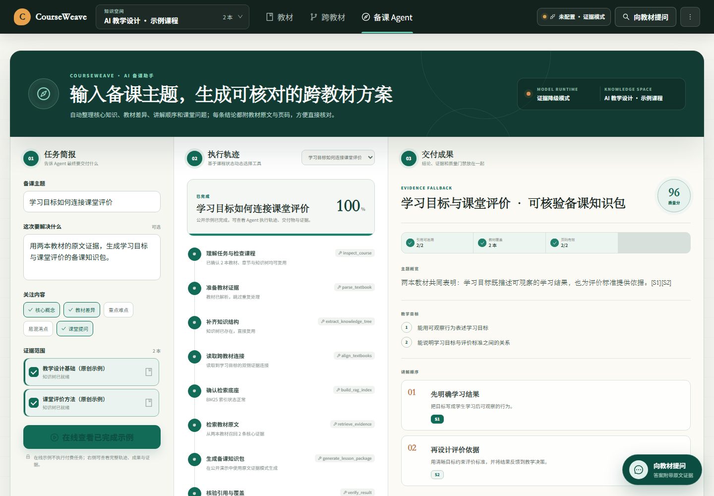

# CourseWeave · 多教材知识连接与备课系统

[](https://github.com/zphsswl/courseweave/actions/workflows/ci.yml)

> 上传多本教材，将章节、知识点、跨教材关系和问答结果组织成一套可回到原文核验的课程知识空间。

CourseWeave 面向需要同时使用多本教材的教师。系统先按页码、章节和语义边界整理教材，再从原文中抽取知识点；当不同教材讲到相同或相关主题时，它会保留各自表述，并给出关系类型、双侧原文、页码、置信度和关联理由，由教师决定是否确认。

教师既可以直接向教材提问，也可以输入备课主题，让备课 Agent 检查课程状态、复用已有知识树与索引、检索证据，并生成一份可逐条核验的备课知识包。



## 核心能力

- **任意课程，而非写死学科**：以课程工作区组织教材，支持 PDF、Markdown 和 TXT。
- **页码感知解析**：保留物理页、章节范围、chunk 偏移与来源原文；低文本页会提示 OCR 风险。
- **章节先审后抽**：教师可修改章节标题和层级，确认后才允许知识抽取，避免错误目录污染全链路。
- **来源节点与统一概念分离**：每本教材中的表述保留为独立 occurrence；跨教材“同一概念”通过 canonical concept 连接，不覆盖原文。
- **证据质量门禁**：概念和语义关系必须绑定可在 chunk 中逐字找到的原文；证据不足的结果不会伪装成高质量节点。
- **跨教材候选 + 教师审核**：系统先召回候选，再由模型判断关系；模型判断只作为审核建议，语义关联在教师确认前保持待审核状态。
- **混合检索可降级**：BM25、真实向量检索和图谱扩展分别记录。向量模型不可用时明确降级为 BM25 + 图谱，不用哈希向量冒充语义能力。
- **对比式 RAG**：可选择多本教材，按共同结论、各教材表述、差异/冲突和教学提示组织回答，并返回教材、章节、页码、chunk 与原文引用。
- **目标驱动备课 Agent**：教师只需给出主题、教学目标和教材范围；Agent 先观察现有状态，再动态决定复用或调用解析、知识树、跨教材关联、RAG 检索和模型生成工具。
- **人类检查点 + 自动质量门禁**：章节结构未确认时任务持久化暂停；生成后检查教材覆盖、页码、引用与结构，不达标时自动补检索并重试一次。

## 核心工作流



## 备课 Agent

顶部进入“备课 Agent”，输入主题和目标，选择 1–6 本教材后启动。它不是把一串固定脚本包装成聊天窗，而是一个可观察的垂直领域 Agent：



1. `Observe`：检查教材是否解析、章节是否确认、知识树和 RAG 索引是否可复用。
2. `Plan & Act`：把目标转成持久化执行计划，已完成步骤直接跳过，只调用当前需要的工具。
3. `Human checkpoint`：章节结构未确认时暂停并请教师处理，确认后从原任务续跑。
4. `Verify & Retry`：核验双教材覆盖、原文页码、结论引用和产物结构；未通过时自动扩充证据并重试一次。
5. `Deliver`：交付主题概览、教学目标、讲解顺序、教材共同点/差异、易混淆点、课堂问题和可点击原文证据。

Agent 任务与原有 RAG 问答相互独立：Agent 用于完成备课交付，右下角悬浮问答仍用于快速查证。

## 为什么不直接合并同名节点

不同教材可能使用相同术语但定义范围不同，也可能用不同术语表达同一概念。直接去重会丢失来源、差异和版本信息。因此数据模型分为四层：

| 层 | 作用 |
|---|---|
| `Course` | 一门课程及其教材集合 |
| `KnowledgeNode` | 某本教材中的知识点出现，保留定义、章节、页码和原文 |
| `CanonicalConcept` | 课程级统一概念，只负责连接多个来源出现 |
| `KnowledgeEdge` + `RelationEvidence` | 教材内/跨教材关系及双侧证据 |

这样既能查看“统一概念”，也能随时切回每本教材的原始表述。

## 界面信息架构

- `教材`：上传、处理状态、章节确认与教材内知识流程。
- `跨教材`：先选证据范围，再生成可筛选、可点击原文的关联节点图。
- `备课 Agent`：任务简报、动态执行轨迹和有证据的交付成果三栏同屏。
- `向教材提问`：可拖动、缩放和全屏的悬浮 RAG 窗，不离开当前任务即可查证。

## 技术架构

| 范围 | 实现 |
|---|---|
| 前端 | React 18、TypeScript、Vite、Ant Design、Cytoscape.js |
| API | FastAPI、Pydantic |
| 数据 | SQLAlchemy + SQLite；课程/教材/页/章节/chunk/节点/边/证据/审核事件 |
| 解析 | PyMuPDF / pypdf；页码感知章节映射 |
| 检索 | rank-bm25；可选 sentence-transformers + ChromaDB；知识图谱扩展；RRF 融合 |
| 生成 | OpenAI-compatible API；提示注入边界；无模型时返回原文证据而非编造回答 |
| Agent | 目标驱动计划、状态观察、工具调度、人类检查点、验证器与自动重试 |
| 任务 | SQLite 持久任务记录 + 单 worker 队列；支持重启恢复、续跑和失败重试 |
| 部署 | 多阶段 Docker；FastAPI 同源托管前端；可选持久磁盘 |

## 快速开始

环境要求：Python 3.11+、Node.js 20+。

### 已配置项目：Windows 一键启动

如果依赖和前端已经构建完成，直接双击根目录的 `start-courseweave.cmd`，或运行：

```powershell
.\.venv\Scripts\python.exe .\scripts\start_local.py
```

启动成功后访问 <http://127.0.0.1:8001/>。脚本会自动复用已运行的服务，并把运行日志写入 `.runtime` 目录。

### 首次安装

```bash
git clone <your-repository-url>
cd courseweave

python -m venv .venv
# Windows
.venv\Scripts\activate
# macOS / Linux
# source .venv/bin/activate

pip install -r requirements.txt
copy .env.example .env  # Windows；macOS/Linux 使用 cp

cd frontend
npm ci
npm run build
cd ..

uvicorn backend.main:app --reload --port 8001
```

浏览器访问 `http://localhost:8001`。开发前端可另开终端运行：

```bash
cd frontend
npm run dev
```

默认代理后端地址为 `http://localhost:8001`。

## 配置

```dotenv
LLM_PROVIDER=openai
LLM_API_KEY=
LLM_BASE_URL=https://api.openai.com/v1
LLM_MODEL=gpt-4o-mini
LLM_TRUST_ENV_PROXY=false
EMBEDDING_MODEL=paraphrase-multilingual-MiniLM-L12-v2
DATABASE_URL=sqlite:///./data/medessence.db
CHROMA_PERSIST_DIR=./data/chroma
CORS_ORIGINS=http://localhost:5173,http://127.0.0.1:5173
MAX_UPLOAD_SIZE_MB=50
PUBLIC_DEMO_READ_ONLY=false
SEED_DEMO_DATA=false
```

`LLM_API_KEY` 为空时，系统仍可解析、切块、执行质量规则和 BM25 检索；生成式回答会降级为原文证据展示。没有安装 sentence-transformers 时，索引会明确显示 `BM25 + graph`，不会报告向量检索成功。`LLM_TRUST_ENV_PROXY` 默认关闭，避免桌面环境中与模型无关的失效系统代理导致误报；确实需要通过系统代理访问模型时再设为 `true`。

## 关键 API

| 方法 | 路径 | 用途 |
|---|---|---|
| `POST` | `/api/courses` | 创建课程工作区 |
| `POST` | `/api/textbooks/upload` | 向课程上传教材 |
| `PATCH` | `/api/textbooks/{id}/chapters` | 修改并确认章节结构 |
| `POST` | `/api/jobs/extract-graph` | 抽取教材知识图谱 |
| `POST` | `/api/jobs/integrate` | 生成跨教材关联候选 |
| `GET/PATCH` | `/api/courses/{course_id}/alignments` | 查看与审核跨教材关系 |
| `GET` | `/api/courses/{course_id}/concepts/{id}` | 查看统一概念及各教材出现 |
| `POST` | `/api/rag/index` | 构建课程检索索引 |
| `POST` | `/api/rag/query` | 课程问答或跨教材对比 |
| `POST` | `/api/agent/runs` | 创建目标驱动的备课 Agent 任务 |
| `GET` | `/api/agent/runs?course_id=...` | 查看持久化任务历史与执行轨迹 |
| `POST` | `/api/agent/runs/{id}/resume` | 人类检查点确认后续跑 |
| `POST` | `/api/agent/runs/{id}/retry` | 重试失败任务 |

启动后可在 `/docs` 查看完整 OpenAPI 文档。

## 测试与验证

```bash
.venv\Scripts\python.exe -m compileall -q backend tests
.venv\Scripts\python.exe -m unittest discover -s tests -v

cd frontend
npm run build
```

当前 95 项自动化测试覆盖：课程隔离、来源 occurrence 保留、真实页码映射、chunk 页范围、原文引用校验、无证据关系拒绝、跨教材候选范围、混合检索课程隔离、Agent 计划与质量验证、人类检查点续跑，以及公开示例数据与引用完整性。

完整的优化前后对比、严格评测口径、技术路线和 Agent 定位见 [RAG 优化与项目技术路线](./docs/RAG优化与项目技术路线.md)。

评估重点不是只看“回答像不像”，而是分别统计：

1. 章节边界准确率与页码命中率
2. 节点证据覆盖率与关系证据有效率
3. 跨教材候选 Recall@K、审核通过率和冲突率
4. 检索 Recall@K、引用准确率和无答案拒答率
5. 教师完成一次审核所需时间

## 部署

Docker 本地运行：

```bash
docker build -t courseweave .
docker run --rm -p 7860:7860 \
  -e PUBLIC_DEMO_READ_ONLY=true \
  -v courseweave-data:/home/user/app/data \
  courseweave
```

仓库提供 `render.yaml`。其中 `SEED_DEMO_DATA=true` 会幂等创建一门由原创短文本构成的示例课程；`PUBLIC_DEMO_READ_ONLY=true` 只允许浏览样例和进行证据问答，上传、抽取、审核和删除在公开环境中被禁止。公开部署默认不配置模型密钥，问答以教材证据降级模式运行；完整模型与写入流程应在本地或具备鉴权、限流和费用配额的私有部署中运行。

## 一次完整的使用流程

1. 创建课程空间并上传 PDF、Markdown 或 TXT 教材。
2. 核对系统识别的章节标题、层级与页码范围，确认后生成教材知识树。
3. 选择两本或更多教材，在跨教材视图中按主题查看候选连接、双侧原文和关联理由。
4. 输入备课主题与教学目标，让 Agent 复用已有知识树和索引，完成检索、生成与质量核验。
5. 在备课结果中点击 `S1/S2` 等引用，回到具体教材、章节、页码和原文。
6. 需要临时查证时，直接使用右下角悬浮问答，不必离开当前任务。

## 已知边界

- 扫描版 PDF 目前只提示 OCR 风险，尚未内置 OCR 队列。
- SQLite 适合单机部署与演示；多用户生产环境应迁移到 PostgreSQL，并将后台任务迁移到持久队列。
- 公开只读模式不是完整鉴权系统；正式 SaaS 需要用户、组织、课程权限、配额与审计。
- 教材版权属于原作者；公开仓库和在线演示不应包含未授权教材全文。

## 仓库说明

`.env`、数据库、向量索引、教材文件、构建产物和本地虚拟环境已被 `.gitignore` 排除。提交前仍应运行密钥扫描，并确认 Git 历史中不存在已泄露 token。

本项目代码采用 [MIT License](./LICENSE)。教材及其原文内容仍归各自权利人所有，不包含在本项目的软件许可范围内。

## 延伸文档

- [RAG 优化与项目技术路线](./docs/RAG优化与项目技术路线.md)
- [Agent 架构说明](./docs/Agent架构说明.md)
- [API 接口文档](./docs/接口文档.md)
- [版本记录](./CHANGELOG.md)
