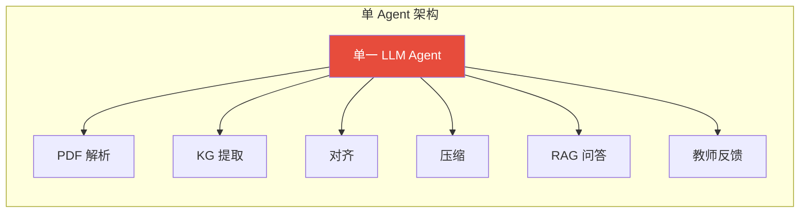
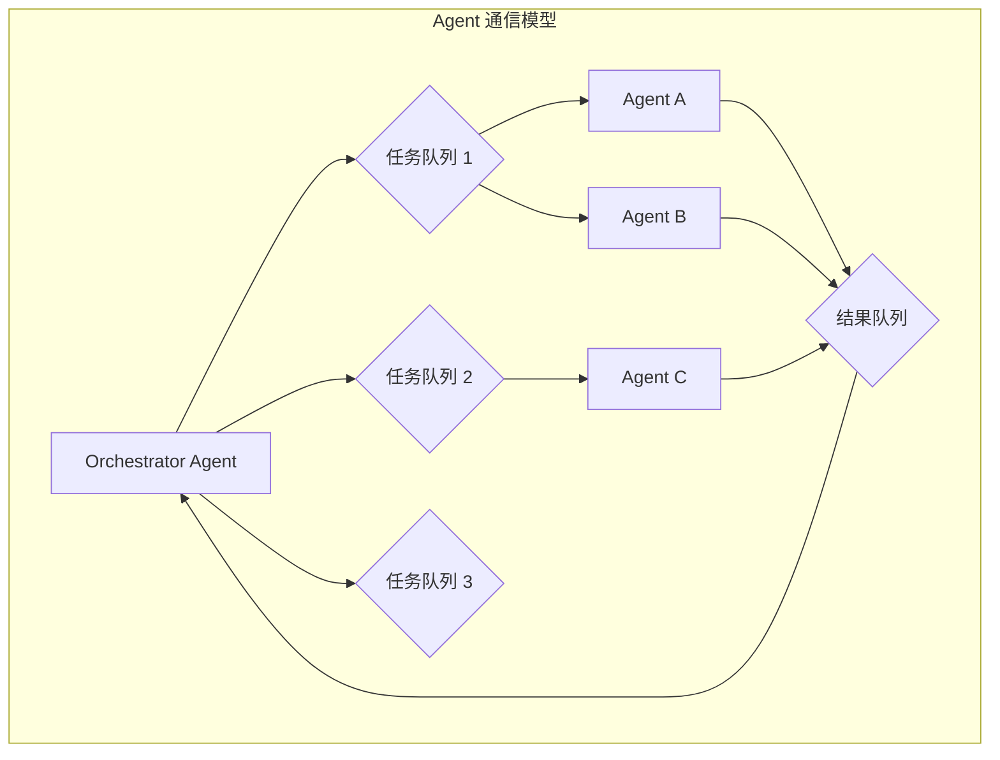
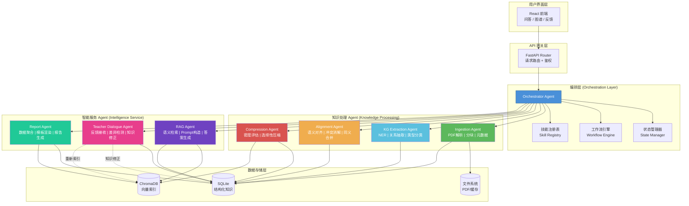

# Agent 架构说明文档

*MedEssence Agent · 七书归一*

> 版本：v1.1.0 | 最后更新：2026-05-10 | LLM引擎：DeepSeek v4-pro

---

## 1. 为什么采用多 Agent 架构？

### 1.1 问题复杂度分析

医学教材知识融合涉及多个本质不同的子问题：

| 子问题 | 复杂度 | 所需能力 |
|--------|--------|----------|
| PDF 解析与文本提取 | 中 | 文档解析、结构识别 |
| 医学实体与关系抽取 | 高 | 领域 NER、关系分类 |
| 跨教材知识对齐 | 高 | 语义理解、冲突消解 |
| 知识选择性压缩 | 中高 | 信息密度评估、重要性排序 |
| 检索增强生成 | 高 | 语义检索、推理、引用生成 |
| 教师反馈处理 | 中 | 差异检测、知识更新 |
| 报告生成 | 中 | 数据聚合、模板渲染 |

### 1.2 单 Agent 架构的局限性



| 问题 | 描述 |
|------|------|
| **Prompt 膨胀** | 单一 Agent 需处理所有任务的指令，Prompt 长度失控 |
| **职责耦合** | 知识处理与问答逻辑耦合，修改一处影响全局 |
| **故障隔离差** | 某个子任务失败可能导致整个系统不可用 |
| **扩展性差** | 新增能力需修改核心 Agent 代码 |
| **调试困难** | 无法单独追踪某个子任务的执行链路 |
| **资源浪费** | 简单任务（如 PDF 解析）也需调用大模型 |

### 1.3 多 Agent 架构的优势

| 优势 | 说明 |
|------|------|
| **关注点分离** | 每个 Agent 只负责一个领域，Prompt 精简高效 |
| **独立扩展** | 可单独优化某个 Agent（如替换嵌入模型）而不影响其他 |
| **故障隔离** | Agent 级别错误处理，失败不扩散 |
| **并行执行** | 独立 Agent 可并行运行，提升吞吐量 |
| **职责清晰** | 每个 Agent 有明确的输入/输出 Schema，便于维护 |
| **技能注册** | 新能力通过注册新 Agent 即可加入系统 |

---

## 2. Agent 矩阵

| 编号 | Agent 名称 | 职责 | 输入 | 输出 | 依赖 |
|------|-----------|------|------|------|------|
| A-01 | **Orchestrator** | 全局任务编排、状态管理、错误处理、进度追踪 | 用户请求 / 系统事件 | 执行结果 / 状态报告 | 所有其他 Agent |
| A-02 | **Ingestion** | PDF 解析、文本分块、元数据提取 | 教材 PDF 文件路径 | 结构化文档块列表 | 无 |
| A-03 | **KG Extraction** | 医学实体识别、关系抽取、知识图谱构建（基于 DeepSeek v4-pro） | 文档块列表 | 实体列表 + 关系列表 | A-02 |
| A-04 | **Alignment** | 跨教材实体对齐、同义合并、冲突检测与消解（基于 DeepSeek v4-pro 复核 + 增强决策理由） | 全部实体与关系 | 对齐后的统一知识图谱 + 增强决策记录 | A-03 |
| A-05 | **Compression** | 信息密度评估、节点质量评分、选择性压缩、压缩质量验证 | 对齐后知识 | 压缩后知识（目标 30%）+ 节点质量分 | A-04 |
| A-06 | **RAG** | 语义检索、上下文构建、LLM 问答（DeepSeek v4-pro）、引用验证 | 用户问题 + 检索结果 | 结构化答案（含引用） | A-05（压缩后数据） |
| A-07 | **Teacher Dialogue** | 教师反馈接收、差异检测、知识修正、版本管理（基于 DeepSeek v4-pro） | 原始内容 + 教师修正 | 更新后的知识 + 确认信息 | A-06 |
| A-08 | **Report** | 数据聚合、跨教材分析、模板渲染、报告生成 | 报告参数 + 知识库 | 格式化报告（Markdown） | A-05, A-06 |
| A-09 | **Benchmark** | 自动化基准测试、问答准确性评测、引用命中率分析、延迟统计 | 预定义测试问题集 | 评测结果 + 统计摘要 | A-06 |

---

## 3. Agent 通信协议

### 3.1 通信方式

Agent 间通信采用**异步消息队列**模式，通过 Orchestrator 中转。



### 3.2 消息格式

所有 Agent 间消息遵循统一格式：

```json
{
    "message_id": "msg_20260510_001",
    "type": "task_request | task_response | status_update | error",
    "source_agent": "orchestrator",
    "target_agent": "ingestion",
    "timestamp": "2026-05-10T14:30:00Z",
    "correlation_id": "corr_001",
    "payload": {
        "action": "process_textbook",
        "params": { ... }
    },
    "metadata": {
        "priority": "high",
        "retry_count": 0,
        "timeout_ms": 300000
    }
}
```

### 3.3 状态码

| 状态码 | 含义 | 处理方式 |
|--------|------|----------|
| SUCCESS | 执行成功 | 继续下一步 |
| PARTIAL_SUCCESS | 部分成功 | 记录警告，继续执行 |
| RETRYABLE_ERROR | 可重试错误 | 自动重试（最多 3 次） |
| FATAL_ERROR | 致命错误 | 终止工作流，通知管理员 |
| TIMEOUT | 超时 | 标记失败，继续其他任务 |

---

## 4. Skill 注册设计

Agent 的能力通过 Skill 注册机制管理，实现插件式扩展。

### 4.1 Skill 注册表

```python
class SkillRegistry:
    """
    Agent 技能注册表
    
    每个 Agent 向注册表注册其提供的技能：
    - skill_name: 技能唯一标识
    - handler: 处理函数引用
    - input_schema: Pydantic 输入模型
    - output_schema: Pydantic 输出模型
    - dependencies: 依赖的其他技能
    - version: 技能版本
    """

    def __init__(self):
        self._skills: Dict[str, SkillDefinition] = {}

    def register(self, agent_cls: type) -> None:
        """Agent 类装饰器，自动注册其技能"""
        for skill in agent_cls.get_skills():
            self._skills[skill.name] = skill

    def get_skill(self, name: str) -> SkillDefinition:
        return self._skills.get(name)

    def execute_skill(self, skill_name: str, **params) -> Any:
        """执行指定技能"""
        skill = self.get_skill(skill_name)
        if not skill:
            raise SkillNotFoundError(skill_name)
        return skill.handler(**params)
```

### 4.2 已注册技能列表

| 技能名 | 所属 Agent | 版本 | 输入 Schema | 输出 Schema |
|--------|-----------|------|-------------|-------------|
| `parse_pdf` | Ingestion | 1.0 | `PDFPathInput` | `DocChunkListOutput` |
| `extract_entities` | KG Extraction | 1.0 | `DocChunkListInput` | `EntityListOutput` |
| `extract_relations` | KG Extraction | 1.0 | `EntityListInput` | `RelationListOutput` |
| `align_entities` | Alignment | 1.0 | `EntityListInput` | `AlignedEntityListOutput` |
| `detect_conflicts` | Alignment | 1.0 | `AlignedEntityListInput` | `ConflictListOutput` |
| `compress_knowledge` | Compression | 1.0 | `KnowledgeBaseInput` | `CompressedKnowledgeOutput` |
| `retrieve_context` | RAG | 1.0 | `QueryInput` | `RetrievedContextOutput` |
| `generate_answer` | RAG | 1.0 | `AnswerGenInput` | `AnswerOutput` |
| `process_feedback` | Teacher Dialogue | 1.0 | `FeedbackInput` | `FeedbackResultOutput` |
| `generate_report` | Report | 1.0 | `ReportParamsInput` | `ReportOutput` |

---

## 5. Agent 输入/输出 Schema 详述

### 5.1 Orchestrator Agent

```python
# 输入：用户请求（经 API 层解析）
class OrchestratorInput(BaseModel):
    request_type: Literal["qa", "ingestion", "feedback", "report", "search"]
    user_id: str
    session_id: str
    payload: Dict[str, Any]
    context: Optional[Dict[str, Any]] = None

# 输出：最终响应
class OrchestratorOutput(BaseModel):
    success: bool
    data: Optional[Any] = None
    error: Optional[str] = None
    trace: List[AgentTrace]  # 执行链路追踪
    metrics: ExecutionMetrics  # 耗时/Token 消耗
```

### 5.2 Ingestion Agent

```python
class IngestionInput(BaseModel):
    textbook_id: int
    file_path: Path
    chunk_strategy: Literal["hierarchical", "sliding_window"] = "hierarchical"
    chunk_size: int = 500  # 每块字符数
    overlap: int = 50      # 重叠字符数

class IngestionOutput(BaseModel):
    textbook_id: int
    total_chunks: int
    chunks: List[DocChunk]
    metadata: TextbookMetadata
    
class DocChunk(BaseModel):
    chunk_id: str
    textbook_id: int
    textbook_name: str
    chapter: str
    section: Optional[str]
    page_start: int
    page_end: int
    content: str
    char_count: int
```

### 5.3 KG Extraction Agent

```python
class KGExtractionInput(BaseModel):
    chunks: List[DocChunk]
    textbook_id: int

class KGExtractionOutput(BaseModel):
    textbook_id: int
    entities: List[KnowledgeEntity]
    relations: List[KnowledgeRelation]

class KnowledgeEntity(BaseModel):
    name: str
    type: EntityType  # disease | anatomy | symptom | drug | physiology | microbe | etc.
    description: str
    aliases: List[str] = []
    source_chunks: List[str]  # chunk_id 列表
    # Node quality scoring fields
    quality_score: float = 0.0
    confidence: float = 0.5
    granularity: str = "core_concept"  # 知识点粒度
    learning_objective: str = ""       # 教学目标描述
    quality_flags: List[str] = []      # 质量标志（如"前置知识"、"需要补充"）

class KnowledgeRelation(BaseModel):
    source_entity: str
    target_entity: str
    relation_type: RelationType  # causes | treats | located_in | part_of | prerequisite | etc.
    confidence: float
    source_chunks: List[str]
```

### 5.4 Alignment Agent

```python
class AlignmentInput(BaseModel):
    all_entities: Dict[int, List[KnowledgeEntity]]  # textbook_id -> entities
    similarity_threshold: float = 0.85

class AlignmentOutput(BaseModel):
    aligned_groups: List[EntityGroup]  # 同一实体的跨教材组合
    conflicts: List[AlignmentConflict]
    
class EntityGroup(BaseModel):
    canonical_name: str
    entities: List[AlignedEntityRef]
    confidence: float
    
class AlignmentConflict(BaseModel):
    entity_name: str
    textbook_a: str
    content_a: str
    textbook_b: str
    content_b: str
    description: str
```

**增强决策理由**：Alignment Agent 记录每项决策的完整证据链：

| 字段 | 说明 |
|------|------|
| `reason` | 决策理由（如"高相似度自动合并"、"LLM判断概念等价"、"上下位概念，保留"）|
| `evidence` | 证据列表（原文片段、Embedding 余弦相似度值）|
| `alternatives_considered` | 备选方案列表 |
| `rejected_alternatives_reason` | 拒绝备选方案的原因 |
| `risk` | 决策风险评估 |
| `confidence` | 置信度（0.0-1.0）|

### 5.5 Compression Agent

```python
class CompressionInput(BaseModel):
    aligned_knowledge: List[EntityGroup]
    target_ratio: float = 0.30  # 目标压缩率 30%

class CompressionOutput(BaseModel):
    compressed_entities: List[CompressedEntity]
    compression_stats: CompressionStats

class CompressedEntity(BaseModel):
    entity_id: int
    original_char_count: int
    compressed_char_count: int
    compression_ratio: float
    preserved: bool
    key_points: List[str]
    
class CompressionStats(BaseModel):
    total_original_chars: int
    total_compressed_chars: int
    overall_ratio: float
    preserved_entity_count: int
    quality_score: float
```

**节点质量评分**：Compression Agent 使用多维度评分函数决定节点保留优先级：

| 维度 | 权重 | 说明 |
|------|------|------|
| 跨教材出现频率 | 35% | 出现在越多教材中，重要性越高 |
| 节点重要度 | 25% | KG 抽取时 LLM 评估的 importance（1-5） |
| 语义丰富度 | 20% | 定义和描述的完整程度 |
| 类别权重 | 10% | "核心概念"和"机制"类比其他类别权重更高 |
| 教师锁定 | 10% | 教师手动保留的节点永不删除 |

评分公式：`score = 0.35 × coverage + 0.25 × importance/5 + 0.20 × richness + 0.10 × category + 0.10 × teacher_locked`

### 5.6 RAG Agent

```python
class RAGInput(BaseModel):
    question: str
    session_id: str
    top_k: int = 5
    use_kg_context: bool = True
    temperature: float = 0.3

class RAGOutput(BaseModel):
    answer: str
    citations: List[Citation]
    related_entities: List[str]
    confidence: float
    latency_ms: int

class Citation(BaseModel):
    textbook_name: str
    chapter: str
    section: Optional[str]
    page: int
    excerpt: str  # 引用原文片段
    relevance_score: float
```

### 5.7 Teacher Dialogue Agent

```python
class TeacherDialogueInput(BaseModel):
    qa_record_id: int
    feedback_type: Literal["correction", "supplement", "approval"]
    original_content: str
    corrected_content: str
    teacher_notes: Optional[str]
    target_entity_id: Optional[int]

class TeacherDialogueOutput(BaseModel):
    feedback_id: int
    applied: bool
    diff_summary: str  # 差异摘要
    affected_entities: List[int]
    next_steps: Optional[str]
```

### 5.8 Report Agent

```python
class ReportInput(BaseModel):
    report_type: Literal["study", "weakness", "comparison", "custom"]
    textbook_ids: Optional[List[int]]
    entity_ids: Optional[List[int]]
    date_range: Optional[Tuple[str, str]]
    format: Literal["markdown", "pdf"] = "markdown"

class ReportOutput(BaseModel):
    report_id: int
    title: str
    content: str  # Markdown 格式
    generated_at: str
    sections: List[ReportSection]
```

---

## 6. 并行执行策略

### 6.1 可并行执行的 Agent 组

| 阶段 | 可并行 Agent | 说明 |
|------|-------------|------|
| 数据摄取 | 多个 Ingestion Agent 实例 | 7 部教材可同时解析 |
| 知识提取 | 多个 KG Extraction Agent 实例 | 每部教材独立提取 |
| 知识对齐 | 单实例（需全局知识） | 需等待所有教材提取完成 |
| 问答服务 | 多个 RAG Agent 实例 | 多用户并发提问 |

### 6.2 并行度控制

```python
class ParallelExecutionStrategy:
    """
    并行执行策略配置
    """
    MAX_CONCURRENT_INGESTION = 3   # 最多同时解析 3 部教材
    MAX_CONCURRENT_EXTRACTION = 3  # 最多同时提取 3 部教材
    MAX_CONCURRENT_QA = 10         # 最多同时处理 10 个问答请求
    BATCH_SIZE_ALIGNMENT = 100     # 对齐时每批处理 100 个实体
```

### 6.3 Orchestrator 工作流定义

```python
class WorkflowDefinition:
    """
    Orchestrator 的工作流定义
    """
    
    INGESTION_PIPELINE = [
        Task("parse_pdf", agent="ingestion", parallel=True, max_concurrent=3),
        Task("extract_entities", agent="kg_extraction", parallel=True, max_concurrent=3, depends_on="parse_pdf"),
        Task("extract_relations", agent="kg_extraction", parallel=True, max_concurrent=3, depends_on="extract_entities"),
    ]

    ALIGNMENT_PIPELINE = [
        Task("align_entities", agent="alignment", parallel=False),  # 必须串行
        Task("detect_conflicts", agent="alignment", parallel=False, depends_on="align_entities"),
    ]

    QA_PIPELINE = [
        Task("retrieve_context", agent="rag", parallel=False),
        Task("generate_answer", agent="rag", parallel=False, depends_on="retrieve_context"),
    ]
```

---

## 7. 错误处理与重试策略

### 7.1 错误分类

| 错误类型 | 示例 | 是否可重试 | 重试策略 |
|----------|------|-----------|----------|
| 临时错误 | 网络超时、LLM API 限流 | 是 | 指数退避：1s, 4s, 16s |
| 资源错误 | 磁盘满、内存不足 | 是（条件性） | 等待后重试，最多 3 次 |
| 数据错误 | PDF 损坏、格式异常 | 否 | 记录错误，跳过该文件 |
| 逻辑错误 | 模型返回格式异常 | 是 | 重新生成，最多 2 次 |
| 致命错误 | 数据库连接失败 | 否 | 终止工作流，通知管理员 |

### 7.2 重试机制

```python
class RetryHandler:
    """
    统一重试处理器，使用指数退避策略
    """
    
    MAX_RETRIES = {
        "RETRYABLE_ERROR": 3,
        "TIMEOUT": 2,
        "RATE_LIMIT": 3,
    }
    
    BACKOFF_STRATEGY = {
        "initial_delay": 1.0,    # 初始等待 1 秒
        "multiplier": 4.0,       # 每次翻 4 倍
        "max_delay": 60.0,       # 最长等待 60 秒
        "jitter": 0.1,           # 随机抖动 10%
    }

    async def execute_with_retry(
        self, 
        task: Callable, 
        error_types: Tuple[Exception, ...],
        max_retries: int
    ) -> Any:
        last_error = None
        for attempt in range(max_retries + 1):
            try:
                return await task()
            except error_types as e:
                last_error = e
                if attempt < max_retries:
                    delay = self._compute_delay(attempt)
                    await asyncio.sleep(delay)
        raise MaxRetriesExceededError(last_error)
```

### 7.3 降级策略

| 场景 | 降级行为 |
|------|----------|
| LLM API 不可用 | 切换至本地小模型，降低回答质量但保持可用 |
| ChromaDB 不可用 | 仅使用 SQLite 关键词检索 |
| 嵌入模型加载失败 | 使用简单的 TF-IDF 向量化 |
| 知识图谱尚未构建完成 | 基于原始分块的直接检索 |
| 某一教材解析失败 | 跳过该教材，不影响其他教材 |

---

## 8. Agent 架构总览图



---

## 9. 与单 Agent 架构对比

| 维度 | 单 Agent 架构 | 多 Agent 架构 (本项目) |
|------|-------------|----------------------|
| **Prompt 长度** | 数千 token（所有任务指令混合） | 数百 token（每个 Agent 精简指令） |
| **模块耦合度** | 高（修改一处需理解全局） | 低（Agent 间松耦合） |
| **故障影响面** | 全局（任一任务失败影响整体） | 局部（失败隔离在单个 Agent） |
| **扩展新能力** | 修改核心 Agent，回归风险高 | 注册新 Agent，无侵入 |
| **并行能力** | 串行执行 | 支持并行（如多教材同时解析） |
| **调试难度** | 高（全局日志混杂） | 低（按 Agent 追踪日志） |
| **资源效率** | 所有任务使用同一模型 | 按需选择模型（简单任务用小模型） |
| **适合场景** | 简单、单域的问答系统 | 复杂、多阶段的知识处理流水线 |
| **实现复杂度** | 低 | 中高（需编排层） |
| **维护成本** | 随功能增长指数上升 | 随功能增长线性上升 |

---

## 10. Agent 执行链路示例

以一次完整问答请求为例，展示 Agent 间的协作链路：

```python
# Orchestrator 调度伪代码
async def handle_qa_request(question: str, session_id: str):
    # Step 1: Orchestrator 解析请求
    trace = ExecutionTrace()

    # Step 2: 调用 RAG Agent
    try:
        # 2a: 语义检索
        chunks = await rag.retrieve_context(
            question=question, 
            top_k=5
        )
        trace.add_step("retrieve_context", status="success")

        # 2b: 知识图谱上下文检索
        kg_context = await kg_extraction.get_subgraph(
            entities=extract_key_entities(question)
        )
        trace.add_step("get_kg_context", status="success")

        # 2c: 生成答案
        answer = await rag.generate_answer(
            question=question,
            context=chunks,
            kg_context=kg_context
        )
        trace.add_step("generate_answer", status="success")

    except ChromaDBUnavailableError:
        # 降级：仅使用 SQLite 关键词检索
        chunks = await database.keyword_search(question)
        trace.add_step("retrieve_context", status="degraded")
        answer = await rag.generate_answer(question=question, context=chunks)

    except LLMAPIError as e:
        # 降级：使用本地小模型
        trace.add_step("generate_answer", status="degraded")
        answer = await rag.generate_answer_local(question=question, context=chunks)

    # Step 3: 返回结果
    return OrchestratorOutput(
        success=True,
        data=answer,
        trace=trace.steps,
        metrics=trace.metrics
    )
```

---

*文档版本：v1.1.0 | 最后更新：2026-05-10 | LLM引擎：DeepSeek v4-pro | 状态：已评审*
