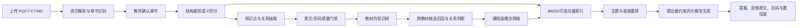

# CourseWeave：RAG 优化、技术路线与 Agent 定位

## 1. 一句话说明

CourseWeave 不是一个“把教材扔给大模型做总结”的聊天工具，而是一套面向教师的多教材知识工程系统：它先把教材解析为可定位到章节和页码的证据单元，再建立教材内知识结构与跨教材概念连接，最后用有引用、可拒答、可降级的 RAG 回答教师问题。

## 2. 原来的 RAG 有什么问题

最初版本使用约 600 字的固定窗口切分，并保留约 80 字的字符级重叠。这个方法实现快，但它只关心长度，不理解教材结构，实际出现了四类问题：

1. **语义边界被切断**：标题、定义、分期列表和解释段落经常分到不同 chunk，检索到其中一段也无法完整回答。
2. **结构信息缺失**：chunk 只有教材和章节，缺少“章 > 节 > 小节 > 条目”的知识路径，标题本身也没有稳定参与检索。
3. **教材噪声污染**：页眉、页码、目录、参考文献和索引进入索引，容易因为词频高而排在真正答案前面。
4. **排序只看词频**：旧检索主要依赖 BM25 的词面重合，无法区分“主题概述”“具体分期”“细胞类型”等回答意图，也容易出现“主细胞”被“宿主细胞”干扰一类的子串误匹配。

旧数据的结构性表现是：共 6,252 个 chunk，长度 P10/P50/P90/最大值约为 563/586/598/600；只有约 6.8% 的 chunk 从完整句子开始，约 46.1% 以完整句子结束；多级 `section_path` 覆盖为 0，重复页眉污染约 31.38%，另有 348 个目录、参考文献或索引尾部 chunk。

旧评测口径曾得到 39/40 的检索命中和 103/120 的引用命中，但旧口径只要命中任意一个预期词就算成功，多知识点问题会被高估，所以这个数字不能直接和新的严格评测作同比。

## 3. 这次做了哪些优化

### 3.1 从“固定字数切分”改为“教材结构感知切分”

- PDF 使用视觉阅读顺序提取文字，避免双栏、标题和正文顺序错乱。
- 先识别章，再识别“节、中文序号、阿拉伯数字标题、括号子标题”等层级。
- 把完整句子、列表项和短小知识单元作为最小切分单位。
- 以约 480 字为软目标、750 字为硬上限进行装箱；短尾段回收进前一个 chunk。
- 重叠从字符截断改为完整语义单元重叠，避免产生不断嵌套的后缀碎片。
- 每个 chunk 保存真实源文本偏移，再映射到物理页码。

### 3.2 建立可检索的知识路径

每个 chunk 现在同时携带教材名、章节名、完整 `section_path`、页码范围和正文。检索文本不再只有正文，而是把“教材 > 章节 > 节 > 小节”一并索引。因此教师问“某病的四个阶段”时，位于阶段小节中的证据不会再被同章内词频更高的并发症段落压住。

### 3.3 加入教材噪声治理，但保留可引用原文

- 删除独立页眉、页码、装饰标题和目录行。
- 到达明确的参考文献、推荐阅读或索引尾部后停止生成检索 chunk。
- 清理 PDF 隐藏控制字符和 Unicode replacement 字符。
- 使用保守规则保护正常句子，例如正文中出现教材名称或“参考文献显示”不会被误删。

### 3.4 从“纯词频”升级为“主题、意图和层级联合排序”

当前排序以 BM25 为稳定底座，并加入：

- 主题词和医学锚点覆盖；
- 章节、节标题和正文的分层匹配；
- “定义、包括哪些、分期、细胞类型、概述”等回答形式识别；
- 主体门控，降低只有意图词、没有问题主体的伪相关结果；
- 同一节内的相邻 chunk 继承，用于找回被分页拆开的阶段或列表；
- 对比模式按教材保底召回，避免全局 Top-K 被一本教材占满；
- 中文和英文超出课程范围检测，无可靠证据时直接拒答。

系统保留向量检索和知识图谱扩展接口，但只有向量索引与当前 chunk 内容签名完全一致时才会启用。当前环境中真实运行方式是 **BM25 + 结构/意图重排**，`embedding_available=false`；系统不会用哈希向量冒充语义检索，也不会把过期向量结果混入答案。

### 3.5 生成阶段增加证据边界

大模型只能读取编号后的 SOURCE 块，事实句必须使用 `[S1]` 等引用。提示词把教材原文明确标记为不可信数据，避免教材中的指令型文字形成提示注入。检索不到证据、模型不可用或余额不足时，系统返回“无足够证据”或原文摘录，不凭模型常识补写教材没有的内容。

## 4. 优化取得了什么效果

重新解析 7 本教材后，系统得到 137 章、6,498 个 chunk：

| 指标 | 优化前 | 优化后 |
|---|---:|---:|
| chunk 数 | 6,252 | 6,498 |
| 多级知识路径覆盖 | 0 | 已按章节和小节写入全部适用 chunk |
| 长度 P05 / P50 / P95 | 未记录 / 586 / 未记录 | 329 / 501 / 575 |
| 最大长度 | 600 | 750（硬上限） |
| 错误源偏移 | 未校验 | 0 |
| 页码映射错误 | 未校验 | 0 |
| 嵌套后缀/重叠链 | 存在 | 0 |
| 明确目录、参考文献和索引尾部 | 348 个 | 已从检索索引排除 |

典型问题的排序也发生了可解释的变化：

- “细胞适应的基本类型”从 Top 8 之外提升到第 1；
- “动脉粥样硬化概述”从第 22 提升到第 1；
- “大叶性肺炎红色肝样变期”从 Top 25 之外提升到第 3，四个阶段均进入前 4；
- “上皮组织共同结构特点”从第 17 提升到第 4；
- “胃底腺主细胞”正确证据进入前 3，并排除了“宿主细胞”的子串噪声。

## 5. 是怎么测试的

评测集放在 `backend/evals/teacher_questions.json`，共 50 道接近教师真实备课方式的问题：40 道教材内可回答问题，其中 5 道要求跨教材覆盖，另有 10 道超出课程范围的问题。

新的判分规则比旧版本严格：单概念必须命中该概念；双概念必须两侧都命中；多项枚举至少覆盖 60%；同一概念的中文、英文或符号别名只计一个概念；Top 3 引用除了包含预期知识，还必须有合法页码，而且前三条整体先达到问题覆盖门槛。

在当前 7 本教材数据上重新执行得到：

| 指标 | 当前结果 | 判定方式 |
|---|---:|---|
| 检索召回率 | 40/40，100% | 前 8 条覆盖问题要求的知识点 |
| 严格 Top 3 引用准确率 | 93/120，77.5% | 单条相关、页码有效，且引用集合满足覆盖门槛 |
| 跨教材覆盖率 | 5/5，100% | 对比问题至少召回两本教材的相关证据 |
| 无答案拒答率 | 10/10，100% | 课程外问题不返回伪相关结果 |
| 页码可追溯率 | 6,498/6,498，100% | 每个 chunk 都能定位到有效物理页范围 |

同时使用 95 项自动化测试覆盖章节边界、页码偏移、语义切分、噪声过滤、课程隔离、对比召回、过期向量拒用、无答案拒答、跨教材证据范围、模型降级，以及 Agent 的计划、验证器、持久任务、检查点续跑和公开示例数据完整性。这里最重要的产品判断是：**77.5% 不是包装成“已经完美”，而是一个可以继续优化、可以回归比较的可信基线。**

## 6. 当前技术路线

技术栈包括：

- 前端：React 18、TypeScript、Vite、Ant Design、Cytoscape.js；
- API：FastAPI、Pydantic；
- 数据：SQLAlchemy + SQLite，保存课程、教材、页、章节、chunk、节点、边、关系证据、审核事件和任务；
- 解析：PyMuPDF / pypdf；
- 检索：rank-bm25，预留 sentence-transformers + ChromaDB，叠加知识图谱扩展和 RRF 融合；
- 生成：OpenAI-compatible API，本地当前使用 DeepSeek；
- 任务：SQLite 持久任务记录 + 单 worker 队列，支持重启后恢复 pending 任务和失败重试；
- 部署：FastAPI 同源托管前端，支持 Docker / Render 与公开只读示例模式。

## 7. 它能叫 Agent 吗

现在可以更明确地叫 **“面向教师备课的可受控领域 Agent”**，底层仍是 Agentic RAG，但已经不只是固定处理管线。

一次 Agent 任务会：

- 理解教师输入的主题、备课目标、关注点与教材范围；
- 观察教材解析、章节确认、知识树、跨教材候选和 RAG 索引的实时状态；
- 持久化计划与工具调用轨迹，跳过已就绪步骤，只执行当前所需动作；
- 在章节未确认时暂停到 `waiting_user`，教师确认后续跑；
- 生成结构化备课知识包，并用确定性验证器检查教材覆盖、页码可追溯、结论引用和结构完整度；
- 质量不达标时自动补检索和重新生成一次，模型异常时明确降级为证据包。

它仍不是“完全自主的通用 Agent”：工具集和质量规则受领域限定，不会自由执行任意操作，最终教学发布权仍属于教师。这正是产品边界，不是能力缺失。对外介绍时可表述为：

> CourseWeave 是一个面向教师备课的可受控领域 Agent。它会根据目标观察知识空间状态，动态复用或调用解析、知识树、跨教材关联、RAG 和模型生成工具，再通过引用验证器与人类检查点约束自主性。

实际端到端验证中，以《生理学》与《病理学》为证据范围生成“动脉粥样硬化”备课包，Agent 复用已有知识树和 BM25 索引，召回 12 条教材证据，生成 12 条可点击引用，质量门禁得分 100，未触发自动重试。这是一次功能验证，不代表对所有主题的泛化质量结论。

## 8. 项目的价值和意义

### 对教师

教师只需要上传教材，就能得到可追溯的知识树、跨教材概念连接和带页码的问答；系统把“找材料、比教材、核原文”从重复劳动变为可复用的课程知识资产。

### 对教学质量

它不粗暴合并同名概念，而是保留每本教材的来源 occurrence，再用课程级 canonical concept 建立连接。这样既能看到共同知识，也能看到定义范围、侧重点和冲突，适合备课、课程整合和跨学科讲解。

### 对产品与工程实践

项目的重点不只是调用大模型，而是形成完整的产品闭环：真实用户问题、数据管线、质量指标、证据可信度、失败降级、人工审核、任务稳定性、交互设计和部署边界。核心判断是让 AI 结果可用、可验证、可运营，而不是只追求一个看起来聪明的 Demo。

### 对后续产品化

如果继续产品化，优先级应是：补充 OCR、把 SQLite/单 worker 升级为 PostgreSQL + 持久任务队列、扩大教师盲测集、提升严格 Top 3 引用准确率、增加用户和版权权限，再扩展 Agent 的课时编排、课件大纲与教师反馈记忆工具。

## 9. 90 秒项目概述

> 我做的 CourseWeave 是一个面向教师的多教材 Agentic RAG 系统，现在增加了一个可受控的备课 Agent。传统教材 RAG 往往固定字数切分，标题、定义和列表会被切散，也无法解释不同教材为什么有关联。我把处理链路改成了页码、章节和小节层级感知的语义切分，并在检索阶段加入主题门控、回答意图、同节相邻证据和多教材保底召回。Agent 会根据任务目标先观察教材和索引状态，再选择工具，在章节未确认时暂停，最后用引用验证器检查交付。
>
> 我用 50 道真实教师问题做了严格评测：40 道可回答问题的检索召回率是 100%，5 道跨教材问题覆盖率是 100%，10 道课程外问题拒答率是 100%，Top 3 严格引用准确率是 77.5%。这个数字也告诉我下一步不是继续堆界面，而是重点优化引用排序。它更准确地说是一个垂直领域的 Agentic RAG，而不是完全自主 Agent；它的核心价值是把多本教材变成可验证、可比较、可复用的课程知识资产。
