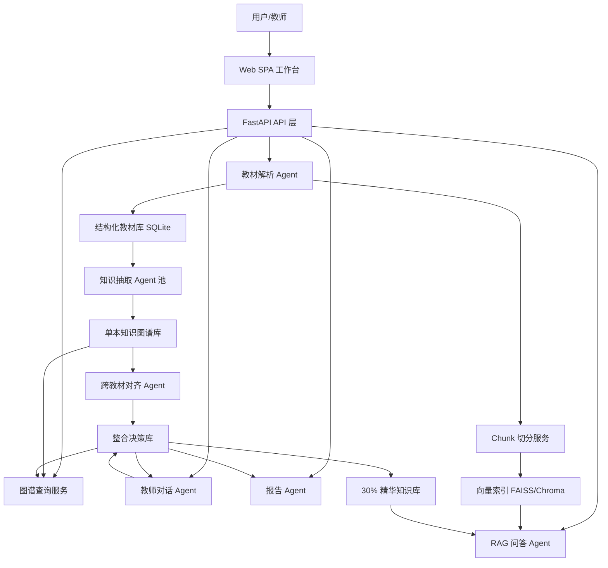

# 医学教材知识整合 Agent 技术方案

## 1. 项目定位

项目建议命名为 **MedEssence Agent：七书归一医学知识整合平台**。

它不是普通医学问答机器人，而是一个面向教师和医学生的 **教材知识整合智能体**：把多本医学教材解析成结构化章节、知识点、知识关系和可引用知识块，再通过跨教材去重、压缩、图谱可视化和 RAG 问答，帮助学生用更少时间学习教材精华，同时让教师能检查整合逻辑是否可靠。

一句话展示：

> 用并行 Agent 把 7 本医学教材压缩成不超过 30% 的可视化知识精华，并提供每句话可追溯来源的精准问答。

## 2. 赛题与产品约束

### 2.1 赛题核心要求

赛题要求开发一个学科知识整合智能体，必须覆盖：

1. 多格式教材加载与解析：PDF、Markdown、TXT 必须支持。
2. 单本教材知识图谱构建与可视化。
3. 知识图谱交互：点击、缩放、拖拽、频次可视化、来源区分。
4. 跨教材知识图谱整合：语义对齐、合并/保留/删除决策、压缩到原始体量 30% 以内。
5. RAG 精准问答：必须引用教材、章节、页码和原文 chunk。
6. Agent 架构说明文档。
7. 教师多轮对话修改整合决策。
8. Web 单页应用。
9. 以 7 本教材为例输出整合报告。
10. README、需求分析、系统设计、Agent 架构说明等开发文档。

### 2.2 当前项目教材资产

本项目已有 7 本医学教材：

| 编号 | 教材文件 | 页数 | 产品中的默认展示名 |
|---|---:|---:|---|
| 01 | 01_局部解剖学.pdf | 305 | 局部解剖学 |
| 02 | 02_组织学与胚胎学.pdf | 319 | 组织学与胚胎学 |
| 03 | 03_生理学.pdf | 450 | 生理学 |
| 04 | 04_医学微生物学.pdf | 386 | 医学微生物学 |
| 05 | 05_病理学.pdf | 418 | 病理学 |
| 06 | 06_传染病学.pdf | 398 | 传染病学 |
| 07 | 07_病理生理学.pdf | 291 | 病理生理学 |

总页数约 2567 页，医学知识覆盖基础形态、机能、病因、病理、微生物、传染病和临床关联，适合展示跨教材知识整合能力。

### 2.3 5 小时开发策略

5 小时内不追求大而全的科研系统，必须优先保证评分项可见、可操作、可复现。

推荐目标：

1. P0 功能全部有闭环。
2. 关键效果能在 Web 页面真实演示。
3. 文档完整度拉满，因为文档占分高，并且 Agent 架构文档单独占 20 分。
4. RAG 必须有引用，图谱必须可点击，整合必须有决策列表和压缩比。
5. 对大教材采用后台任务和缓存，前端实时展示处理进度，避免等待全量处理时页面空白。

### 2.4 核心问题拆解

这部分必须写进最终报告或 `docs/需求分析.md`，因为它直接回答赛题中“为什么这样整合”的技术依据。

#### 2.4.1 知识点粒度定义

本系统中的知识点不是任意关键词，也不是整章摘要，而是满足以下条件的最小教学单元：

1. 能被学生单独学习和记忆。
2. 在教材中有明确解释、定义、分类、机制、结构、表现或应用。
3. 能与其他知识点形成关系，例如前置依赖、包含、并列、应用。
4. 能定位到原文段落或原文语句。

医学教材中建议采用四级粒度：

| 粒度 | 示例 | 是否作为图谱节点 | 处理方式 |
|---|---|---|---|
| 学科/模块 | 生理学、病理学 | 否 | 作为教材或章节来源 |
| 章节主题 | 炎症、血液循环、免疫应答 | 可作为高层节点 | 用于图谱聚类 |
| 核心知识点 | 炎症、动作电位、结核分枝杆菌、抗原递呈 | 是 | 主要整合对象 |
| 细节事实 | 某一数值、某一句例子、某个实验现象 | 一般否 | 作为原文引用或 RAG chunk |

最终系统以“核心知识点”为主要节点，以“章节主题”为聚合层，以“细节事实”为引用依据。这样既不会把图谱做得过细导致不可读，也不会把概念做得过粗导致无法比较教材差异。

#### 2.4.2 重复知识点判别标准

重复不是简单名称相同，而是“教学含义是否等价”。系统采用四层判别：

| 判别层 | 标准 | 示例 | 决策 |
|---|---|---|---|
| 名称一致 | 名称完全或近似一致 | 炎症 / 炎症 | 候选重复 |
| 别名一致 | 中文、英文、缩写、同义表达一致 | 白细胞 / leukocyte | 候选重复 |
| 定义等价 | 定义中的对象、机制、边界基本一致 | 炎症 / 炎症反应 | 可合并 |
| 教学角色一致 | 在课程中承担同一学习目标 | 结核分枝杆菌致病特点在微生物学和传染病学中互为补充 | 可能合并，也可能保留互补 |

不能合并的情况：

1. 上下位概念不能合并，例如“免疫系统”和“T 细胞”。
2. 相关概念不能合并，例如“抗原”和“抗体”。
3. 机制和疾病不能合并，例如“炎症反应”和“肺炎”。
4. 名称接近但教学上必须区分的概念不能合并，例如“抗原”和“免疫原”。
5. 同一概念在不同教材中承担不同教学功能时，不直接删除，而是合并主定义并保留互补说明。

系统判别流程：

1. 用 embedding 召回语义相似候选。
2. 用规则过滤明显不能合并的上下位、因果、应用关系。
3. 对边界案例调用 LLM 判断是否等价。
4. 生成 `merge / keep / remove / split` 决策，并保留理由和置信度。
5. 允许教师通过多轮对话覆盖系统决策。

#### 2.4.3 重叠、互补与缺失定义

跨教材整合不仅识别重复，还要识别互补和缺失：

| 类型 | 定义 | 示例 | 产品展示 |
|---|---|---|---|
| 重叠 | 多本教材讲同一知识点，定义或解释高度一致 | 病理学和病理生理学都讲炎症 | 合并为一个主节点，保留多来源引用 |
| 互补 | 多本教材讲同一主题的不同侧面 | 微生物学讲病原体，传染病学讲传播和临床表现 | 合成精华节点，标记来源贡献 |
| 缺失 | 某本教材未覆盖某条教学链中必要节点 | 讲疾病但缺少病原体机制 | 在图谱中标记缺口，报告中提示 |

互补不是冗余，不能为了压缩直接删除。系统会把互补内容合并到精华版本的不同小节中，例如“定义、机制、结构基础、临床联系、教材来源”。

#### 2.4.4 整合后教学连贯性保障

整合压缩后要保证“学生还能学得懂”。系统通过四种机制保障连贯性：

1. 前置依赖保护：保留节点如果依赖某个基础概念，基础概念不能被删除。
2. 章节覆盖保护：每本教材、每个核心章节至少保留一定数量的高价值节点。
3. 教学链路检查：对 `prerequisite -> concept -> applies_to` 链路做完整性检查。
4. 教师反馈保护：教师手动标记保留的节点不会被压缩算法删除。

示例：

如果系统保留“动作电位”，则必须保留或解释“静息电位”“膜电位”“离子通道”等前置节点；如果这些前置节点在压缩中被删，系统会自动恢复或在精华版本中补充一句桥接说明。

#### 2.4.5 30% 压缩比计算方式

压缩比必须可量化，不能只说“内容变少”。本系统采用字符数和知识点数双指标，但以字符数作为赛题验收主指标。

主指标：

```text
压缩比 = 整合后精华知识库总字符数 / 原始教材正文总字符数 * 100%
```

其中：

1. 原始教材正文总字符数：PDF/MD/TXT 解析后，去掉页眉、页脚、页码、目录、参考文献后的正文字符数。
2. 整合后精华知识库总字符数：合并知识点定义、精华解释、必要教学桥接说明的字符数。
3. 引用原文不计入精华正文，但会作为来源证据单独保存。
4. 图谱节点名称、元数据、JSON 字段名不计入压缩正文。

辅助指标：

```text
节点压缩比 = 整合后知识点节点数 / 整合前知识点节点数 * 100%
关系保留率 = 整合后关键关系数 / 整合前关键关系数 * 100%
引用覆盖率 = 带来源引用的精华知识点数 / 整合后知识点数 * 100%
```

验收目标：

1. 字符压缩比小于等于 30%。
2. 关键前置关系不断裂。
3. 每个精华知识点至少保留一个原文来源。
4. 教师可查看为什么某段内容被保留、合并或删除。

## 3. 产品形态

### 3.1 用户角色

| 用户 | 需求 | 产品回应 |
|---|---|---|
| 医学生 | 少读重复内容，快速掌握重点 | 查看整合精华、知识图谱、学习路径、RAG 问答 |
| 任课教师 | 检查教材重叠、缺失和压缩合理性 | 查看整合决策、修改合并结果、导出整合报告 |
| 评委 | 判断产品完整性和工程能力 | 看到端到端流程、架构说明、可复现部署、真实引用 |

### 3.2 产品主流程

1. 教师或学生把教材文件拖入 Web 页面，文件自动进入 Agent 处理流水线。
2. Ingestion Agent 逐页解析 PDF/MD/TXT，识别章节，生成教材结构。
3. Chunking Agent 把原文拆成可引用段落或语句块，保留教材、章节和页码。
4. Knowledge Graph Agent 按章节抽取知识点和关系，生成单本教材知识图谱。
5. Alignment Agent 跨教材识别知识点的重叠、互补与缺失，生成候选整合结果。
6. Compression Agent 按重要度、图谱依赖和教师反馈生成不超过 30% 的精华版本。
7. Graph UI 在图谱节点上绑定原文证据，点击节点即可显示原文段落或语句。
8. RAG Agent 基于原文 chunk 和精华知识库建立索引，回答问题并引用来源。
9. Teacher Dialogue Agent 接收学科教师多轮反馈，迭代修改合并、拆分、保留、删除决策。
10. Report Agent 输出 `report/整合报告.md`，记录压缩比、决策依据和教学连贯性说明。

## 4. 页面设计

采用单页应用 SPA。推荐前端技术栈：React + Vite + TypeScript + Ant Design + Cytoscape.js。

### 4.1 页面整体布局

1920x1080 演示屏下推荐三栏布局：

| 区域 | 位置 | 功能 |
|---|---|---|
| 顶部状态栏 | 页面顶部 | 项目名、索引状态、总压缩比、当前任务进度、导出按钮 |
| 教材管理区 | 左侧 300px | 上传教材、教材列表、解析状态、页数、章节数、知识点数 |
| 知识图谱区 | 中间主区域 | 单本图谱、整合图谱、整合前后对比、节点详情 |
| 功能面板 | 右侧 420px | Tab：整合决策、RAG 问答、教师对话、整合报告、Benchmark |

页面不要做营销首页，打开就是工作台。

### 4.2 顶部状态栏

展示内容：

1. 已加载教材：7 本。
2. 已解析章节：X 个。
3. 原始总字数：X。
4. 整合后字数：X。
5. 压缩比：例如 28.6%。
6. RAG 索引状态：已索引 X 个 chunk。
7. 后台任务状态：解析中、抽取中、整合中、完成。

### 4.3 左侧教材管理区

功能：

1. 文件上传：拖拽上传 + 点击选择。
2. 文件格式支持：PDF、MD、TXT，DOCX 可作为加分。
3. 教材列表字段：
   - 文件名
   - 格式
   - 大小
   - 页数
   - 章节数
   - 解析状态
   - 图谱状态
   - 索引状态
4. 点击教材后，中间图谱切换到该教材。

### 4.4 中间知识图谱区

核心展示区，必须最大。

推荐视图：

1. 单本图谱：展示某一本教材的知识点和关系。
2. 整合图谱：展示跨教材合并后的知识点。
3. 对比视图：左侧整合前、右侧整合后，或用颜色标记被合并/删除节点。

节点视觉编码：

| 维度 | 表现 |
|---|---|
| 教材来源 | 颜色 |
| 出现频次 | 节点大小 |
| 知识类型 | 节点形状或边框 |
| 是否合并节点 | 双层边框 |
| 教师手动保留 | 星标 |
| 低置信度决策 | 黄色描边 |

交互：

1. 点击节点：右侧弹出知识点详情。
2. 鼠标滚轮缩放。
3. 拖拽画布。
4. 拖拽节点。
5. 搜索知识点，高亮结果。
6. 按教材、关系类型、置信度筛选。

节点详情必须展示原文证据，而不是只展示模型总结：

1. 知识点名称、定义、类别。
2. 来源教材、章节、页码。
3. 原文段落：展示该知识点所在 chunk。
4. 原文语句：高亮最直接支持该知识点的 1 到 3 句话。
5. 来源对比：如果该节点由多本教材合并，按教材分组展示不同原文。
6. 整合说明：说明该节点是保留、合并、补充还是教师手动修正。

### 4.5 右侧功能面板

#### Tab 1：整合决策

展示合并、保留、删除决策：

| 字段 | 示例 |
|---|---|
| 决策类型 | merge |
| 涉及教材 | 病理学、生理学、病理生理学 |
| 知识点 | 炎症 / 炎症反应 |
| 系统理由 | 三本教材均讲解炎症概念，病理学定义最完整，生理学补充机体反应机制 |
| 置信度 | 0.92 |
| 教师操作 | 接受、撤销、拆分、保留 |

#### Tab 2：RAG 问答

界面元素：

1. 输入框：输入医学问题。
2. 回答区：只基于教材知识回答。
3. 引用区：展示教材名、章节、页码、相似度。
4. 原文区：点击引用展开 chunk 原文。

建议示例问题：

1. “炎症的基本病理变化是什么？”
2. “动作电位和静息电位有什么关系？”
3. “结核分枝杆菌的致病特点和传染病学表现如何对应？”
4. “组织学中的上皮组织知识和病理学中的肿瘤来源有什么联系？”

#### Tab 3：教师对话

支持教师自然语言修正：

1. “为什么把《病理学》的炎症和《病理生理学》的炎症反应合并？”
2. “把抗原和免疫原分开，它们不是完全等价。”
3. “保留传染病学中关于结核传播途径的章节，不要压缩掉。”

系统行为：

1. 识别教师意图。
2. 定位对应整合决策。
3. 修改 merge/keep/remove 状态。
4. 重新计算压缩比。
5. 更新图谱。
6. 记录对话历史。

#### Tab 4：整合报告

展示并支持导出 Markdown：

1. 整合概览。
2. 决策摘要。
3. 知识图谱统计。
4. 重点整合案例。
5. 教学完整性说明。
6. RAG Benchmark 简表。

#### Tab 5：Benchmark

加分项，但实现成本不高。展示 20 个测试问题的检索命中率、引用准确率和平均响应时间。

## 5. 技术架构

### 5.1 推荐技术栈

| 层级 | 推荐方案 | 选择理由 |
|---|---|---|
| 前端 | React + Vite + TypeScript | 搭建快，组件生态成熟 |
| UI | Ant Design | 表格、Tabs、上传、抽屉组件省时间 |
| 图谱 | Cytoscape.js | 交互强，节点/边样式灵活，适合医学概念图谱 |
| 后端 | FastAPI | API 开发快，天然支持异步任务 |
| PDF 解析 | PyMuPDF + pypdf fallback | PyMuPDF 更适合页级解析，pypdf 可兜底 |
| 文档解析 | markdown、python-docx | 覆盖 MD/TXT/DOCX |
| 向量模型 | BGE-small-zh 或 paraphrase-multilingual-MiniLM-L12-v2 | 中文支持较好，可本地运行 |
| 向量库 | FAISS 或 ChromaDB | 轻量，适合黑客松 |
| BM25 | rank-bm25 | 实现混合检索加分 |
| LLM | DeepSeek / 通义千问 / OpenAI API | 用于知识抽取、合并判断、回答生成 |
| 数据库 | SQLite | 5 小时内最稳，部署简单 |
| 后台任务 | FastAPI BackgroundTasks 或 Celery-lite 队列 | 避免上传后页面阻塞 |
| 部署 | Docker + 魔搭创空间 / Render / Railway | 满足公网访问 |

### 5.2 系统架构图



### 5.3 并行 Agent 架构

建议采用 **Orchestrator + 多专职 Agent + Skill Registry**。

这种架构借鉴 gstack skill 的思想：每个能力被声明成一个独立 skill，包含输入、输出、工具、Prompt 模板和质量检查标准；Orchestrator 根据任务状态并行调度。

| Agent | 职责 | 输入 | 输出 | 是否并行 |
|---|---|---|---|---|
| Orchestrator Agent | 统一调度任务、维护状态机 | 用户操作、任务状态 | Job plan、状态更新 | 否 |
| Ingestion Agent | 解析 PDF/MD/TXT，识别章节 | 教材文件 | textbook/chapter JSON | 按教材并行 |
| Chunking Agent | 切分正文并保留元数据 | 章节正文 | chunks | 按章节并行 |
| KG Extraction Agent | 抽取知识点和关系 | 章节正文 | nodes/edges JSON | 按章节并行 |
| Alignment Agent | 跨教材语义对齐 | nodes、embeddings | 候选合并对 | 批量并行 |
| Compression Agent | 决策 merge/keep/remove，控制 30% 压缩比 | 候选合并对、章节重要度 | merge decisions、essence notes | 否 |
| RAG Agent | 建索引、检索、生成带引用回答 | chunks、用户问题 | answer + citations | 查询时运行 |
| Teacher Dialogue Agent | 理解教师反馈并修改整合决策 | 对话、决策库 | decision patch | 查询时运行 |
| Report Agent | 生成 Markdown 报告 | 统计数据、决策、案例 | report/整合报告.md | 否 |
| Benchmark Agent | 生成并运行测试问题 | RAG query set | 指标表 | 可选并行 |

### 5.4 为什么选择多 Agent

多 Agent 的理由不是为了炫技，而是因为赛题天然有多个不同性质的任务：

1. PDF 解析是工程任务，需要稳定和错误处理。
2. 医学知识抽取是 LLM 结构化生成任务，需要 Prompt 和 JSON 校验。
3. 图谱对齐是算法任务，需要 embedding、阈值和 LLM 复核。
4. RAG 是检索生成任务，需要引用约束和防幻觉。
5. 教师对话是交互式决策修改任务，需要保留上下文。
6. 报告生成是总结任务，需要汇总系统真实数据。

如果放进单 Agent，会出现上下文过长、Prompt 混乱、错误难定位的问题。拆成专职 Agent 后，每个 Agent 都有清晰输入输出，适合并行跑 7 本教材，也更容易在文档中论证架构合理性。

### 5.5 Agent 通信方式

不建议 5 小时内引入复杂消息队列。采用 SQLite + job_status 表即可：

1. 前端请求创建任务。
2. API 写入 job 表。
3. 后台 worker 读取任务并更新状态。
4. 每个 Agent 把产物写入固定数据表。
5. 前端轮询 `/api/jobs/{id}` 和 `/api/rag/status`。

## 6. 数据模型

### 6.1 教材结构

```json
{
  "textbook_id": "book_03",
  "filename": "03_生理学.pdf",
  "title": "生理学",
  "total_pages": 450,
  "total_chars": 385000,
  "chapters": [
    {
      "chapter_id": "book_03_ch_01",
      "title": "第一章 绪论",
      "page_start": 1,
      "page_end": 15,
      "content": "生理学是研究机体正常生命活动规律的科学...",
      "char_count": 8500
    }
  ]
}
```

### 6.2 知识点节点

```json
{
  "id": "book_05_node_001",
  "name": "炎症",
  "aliases": ["炎症反应", "inflammation"],
  "definition": "具有血管系统的活体组织对损伤因子发生的防御性反应。",
  "category": "核心概念",
  "textbook_id": "book_05",
  "textbook": "病理学",
  "chapter": "第四章 炎症",
  "page": 78,
  "source_chunk_id": "book_05_ch_04_chunk_003",
  "source_paragraph": "炎症是具有血管系统的活体组织对各种损伤因子的刺激所发生的防御性反应...",
  "source_sentences": [
    "炎症是具有血管系统的活体组织对各种损伤因子的刺激所发生的防御性反应。"
  ]
}
```

### 6.3 知识关系

```json
{
  "source": "book_03_node_021",
  "target": "book_03_node_022",
  "relation_type": "prerequisite",
  "description": "理解动作电位需要先掌握静息电位的概念",
  "confidence": 0.88
}
```

关系类型至少实现三种，建议实现四种：

1. prerequisite：前置依赖。
2. parallel：并列关系。
3. contains：包含关系。
4. applies_to：应用关系。

### 6.4 整合决策

```json
{
  "decision_id": "merge_001",
  "action": "merge",
  "affected_nodes": ["book_05_node_001", "book_07_node_014", "book_03_node_088"],
  "result_node": "merged_node_001",
  "result_name": "炎症",
  "reason": "病理学、病理生理学和生理学均涉及炎症概念，病理学定义最系统，病理生理学补充机制，生理学补充机体反应。",
  "confidence": 0.92,
  "teacher_override": false
}
```

### 6.5 RAG Chunk

```json
{
  "chunk_id": "book_05_ch_04_chunk_003",
  "textbook": "病理学",
  "chapter": "第四章 炎症",
  "page_start": 78,
  "page_end": 79,
  "content": "炎症是具有血管系统的活体组织对各种损伤因子的刺激所发生的防御性反应...",
  "char_count": 642
}
```

## 7. 核心算法方案

### 7.1 PDF 解析与章节识别

实现目标：

1. 逐页读取 PDF，避免一次性加载整本教材。
2. 去除页眉、页脚、页码。
3. 用正则识别章节标题。
4. 输出统一教材 JSON。

章节识别规则：

1. 优先匹配 `第[一二三四五六七八九十百0-9]+章`。
2. 其次匹配医学教材常见标题，如“绪论”“总论”“各论”。
3. 如果某本 PDF 章节识别失败，则按每 15 页生成一个伪章节，保证系统不中断。

大文件策略：

1. 每次只处理一页。
2. 每处理完一章就落库。
3. 前端实时显示解析进度。
4. 解析失败的页记录错误，不影响整本书继续处理。

### 7.2 知识点抽取

每章调用 LLM，输出严格 JSON。

抽取字段：

1. name：知识点名称。
2. aliases：同义词、中英文别名。
3. definition：定义。
4. category：核心概念、结构、机制、疾病、病原体、诊断、治疗、现象等。
5. importance：1 到 5。
6. source_quote：原文依据。
7. relations：知识点关系。

Prompt 要点：

1. 只抽取本章内容中明确出现或直接定义的知识点。
2. 不要使用模型自身医学知识补充教材没有写的内容。
3. 每章最多抽取 20 到 40 个知识点，避免图谱爆炸。
4. 输出必须是 JSON，不允许 Markdown。
5. 每个节点必须带 source_quote，后续用于点击展示和引用。

### 7.3 跨教材语义对齐

采用“两阶段对齐”：

第一阶段：Embedding 召回候选。

1. 对每个知识点构造对齐文本：`name + aliases + definition + category`。
2. 计算向量。
3. 对不同教材节点做 top-k 相似搜索。
4. 相似度大于 0.82 的进入候选集合。

第二阶段：LLM 复核。

1. 相似度大于 0.92：自动 merge。
2. 相似度 0.82 到 0.92：交给 LLM 判断是否同一医学概念。
3. 相似度低于 0.82：默认 keep。

LLM 判断标准：

1. 名称不同但定义等价，可以合并。
2. 上下位概念不能合并，只能建立 contains。
3. 机制、表现、疾病、病原体不能因为相关就合并。
4. 医学近义但教学上需要区分的概念，保留为 parallel 或 prerequisite。

整合输出不只给“是否合并”，还要给出三类分析结果：

| 结果 | 判断方式 | 系统动作 |
|---|---|---|
| 重叠 overlap | 多本教材知识点定义等价或高度相似 | 合并为统一节点，保留所有来源 |
| 互补 complement | 同一主题下不同教材补充不同侧面 | 生成综合节点，按来源拼接精华说明 |
| 缺失 missing | 某条教学链中某教材缺少必要前置或应用节点 | 在报告和图谱中标记缺口 |

例如：

1. 《病理学》和《病理生理学》都解释“炎症”，属于重叠，合并主定义。
2. 《医学微生物学》讲“结核分枝杆菌”的病原学，《传染病学》讲结核传播和临床表现，属于互补，合成跨教材知识单元。
3. 如果某疾病节点缺少病原体、病理机制或临床表现中的关键环节，属于缺失，在报告中提示教师检查。

### 7.4 压缩到 30% 的策略

压缩不能简单删字，要保证教学链路不断裂。

正式计算采用正文字符数：

```text
原始正文总字符数 = sum(每本教材去页眉页脚、目录、参考文献后的章节正文字符数)
整合后精华字符数 = sum(所有保留/合并知识点的精华解释字符数 + 必要桥接说明字符数)
压缩比 = 整合后精华字符数 / 原始正文总字符数 * 100%
```

注意：

1. 原文引用作为证据保存，不计入精华正文。
2. 节点 ID、JSON 字段名、页码、章节名等元数据不计入精华正文。
3. 如果教师手动保留导致压缩比超过 30%，系统需要提示“超出压缩目标”，并推荐可删除的低价值节点。

建议采用知识点重要度评分：

```text
score = 0.35 * 出现教材数
      + 0.25 * LLM重要度
      + 0.20 * 图谱中心性
      + 0.10 * 是否前置依赖
      + 0.10 * 教师保留标记
```

保留策略：

1. 多本教材重复出现的核心概念优先保留。
2. 图谱中前置依赖节点优先保留。
3. 与疾病机制、临床表现、病原体相关的医学高价值节点优先保留。
4. 低频但补充教材缺口的节点保留。
5. 重复表述删除，但来源引用保留。

压缩产物：

1. 合并后的知识点定义。
2. 精华解释。
3. 来源引用列表。
4. 与其他知识点的关系。
5. 被压缩掉的原文依据。

### 7.5 教学完整性保障

用图谱结构检查压缩后是否断链：

1. 如果某个保留节点的 prerequisite 被删除，则自动恢复前置节点。
2. 如果某章所有核心节点都被删除，则保留该章最高分节点。
3. 如果某本教材贡献节点低于阈值，则提示可能过度压缩。
4. 教师手动保留节点永不删除。

## 8. RAG 方案

### 8.1 Chunking 策略

建议 chunk 大小：500 到 800 中文字符，重叠 80 字。

理由：

1. 医学教材单个概念通常需要定义、机制、表现或分类，500 字以下容易截断。
2. 800 字以内适合 top-5 注入 LLM，不会让上下文过长。
3. 80 字重叠可以保留跨段落定义和例子。

每个 chunk 保留：

1. 教材名。
2. 章节名。
3. 起止页码。
4. chunk 序号。
5. 原文内容。

### 8.2 检索策略

基础版：

1. 用户问题转 embedding。
2. FAISS 检索 top-8。
3. 取 top-5 作为上下文。
4. LLM 生成答案。

进阶版：

1. 向量检索 top-10。
2. BM25 检索 top-10。
3. 合并去重。
4. 按 `0.7 * vector_score + 0.3 * bm25_score` 重排。
5. 取 top-5。

### 8.3 防幻觉 Prompt

```text
你是医学教材知识库问答 Agent。
你只能依据给定的教材片段回答问题，不允许使用外部知识。
如果片段中没有答案，回答“当前知识库中未找到相关信息”。
回答必须包含引用，引用格式为：[教材名称, 章节名称, 第X页]。
不要编造页码、章节或教材名称。
```

### 8.4 RAG 返回结构

```json
{
  "answer": "炎症是具有血管系统的活体组织对损伤因子发生的防御性反应，常见基本病理变化包括变质、渗出和增生。[病理学, 第四章 炎症, 第78页]",
  "citations": [
    {
      "textbook": "病理学",
      "chapter": "第四章 炎症",
      "page": 78,
      "relevance_score": 0.92
    }
  ],
  "source_chunks": [
    "炎症是具有血管系统的活体组织对各种损伤因子的刺激所发生的防御性反应..."
  ]
}
```

## 9. API 设计

| 方法 | 路径 | 功能 |
|---|---|---|
| POST | `/api/textbooks/upload` | 上传教材 |
| GET | `/api/textbooks` | 获取教材列表 |
| GET | `/api/textbooks/{id}/chapters` | 获取章节 |
| POST | `/api/jobs/parse` | 启动解析任务 |
| POST | `/api/jobs/extract-graph` | 启动知识图谱抽取 |
| POST | `/api/jobs/integrate` | 启动跨教材整合 |
| GET | `/api/jobs/{id}` | 查询任务进度 |
| GET | `/api/graph/book/{id}` | 获取单本图谱 |
| GET | `/api/graph/integrated` | 获取整合图谱 |
| GET | `/api/decisions` | 获取整合决策 |
| PATCH | `/api/decisions/{id}` | 教师修改决策 |
| POST | `/api/rag/index` | 建立 RAG 索引 |
| GET | `/api/rag/status` | 查询索引状态 |
| POST | `/api/rag/query` | 带引用问答 |
| POST | `/api/chat` | 教师多轮对话 |
| GET | `/api/report/summary` | 获取报告数据 |
| POST | `/api/report/export` | 导出整合报告 |

## 10. 推荐仓库结构

```text
project/
  README.md
  .env.example
  .gitignore
  requirements.txt
  package.json
  docker-compose.yml
  docs/
    需求分析.md
    系统设计.md
    Agent 架构说明.md
    接口文档.md
    医学教材知识整合Agent技术方案.md
  report/
    整合报告.md
  backend/
    main.py
    api/
    agents/
      orchestrator.py
      ingestion_agent.py
      kg_extraction_agent.py
      alignment_agent.py
      compression_agent.py
      rag_agent.py
      teacher_dialogue_agent.py
      report_agent.py
    services/
      pdf_parser.py
      chunker.py
      embeddings.py
      vector_store.py
      graph_store.py
    models/
    prompts/
    db/
  frontend/
    src/
      App.tsx
      components/
        TextbookPanel.tsx
        GraphCanvas.tsx
        DecisionPanel.tsx
        RagPanel.tsx
        TeacherChatPanel.tsx
        ReportPanel.tsx
      api/
      types/
  data/
    textbooks/
      .gitkeep
    cache/
      .gitkeep
```

`.gitignore` 必须包含：

```gitignore
*.pdf
data/textbooks/*.pdf
data/cache/
.env
__pycache__/
node_modules/
dist/
```

## 11. 5 小时开发流程

### 0:00 到 0:25，搭建骨架

目标：

1. 创建 FastAPI 后端。
2. 创建 React/Vite 前端。
3. 建立 SQLite 数据库表。
4. 跑通前后端通信。
5. 写好 `.env.example` 和 README 初稿。

验收：

1. 浏览器能打开工作台。
2. `/api/health` 返回 OK。

### 0:25 到 1:10，文件上传与解析

目标：

1. 前端上传区域和教材列表。
2. 后端支持 PDF/MD/TXT。
3. PDF 逐页解析。
4. 章节识别。
5. 状态轮询。

优先级：

1. 先保证 PDF。
2. MD/TXT 用简单读取实现。
3. DOCX 有时间再做。

验收：

上传一本《病理学》PDF 后，前端能显示页数、章节和解析状态。

### 1:10 到 2:05，知识图谱

目标：

1. 实现知识抽取 Prompt。
2. 按章节调用 LLM。
3. 保存 nodes/edges。
4. 前端 Cytoscape 渲染图谱。
5. 点击节点展示详情。

提速策略：

1. 每章最多抽 20 个节点。
2. 先抽每本教材前 3 到 5 个章节用于演示。
3. 后台继续处理全量。
4. LLM 返回失败时用规则抽取兜底，保证图谱不空。

验收：

选择一本教材后，能看到可交互知识图谱。

### 2:05 到 2:55，跨教材整合与压缩

目标：

1. 节点 embedding。
2. 相似度匹配。
3. LLM 复核或阈值判断。
4. 生成 merge/keep/remove 决策。
5. 显示压缩比。
6. 展示整合图谱。

提速策略：

1. 先实现 embedding 相似度。
2. 再对 0.82 到 0.92 的边界案例调用 LLM。
3. 先保证至少 2 本教材整合成功，再扩展到 7 本。

验收：

加载 2 本以上教材后，能看到合并决策、理由、置信度和整合后压缩比。

### 2:55 到 3:40，RAG 问答

目标：

1. 章节内容切 chunk。
2. 建立向量索引。
3. 实现 `/api/rag/query`。
4. 回答必须带引用。
5. 前端展示引用和原文 chunk。

提速策略：

1. 先做向量检索。
2. 有时间再加 BM25 混合检索。
3. 如果本地 embedding 安装慢，临时切到 API embedding 或 TF-IDF/BM25 兜底，但文档说明正式方案。

验收：

输入“炎症是什么”，返回答案并引用《病理学》对应章节页码。

### 3:40 到 4:15，教师对话与报告

目标：

1. 教师聊天框。
2. 支持至少三类指令：保留、拆分、合并。
3. 修改决策后更新图谱和压缩比。
4. 生成整合报告 Markdown。

验收：

教师输入“把抗原和免疫原分开”，系统能修改相关 merge 决策。

### 4:15 到 5:00，文档、部署与演示检查

目标：

1. 补齐 README。
2. 补齐 `docs/需求分析.md`。
3. 补齐 `docs/系统设计.md`。
4. 补齐 `docs/Agent 架构说明.md`。
5. 补齐 `report/整合报告.md`。
6. 部署到公网。
7. 准备 3 分钟演示脚本。

验收：

1. GitHub 仓库公开可访问。
2. 部署链接可访问。
3. 演示路径完整。

## 12. 并行开发分工

如果你用一套并行 Agent 系统辅助开发，建议按文件责任拆分，避免互相覆盖。

| 开发 Agent | 负责范围 | 产物 |
|---|---|---|
| Backend API Agent | `backend/main.py`、`backend/api/` | API 路由和状态接口 |
| Parser/RAG Agent | `backend/services/`、`backend/agents/rag_agent.py` | 解析、chunk、embedding、检索 |
| KG Agent | `backend/agents/kg_extraction_agent.py`、`alignment_agent.py` | 知识图谱和整合算法 |
| Frontend Agent | `frontend/src/` | 工作台页面、图谱、右侧面板 |
| Docs Agent | `docs/`、`report/`、`README.md` | 文档与报告 |
| QA Agent | 测试和演示脚本 | 检查页面可用、API 可通、引用存在 |

推荐并行顺序：

1. Backend API Agent 和 Frontend Agent 同时启动，用 mock 数据对接。
2. Parser/RAG Agent 先跑通 PDF 解析和 chunk。
3. KG Agent 先用 mock nodes 渲染整合流程，再接真实抽取。
4. Docs Agent 从一开始就写，不要等最后。
5. QA Agent 最后 30 分钟只检查演示路径。

## 13. Skill 化设计

可以在项目中加入 `backend/skills/`，把每种 Agent 能力写成声明式 skill，借鉴 gstack skill 的组织方法。

示例：

```text
backend/skills/
  parse_textbook.skill.md
  extract_kg.skill.md
  align_concepts.skill.md
  compress_essence.skill.md
  rag_answer.skill.md
  teacher_patch.skill.md
  generate_report.skill.md
```

每个 skill 包含：

1. skill name。
2. 适用场景。
3. 输入 schema。
4. 输出 schema。
5. Prompt 模板。
6. 失败重试策略。
7. 质量检查规则。

这样写的好处：

1. 文档上能体现 Agent 架构不是口号，而是有可执行边界。
2. Prompt 与业务代码分离，便于调试。
3. 并行 Agent 可以读取同一套 skill 定义，减少实现偏差。
4. 后续可以把某个 skill 替换成更强模型或本地模型。

## 14. 关键 Prompt 模板

### 14.1 知识抽取 Prompt

```text
你是医学教材知识图谱抽取 Agent。
请只依据给定章节原文抽取知识点，不要补充外部知识。

要求：
1. 输出 JSON。
2. nodes 最多 30 个。
3. 每个 node 必须包含 name、aliases、definition、category、importance、source_quote、page。
4. edges 至少包含 prerequisite、parallel、contains、applies_to 中的三种关系。
5. 如果原文依据不足，不要抽取该知识点。

章节信息：
教材：{textbook}
章节：{chapter}
页码：{page_start}-{page_end}
原文：{content}
```

### 14.2 概念对齐 Prompt

```text
你是医学概念对齐 Agent。
请判断两个知识点是否表示同一个医学概念。

判断规则：
1. 定义等价，可以合并。
2. 一个是另一个的上位或下位概念，不合并，标记 contains。
3. 只是相关、因果、应用关系，不合并。
4. 教学上必须区分的近义词，不合并。

输出 JSON：
{
  "same_concept": true/false,
  "relation_type": "merge|contains|parallel|related",
  "reason": "...",
  "confidence": 0.0-1.0
}

概念 A：{node_a}
概念 B：{node_b}
```

### 14.3 教师对话 Prompt

```text
你是教材整合方案助手。
你的任务是把教师自然语言反馈转成对整合决策的修改。

可用操作：
1. keep：保留某知识点。
2. merge：合并知识点。
3. split：拆分已合并知识点。
4. remove：删除冗余知识点。
5. explain：解释某个决策。

不要直接修改不存在的决策。如果信息不足，返回 need_clarification。
输出 JSON patch。

教师输入：{message}
相关决策：{decisions}
```

## 15. 整合报告结构

`report/整合报告.md` 是最终报告中最容易拿分的文档，必须把“怎么定义、怎么判定、怎么压缩、怎么保证教学效果”写清楚。建议结构：

```markdown
# 医学教材整合报告

## 1. 整合概览
- 原始教材数量：7 本
- 原始总页数：2567 页
- 原始总字数：X
- 整合后字数：X
- 压缩比：X%

## 2. 核心问题拆解

### 2.1 知识点粒度定义
- 本系统将知识点定义为可独立学习、可在教材中定位、可与其他概念建立关系的最小教学单元。
- 粒度分为章节主题、核心知识点、细节事实三层。
- 图谱节点以核心知识点为主，细节事实作为原文引用依据。

### 2.2 重复判别标准
- 名称或别名一致只是候选重复。
- 定义等价、教学角色一致才允许合并。
- 上下位、因果、应用、近义但需区分的概念不直接合并。

### 2.3 重叠、互补与缺失识别
- 重叠：多本教材讲同一知识点，合并主定义。
- 互补：多本教材讲同一主题的不同侧面，组合为精华说明。
- 缺失：教学链路中缺少必要前置或应用节点，在报告中标记。

### 2.4 教学连贯性保障
- 保留前置依赖节点。
- 检查 prerequisite -> concept -> applies_to 教学链路。
- 每个核心章节至少保留关键知识点。
- 教师手动保留节点不被自动删除。

### 2.5 30% 压缩计算方式
- 压缩比 = 整合后精华知识库总字符数 / 原始教材正文总字符数 * 100%。
- 原始正文去除页眉、页脚、目录、参考文献。
- 原文引用作为证据保存，不计入精华正文。
- 目标压缩比不超过 30%。

## 3. 整合决策摘要
- 合并：X 项
- 保留：X 项
- 删除：X 项
- 拆分：X 项
- 教师手动修正：X 项

## 4. 知识图谱统计
- 整合前节点数：X
- 整合后节点数：X
- 整合前关系数：X
- 整合后关系数：X
- 重叠节点数：X
- 互补节点数：X
- 缺失提示数：X

## 5. 重点整合案例
### 案例一：炎症
- 涉及教材：病理学、病理生理学、生理学
- 类型：重叠 + 互补
- 系统决策：合并主定义，保留机制补充
- 原文证据：列出教材、章节、页码、原文句子
- 教学连贯性说明：保留前置概念和应用关系

## 6. 教学完整性说明
...

## 7. 教师多轮对话迭代记录
- 教师反馈 1：...
- 系统修改：...
- 图谱变化：...
- 压缩比变化：...

## 8. RAG Benchmark
...
```

重点案例建议选：

1. 炎症：病理学、病理生理学、生理学之间的交叉。
2. 免疫应答：组织学与胚胎学、医学微生物学、传染病学之间的交叉。
3. 结核感染：医学微生物学与传染病学之间的交叉。
4. 细胞损伤：病理学与病理生理学之间的交叉。
5. 神经调节或血液循环：局部解剖学与生理学之间的结构和功能对应。

## 16. RAG Benchmark 设计

建议准备 20 个问题：

| 类型 | 数量 | 示例 |
|---|---:|---|
| 事实型 | 6 | “炎症的定义是什么？” |
| 比较型 | 4 | “静息电位和动作电位有什么区别？” |
| 跨教材型 | 6 | “结核分枝杆菌的微生物学特点如何影响传染病学传播？” |
| 推理型 | 4 | “为什么细胞损伤会导致病理生理功能改变？” |

指标：

1. answer_correct：答案是否正确。
2. citation_hit：引用是否命中预期教材/章节。
3. avg_latency：平均响应时间。
4. no_answer_correct：无依据时是否拒答。
5. token_cost：Token 消耗。

文档中展示一个小表即可拿到架构和创新加分。

## 17. 评分点映射

| 评分维度 | 产品对应设计 |
|---|---|
| 文档完整性 | README、需求分析、系统设计、Agent 架构说明、整合报告 |
| 多格式解析 | PDF/MD/TXT 上传、逐页解析、章节识别 |
| 知识图谱 | LLM 抽取 nodes/edges、Cytoscape 可视化 |
| 图谱交互 | 点击详情、缩放拖拽、搜索、高亮、来源颜色、频次大小 |
| 跨教材整合 | embedding 候选 + LLM 复核 + merge/keep/remove |
| 30% 压缩 | 压缩比统计、重要度评分、教学完整性检查 |
| RAG 问答 | chunk、embedding、向量库、top-5、引用来源 |
| 多轮对话 | 教师反馈转 decision patch，更新图谱 |
| Agent 架构 | Orchestrator + 多 Agent + Skill Registry |
| 创新 | 医学教学完整性检查、Benchmark、Skill 化能力编排 |

## 18. 风险与兜底方案

| 风险 | 影响 | 兜底 |
|---|---|---|
| PDF 解析慢 | 影响演示 | 逐页后台处理，先显示前几章结果 |
| 章节识别失败 | 图谱结构乱 | 每 15 页生成伪章节 |
| LLM 输出 JSON 错误 | 图谱无法入库 | JSON repair + 重试 + 规则兜底 |
| embedding 模型安装慢 | RAG 延误 | 使用 API embedding 或 BM25 临时兜底 |
| 全量 7 本处理超时 | 演示不完整 | 优先每本抽取核心章节，后台继续全量 |
| 压缩比超过 30% | 不满足要求 | 按重要度阈值继续删除低分节点，同时保护前置依赖 |
| 回答幻觉 | 失分严重 | Prompt 强约束，只基于 chunk 回答，无依据就拒答 |
| 教师反馈难解析 | 对话功能弱 | 先支持保留、拆分、合并三类明确指令 |

## 19. 演示脚本

推荐 3 分钟演示：

1. 打开工作台，展示 7 本医学教材已加载。
2. 点击《病理学》，展示章节解析结果。
3. 切换到知识图谱，点击“炎症”节点，展示定义、章节、页码和原文出处。
4. 切换整合图谱，展示炎症相关节点来自《病理学》《病理生理学》《生理学》，系统已合并。
5. 打开整合决策，展示 merge 理由和置信度。
6. 输入 RAG 问题：“炎症的基本病理变化是什么？”展示带引用回答。
7. 在教师对话输入：“把抗原和免疫原分开”，展示决策修改和图谱更新。
8. 打开整合报告，展示压缩比低于 30%、决策摘要和教学完整性说明。
9. 最后展示 `docs/Agent 架构说明.md` 的 Mermaid 架构图，强调并行 Agent 和 Skill 化设计。

## 20. 最终建议

这个项目的最佳取胜路径是：

1. 产品上做成一个“医学教材整合工作台”，不要只做聊天机器人。
2. 技术上用多 Agent，但保持工程实现轻量，避免复杂框架拖慢开发。
3. 展示上把知识图谱放中间，把 7 本教材和压缩比放在显眼位置。
4. 评分上优先命中文档、图谱、RAG 引用、整合决策、教师对话。
5. 创新上强调医学教学完整性检查和 Skill 化并行 Agent 系统。

最终交付口径：

> MedEssence Agent 通过教材解析 Agent、知识抽取 Agent、图谱对齐 Agent、压缩 Agent、RAG Agent 和教师对话 Agent 的并行协作，将 7 本医学教材结构化为可交互知识图谱，并在保留教学逻辑完整性的前提下压缩为不超过 30% 的精华知识库。系统支持带原文引用的精准问答，也支持教师通过自然语言调整整合决策，形成可解释、可追溯、可迭代的医学学习资源整合平台。
