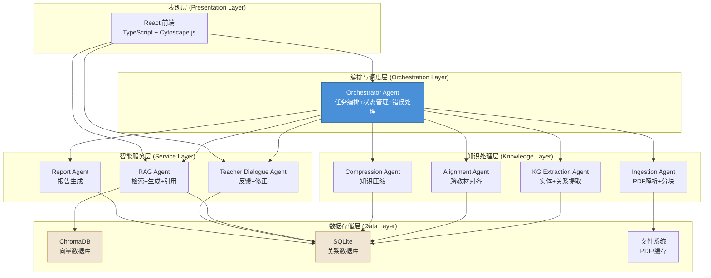
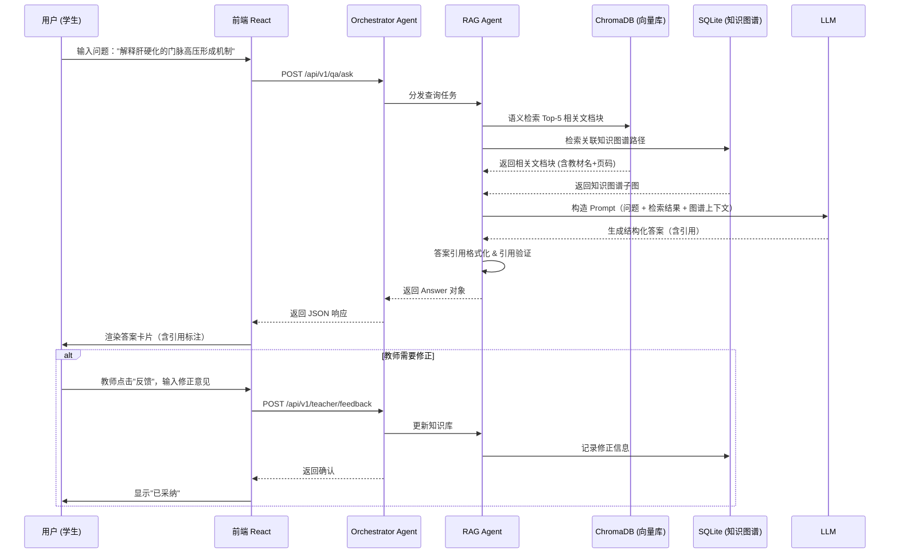
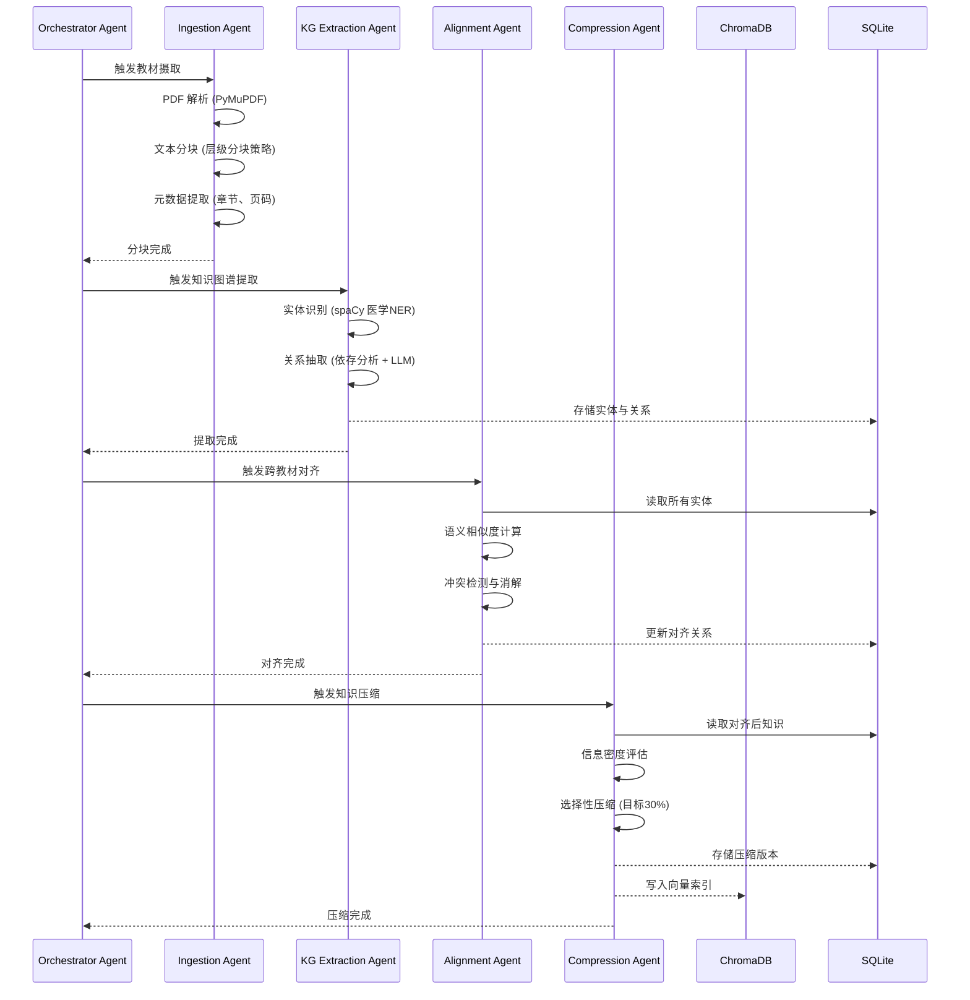
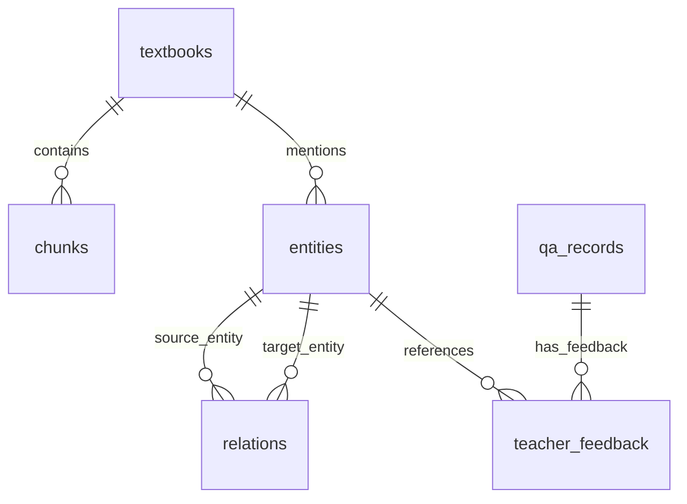
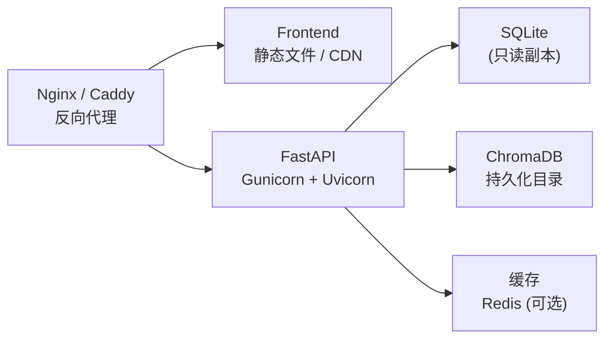

# 系统设计文档

> 项目名称：MedEssence Agent · 七书归一
>
> 版本：v1.0 | 最后更新：2026-05-10

---

## 1. 架构总览

MedEssence Agent 采用**分层 + 多 Agent 编排**架构，自底向上分为四层：数据存储层、知识处理层、智能服务层、表现层。Orchestrator Agent 作为中央控制器，横跨各层进行任务编排与状态管理。



---

## 2. 技术选型与理由

### 2.1 前端技术选型

| 技术 | 版本 | 选型理由 |
|------|------|----------|
| **React 18** | 18.2+ | 生态系统成熟，组件化开发，适合快速迭代的 hackathon 项目 |
| **TypeScript** | 5.x | 类型安全减少运行时错误，提升协作效率 |
| **Vite** | 5.x | 开发服务器启动快（< 1s），热更新响应迅速 |
| **Cytoscape.js** | 3.x | 医学知识图谱可视化首选，支持复杂图布局、交互操作、性能优异 |
| **Ant Design** | 5.x | 丰富的开箱即用组件，适合管理后台类应用 |
| **Tailwind CSS** | 3.x | 原子化 CSS，开发效率高，避免样式冲突 |
| **React Router v6** | 6.x | SPA 路由标准方案，支持嵌套路由与加载状态 |

### 2.2 后端技术选型

| 技术 | 版本 | 选型理由 |
|------|------|----------|
| **Python 3.11** | 3.11+ | AI/ML 生态最佳选择，NLP 工具链完善 |
| **FastAPI** | 0.110+ | 异步高性能，自动生成 OpenAPI 文档，Pydantic 数据校验 |
| **SQLite** | 3.x | 零配置的关系数据库，适合嵌入式场景，不支持高并发但满足教学需求 |
| **ChromaDB** | 0.5+ | 轻量级向量数据库，本地运行无需额外服务，与 LangChain 深度集成 |
| **sentence-transformers** | 2.x | 高质量中文文本嵌入模型（如 paraphrase-multilingual-MiniLM-L12-v2） |
| **LangChain** | 0.2+ | Agent 编排框架，提供工具注册、链式调用、回调系统 |

### 2.3 关键决策记录

| 决策 | 选项 | 选择 | 理由 |
|------|------|------|------|
| 向量数据库 | Pinecone / Weaviate / ChromaDB | **ChromaDB** | 本地运行，无需云服务，适合 hackathon |
| 关系数据库 | PostgreSQL / MySQL / SQLite | **SQLite** | 零运维，单文件存储，适合教学场景规模 |
| 嵌入模型 | OpenAI / 本地模型 | **sentence-transformers 本地** | 离线可用，避免 API 费用和延迟 |
| LLM | GPT-4 / 本地模型 / Claude | **可切换** | 本地小模型用于基础任务，API 大模型用于复杂推理 |
| 图谱可视化 | D3.js / vis.js / Cytoscape.js | **Cytoscape.js** | 医学图谱社区标准，布局算法丰富 |
| 前端构建 | Webpack / Vite | **Vite** | 开发体验显著优于 Webpack |

---

## 3. 数据流设计

### 3.1 核心问答流程



### 3.2 数据摄取流程



---

## 4. 组件设计

### 4.1 前端组件树

```
App
├── Layout
│   ├── Sidebar (导航菜单)
│   └── Header (用户信息 + 通知)
├── Pages
│   ├── HomePage
│   │   ├── SystemStatus (7教材进度)
│   │   ├── QuickStats (知识实体数/问答数)
│   │   ├── RecentQA (最近问答)
│   │   └── KnowledgeOverview (图谱总览缩略图)
│   ├── QAPage
│   │   ├── SearchInput (带提示的搜索框)
│   │   ├── ConversationPanel
│   │   │   ├── QAMessage (问题/答案卡片)
│   │   │   ├── CitationBadge (引用标签)
│   │   │   └── FeedbackButton (教师反馈入口)
│   │   └── RelatedKnowledge (相关知识点推荐)
│   ├── KnowledgeGraphPage
│   │   ├── GraphCanvas (Cytoscape.js 渲染)
│   │   ├── GraphControls (缩放/布局切换/搜索)
│   │   ├── EntityDetailPanel (实体详情)
│   │   └── LegendPanel (图例)
│   ├── TeacherDialoguePage
│   │   ├── FeedbackList (待处理/已处理)
│   │   ├── FeedbackForm (修正表单)
│   │   └── VersionHistory (版本历史)
│   └── ReportsPage
│       ├── ReportGenerator (参数配置)
│       └── ReportViewer (报告预览)
```

### 4.2 后端模块设计

```
app/
├── main.py                    # FastAPI 应用入口，生命周期管理
├── api/
│   ├── __init__.py
│   ├── router.py              # 主路由聚合
│   ├── textbook.py            # 教材相关端点
│   ├── knowledge_graph.py     # 知识图谱端点
│   ├── qa.py                  # 问答端点
│   ├── teacher.py             # 教师对话端点
│   └── report.py              # 报告端点
├── agents/
│   ├── base.py                # Agent 基类（定义通用接口）
│   ├── orchestrator.py        # 编排 Agent - 状态机实现
│   ├── ingestion.py           # 摄取 Agent - PDF解析+分块
│   ├── kg_extraction.py       # KG提取 Agent - NER+关系抽取
│   ├── alignment.py           # 对齐 Agent - 语义匹配+冲突消解
│   ├── compression.py         # 压缩 Agent - 信息密度评估
│   ├── rag.py                 # RAG Agent - 检索+生成
│   ├── teacher_dialogue.py    # 教师对话 Agent - 反馈处理
│   └── report.py              # 报告 Agent - 数据聚合+模板渲染
├── core/
│   ├── config.py              # 全局配置
│   ├── database.py            # SQLite 连接管理
│   ├── chroma_client.py       # ChromaDB 客户端
│   ├── embedding.py           # 嵌入模型管理
│   └── exceptions.py          # 自定义异常
└── models/
    ├── textbook.py            # 教材模型
    ├── entity.py              # 知识实体模型
    ├── relation.py            # 关系模型
    ├── question.py            # 问答模型
    ├── feedback.py            # 教师反馈模型
    └── report.py              # 报告模型
```

---

## 5. 数据库设计

### 5.1 SQLite 表结构

#### textbooks（教材表）

| 列名 | 类型 | 约束 | 说明 |
|------|------|------|------|
| id | INTEGER | PK, AUTOINCREMENT | 教材编号 |
| name | VARCHAR(200) | NOT NULL | 教材名称 |
| subject | VARCHAR(100) | NOT NULL | 所属学科 |
| total_pages | INTEGER | NOT NULL | 总页数 |
| processed_pages | INTEGER | DEFAULT 0 | 已处理页数 |
| status | VARCHAR(20) | DEFAULT 'pending' | 状态：pending/processing/done/failed |
| file_path | VARCHAR(500) | | PDF 文件路径 |
| created_at | DATETIME | DEFAULT NOW | 创建时间 |
| updated_at | DATETIME | DEFAULT NOW | 更新时间 |

#### chunks（文档块表）

| 列名 | 类型 | 约束 | 说明 |
|------|------|------|------|
| id | INTEGER | PK, AUTOINCREMENT | 块编号 |
| textbook_id | INTEGER | FK -> textbooks.id | 所属教材 |
| chapter | VARCHAR(200) | | 章节名 |
| section | VARCHAR(200) | | 小节名 |
| page_start | INTEGER | | 起始页码 |
| page_end | INTEGER | | 结束页码 |
| content | TEXT | NOT NULL | 文本内容 |
| char_count | INTEGER | | 字符数 |
| embedding_id | VARCHAR(100) | | ChromaDB 向量 ID |
| created_at | DATETIME | DEFAULT NOW | 创建时间 |

#### entities（知识实体表）

| 列名 | 类型 | 约束 | 说明 |
|------|------|------|------|
| id | INTEGER | PK, AUTOINCREMENT | 实体编号 |
| name | VARCHAR(500) | NOT NULL | 实体名称 |
| type | VARCHAR(50) | NOT NULL | 类型：disease/anatomy/symptom/drug/gene/... |
| description | TEXT | | 实体描述 |
| aliases | TEXT | | 别名列表（JSON 数组） |
| source_textbook_ids | TEXT | | 来源教材 ID 列表（JSON 数组） |
| compression_ratio | FLOAT | | 压缩率 |
| is_aligned | BOOLEAN | DEFAULT 0 | 是否已完成对齐 |
| created_at | DATETIME | DEFAULT NOW | 创建时间 |

#### relations（实体关系表）

| 列名 | 类型 | 约束 | 说明 |
|------|------|------|------|
| id | INTEGER | PK, AUTOINCREMENT | 关系编号 |
| source_entity_id | INTEGER | FK -> entities.id | 源实体 |
| target_entity_id | INTEGER | FK -> entities.id | 目标实体 |
| relation_type | VARCHAR(100) | NOT NULL | 关系类型：causes/treats/located_in/part_of/... |
| description | TEXT | | 关系描述 |
| source_textbook_ids | TEXT | | 来源教材 ID 列表 |
| confidence | FLOAT | DEFAULT 1.0 | 置信度 (0~1) |
| created_at | DATETIME | DEFAULT NOW | 创建时间 |

#### qa_records（问答记录表）

| 列名 | 类型 | 约束 | 说明 |
|------|------|------|------|
| id | INTEGER | PK, AUTOINCREMENT | 记录编号 |
| session_id | VARCHAR(100) | NOT NULL | 会话 ID |
| question | TEXT | NOT NULL | 问题 |
| answer | TEXT | NOT NULL | 回答 |
| citations | TEXT | | 引用信息（JSON） |
| model_used | VARCHAR(100) | | 使用的模型 |
| latency_ms | INTEGER | | 响应延迟 |
| teacher_corrected | BOOLEAN | DEFAULT 0 | 是否已被教师修正 |
| created_at | DATETIME | DEFAULT NOW | 创建时间 |

#### teacher_feedback（教师反馈表）

| 列名 | 类型 | 约束 | 说明 |
|------|------|------|------|
| id | INTEGER | PK, AUTOINCREMENT | 反馈编号 |
| qa_record_id | INTEGER | FK -> qa_records.id | 关联问答 |
| entity_id | INTEGER | FK -> entities.id | 关联实体（可选） |
| feedback_type | VARCHAR(50) | NOT NULL | 类型：correction/补充/approval |
| original_content | TEXT | | 原始内容 |
| corrected_content | TEXT | NOT NULL | 修正内容 |
| teacher_notes | TEXT | | 教师备注 |
| applied | BOOLEAN | DEFAULT 0 | 是否已应用 |
| applied_at | DATETIME | | 应用时间 |
| created_at | DATETIME | DEFAULT NOW | 反馈时间 |

#### reports（报告表）

| 列名 | 类型 | 约束 | 说明 |
|------|------|------|------|
| id | INTEGER | PK, AUTOINCREMENT | 报告编号 |
| title | VARCHAR(200) | NOT NULL | 报告标题 |
| report_type | VARCHAR(50) | NOT NULL | 类型：study/weakness/comparison |
| parameters | TEXT | | 生成参数（JSON） |
| content | TEXT | | 报告内容（Markdown） |
| created_at | DATETIME | DEFAULT NOW | 创建时间 |

### 5.2 ChromaDB 集合设计

| 集合名 | 维度 | 嵌入模型 | 说明 |
|--------|------|----------|------|
| textbook_chunks | 384 | paraphrase-multilingual-MiniLM-L12-v2 | 教材文本块向量 |
| entity_descriptions | 384 | paraphrase-multilingual-MiniLM-L12-v2 | 实体描述向量 |

### 5.3 ER 关系图



---

## 6. API 设计

所有 API 遵循 RESTful 风格，基础路径为 `/api/v1`。详细接口定义见 [接口文档.md](./接口文档.md)。

### 端点总览

| 方法 | 路径 | 描述 |
|------|------|------|
| GET | /health | 系统健康检查 |
| GET | /textbooks | 获取教材列表 |
| GET | /textbooks/{id} | 获取教材详情 |
| POST | /textbooks/upload | 上传教材 PDF |
| GET | /knowledge-graph | 获取完整知识图谱 |
| GET | /knowledge-graph/search | 搜索知识图谱 |
| GET | /knowledge-graph/entity/{id} | 获取实体详情 |
| POST | /qa/ask | 提问 |
| GET | /qa/history | 历史记录 |
| POST | /teacher/feedback | 提交教师反馈 |
| GET | /teacher/conversations | 对话记录 |
| POST | /reports/generate | 生成报告 |
| GET | /reports/{id} | 获取报告 |
| POST | /search/semantic | 语义搜索 |

---

## 7. 安全设计

### 7.1 API 安全

```python
# 简化的 Token 鉴权中间件设计
class AuthMiddleware:
    """
    基于 Token 的简易鉴权
    - 教学场景使用预共享 Token
    - 生产环境可替换为 OAuth2/JWT
    """
    def __init__(self, config):
        self.api_tokens = config.get("API_TOKENS", [])

    async def verify_token(self, request: Request):
        token = request.headers.get("X-API-Token")
        if token not in self.api_tokens:
            raise HTTPException(status_code=401)
```

### 7.2 数据安全

| 措施 | 实现方式 |
|------|----------|
| 输入校验 | Pydantic 模型字段校验 + 长度限制 |
| SQL 注入防护 | 使用参数化查询（SQLite 原生支持） |
| XSS 防护 | 前端 React 默认转义 + 输出编码 |
| 敏感信息 | 日志中自动过滤潜在个人标识信息 |
| 数据备份 | SQLite 定时 VACUUM + 文件备份 |

### 7.3 审计日志

所有 Agent 操作记录审计日志，包含：时间戳、Agent 名称、操作类型、输入摘要、状态码、执行时长。

---

## 8. 部署架构

### 8.1 开发环境

```
用户浏览器 <--> Vite Dev Server (:5173) <--> FastAPI Dev Server (:8000) <--> SQLite + ChromaDB
```

### 8.2 生产部署（推荐）



### 8.3 资源估算

| 组件 | 最低配置 | 推荐配置 |
|------|----------|----------|
| CPU | 4 核 | 8 核 |
| RAM | 8 GB | 16 GB（含嵌入模型加载） |
| 磁盘 | 10 GB | 50 GB（含向量索引） |
| Python | 3.11 | 3.11+ |
| Node.js | 18 LTS | 20 LTS |

---

*文档版本：v1.0 | 最后更新：2026-05-10 | 状态：已评审*
