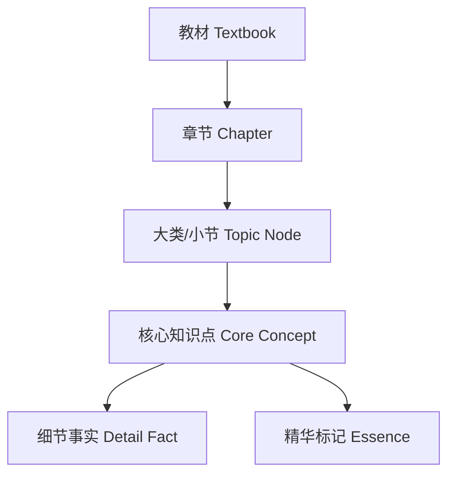

# MedEssence Agent 改进02方案：分层知识图谱与高质量整合

> 检查时间：2026-05-10-12：05  
> 检查目录：`C:\try03`  
> 目标：解决“每本教材图谱节点仍然太少、结构不清晰、整合质量不稳定、整合理由不够完整”的问题。  
> 核心建议：从“平铺抽知识点 + 事后压缩”升级为“章节大类层 -> 核心知识点层 -> 精华压缩层”的分层知识图谱。

---

## 1. 当前项目最新状态

相比上一版，项目已经有明显改进：

1. `.env` 已配置 DeepSeek：
   - `LLM_PROVIDER=deepseek`
   - `LLM_BASE_URL=https://api.deepseek.com`
   - `LLM_MODEL=deepseek-v4-pro`
   - `LLM_API_KEY` 已写入 `.env`
2. 后端配置已从 `OPENAI_*` 升级为更通用的 `LLM_*`。
3. 数据库模型已经新增质量与精华字段：
   - `quality_score`
   - `confidence`
   - `granularity`
   - `learning_objective`
   - `is_essence`
   - `essence_score`
   - `essence_reason`
4. 整合决策模型也新增了：
   - `evidence`
   - `alternatives_considered`
   - `rejected_alternatives_reason`
   - `risk`
   - `created_by`
5. 前端已经能在决策列表展示 `reason`，节点详情也能展示质量评分、精华概念、学习目标和关联决策。
6. `model_status.py`、`benchmark.py` 已补齐，系统模型状态和 Benchmark 能力有了入口。

但真实数据层面仍然很薄：

| 指标 | 当前值 | 问题 |
|---|---:|---|
| 教材数 | 7 | 已登记 |
| 章节数 | 0 | 真实章节没有入库 |
| chunks | 3 | 只有演示 chunk |
| 知识节点 | 22 | 每本书 2-5 个节点，远低于可展示要求 |
| 关系边 | 10 | 四类关系都有，但数量太少 |
| 整合决策 | 6 | 仍是少量演示/局部生成决策 |

每本书当前节点数：

| 教材 | 当前节点数 |
|---|---:|
| 局部解剖学 | 2 |
| 组织学与胚胎学 | 2 |
| 生理学 | 4 |
| 医学微生物学 | 3 |
| 病理学 | 5 |
| 传染病学 | 3 |
| 病理生理学 | 3 |

结论：现在节点少的主要原因不是“分类太细”或“压缩太狠”，而是项目仍然没有完成真实教材的章节化、chunk 化和全量抽取。同时，当前抽取策略仍偏平铺，没有先建立章节大类层，因此即使后续节点变多，也容易变乱。

---

## 2. 对你的想法的判断

你的想法是正确的，应该采用：

```text
每本教材
  -> 章节/小节大类节点
    -> 大类下核心知识点
      -> 精华知识点标记
        -> 跨教材相似性整合
```

这比当前“直接从章节内容抽节点，然后拿全部节点做相似度整合”的方式更好，原因如下：

1. 图谱更清晰：先有章节主题和大类，用户可以理解这本书的知识结构。
2. 节点可以更多：不是把所有知识点直接挤在一张图上，而是按大类折叠展示。
3. 关系更自然：`contains` 可以由章节大类自动生成，`parallel` 可以由同一大类下的兄弟节点生成，`prerequisite` 可以按学习顺序生成，`applies_to` 可以连接机制、疾病、诊断和治疗。
4. 整合质量更高：跨教材相似性比较时，不再只看节点名称和定义，而是同时看教材、章节、大类、类别、原文依据和关系上下文。
5. 压缩更合理：压缩不应该先把每本书节点删少，而应该先保留完整结构，再标记哪些节点属于精华层。

关键原则：

> 不要把“可视化图谱”和“30% 精华压缩结果”混成一个东西。  
> 图谱可以展示更多节点，精华压缩只是给节点打 `is_essence=true/false` 标记。

---

## 3. 当前节点少的具体原因

### 3.1 数据库仍是演示数据

数据库里 `Chapter=0`，说明 7 本教材并没有真正被解析成章节。当前 `setup_demo.py` 只是登记教材元信息，并写入少量演示节点。

所以前端看到每本书只有几个节点，是数据库真实状态导致的。

### 3.2 已有 demo 节点会阻止真实抽取

`kg_extraction_agent.py` 中有逻辑：

```python
existing_nodes = db.query(KnowledgeNode).filter(KnowledgeNode.textbook_id == textbook_id).count()
if existing_nodes > 0:
    return {"textbook_id": textbook_id, "nodes": existing_nodes, "edges": 0, "message": "Already extracted"}
```

这意味着只要某本书已有 2 个 demo 节点，系统就不会重新抽取真实章节。

必须增加：

1. `force_reextract=true`
2. 清理该教材旧 nodes/edges/decisions 的接口
3. demo 数据和真实数据的标记字段，例如 `created_by=demo_seed`

### 3.3 前端状态让用户难以重新解析

教材状态已经是 `parse_status=completed`，用户界面只会显示“提取图谱”，不容易触发重新解析。需要增加“重新解析”按钮。

### 3.4 当前抽取仍以章节/前若干 chunk 为中心

新代码已经支持 chunk 抽取，但仍有这一句：

```python
for ck in chunks[:15]:
```

这会限制每章最多处理 15 个 chunk。对医学教材长章节来说，后半部分仍会漏掉。

### 3.5 没有显式“章节大类节点”

当前 `granularity` 支持：

```text
chapter_topic | core_concept | detail_fact
```

但抽取流程没有稳定地产生：

```text
教材 -> 章 -> 节/大类 -> 核心节点
```

因此图谱缺少层次骨架。

### 3.6 关系补全不足

当前 LLM 抽取边不稳定，规则 fallback 生成的边很少。最终关系边只有 10 条，无法支撑清晰图谱。

---

## 4. 改进02核心架构

建议采用“三层图谱 + 三种视图”。

### 4.1 三层图谱



| 层级 | granularity | 是否默认展示 | 作用 |
|---|---|---|---|
| 教材层 | `textbook` | 是 | 区分 7 本书 |
| 章节层 | `chapter_topic` | 是 | 建立知识结构骨架 |
| 大类层 | `section_topic` | 是 | 让图谱按主题聚类 |
| 核心知识点层 | `core_concept` | 是 | 主要学习节点 |
| 细节事实层 | `detail_fact` | 默认折叠 | 作为 RAG 与证据，不直接铺满图 |
| 精华层 | `is_essence=true` | 可筛选 | 用于 30% 压缩结果 |

目前数据库只有 `chapter_topic/core_concept/detail_fact`，建议新增或约定 `section_topic`。如果不改表，也可以继续用 `granularity="chapter_topic"` 表示章/节主题，但更推荐细分。

### 4.2 三种视图

| 视图 | 展示内容 | 用途 |
|---|---|---|
| 结构视图 | 章节大类 + 核心节点 | 清楚展示每本书结构 |
| 精华视图 | `is_essence=true` 节点 | 展示压缩后的学习材料 |
| 整合视图 | 跨教材合并/互补/应用关系 | 展示七书归一效果 |

这样能同时满足：

1. 节点稍微多一些。
2. 图谱不乱。
3. 压缩结果仍然清晰。
4. 整合质量可解释。

---

## 5. 每本书节点数量目标

建议不要按“每本书固定抽 30 个节点”，而按章节和正文长度动态配额。

### 5.1 演示版目标

适合比赛/演示：

| 项目 | 目标 |
|---|---:|
| 每本教材章节大类节点 | 10-25 |
| 每本教材核心知识点 | 80-180 |
| 每本教材默认展示节点 | 80-120 |
| 7 本教材总节点 | 700-1200 |
| 默认整合视图显示 | 200-400 |

### 5.2 全量版目标

适合完整系统：

| 项目 | 目标 |
|---|---:|
| 每本教材核心知识点 | 250-500 |
| 7 本教材总核心节点 | 1800-3500 |
| 细节事实节点 | 5000+，默认不显示 |
| 关系边 | 节点数的 2-5 倍 |
| 孤立节点比例 | < 15% |

### 5.3 每章抽取配额

建议：

```text
每章 topic 节点：1 个
每章 section_topic 节点：3-8 个
每章 core_concept 节点：min(max(12, 章节字符数 / 1200), 45)
每章 detail_fact 节点：作为证据层保存，默认不展示
```

例如一章 24000 字：

```text
section_topic: 6-8 个
core_concept: 20 个左右
detail_fact: 50 个左右，不默认展示
```

---

## 6. 分层抽取流程

### 6.1 第一阶段：章节大类抽取

先从每章内容中抽取章节大类，不直接抽所有知识点。

输出：

```json
{
  "chapter_topic": {
    "name": "炎症",
    "definition": "本章围绕炎症的定义、病因、基本病理变化和结局展开。",
    "learning_objective": "掌握炎症的概念、基本病理变化及其临床意义"
  },
  "section_topics": [
    {
      "name": "炎症的定义",
      "scope": "概念与基本特征"
    },
    {
      "name": "炎症的基本病理变化",
      "scope": "变质、渗出、增生"
    },
    {
      "name": "炎症介质",
      "scope": "血管活性胺、补体、细胞因子等"
    }
  ]
}
```

自动生成 `contains`：

```text
第四章 炎症 -> 炎症的定义
第四章 炎症 -> 炎症的基本病理变化
第四章 炎症 -> 炎症介质
```

### 6.2 第二阶段：大类内核心节点抽取

对每个 `section_topic` 内的相关 chunks 抽取核心知识点。

输出：

```json
{
  "parent_topic": "炎症的基本病理变化",
  "nodes": [
    {
      "name": "变质",
      "category": "机制",
      "definition": "炎症局部组织发生变性和坏死的过程。",
      "importance": 4,
      "source_quote": "...",
      "quality_reason": "属于炎症三大基本病理变化之一"
    },
    {
      "name": "渗出",
      "category": "机制",
      "definition": "...",
      "importance": 5,
      "source_quote": "..."
    }
  ]
}
```

自动生成：

```text
炎症的基本病理变化 -> 变质      contains
炎症的基本病理变化 -> 渗出      contains
炎症的基本病理变化 -> 增生      contains
变质 <-> 渗出                   parallel
渗出 <-> 增生                   parallel
```

### 6.3 第三阶段：关系补全

对同一章、同一大类、跨大类节点做关系补全。

四类关系的生成规则：

| 关系 | 生成方式 |
|---|---|
| `contains` | 教材/章节/大类天然包含子节点 |
| `parallel` | 同一大类下同级概念，或同一分类下互补概念 |
| `prerequisite` | 基础概念、结构、正常功能 -> 机制、病理变化、疾病 |
| `applies_to` | 病原体/机制/结构/诊断/治疗 -> 疾病或临床应用 |

建议每个核心节点至少 1 条关系，核心节点平均 2-5 条关系。

### 6.4 第四阶段：质量校验

每章必须通过以下检查：

| 检查项 | 阈值 |
|---|---:|
| section_topic 数 | >= 3 |
| core_concept 数 | >= 12 |
| 四类关系覆盖 | 至少 2 类，整本书必须 4 类全覆盖 |
| 有原文依据节点比例 | >= 95% |
| 孤立核心节点比例 | < 15% |
| 低质量节点比例 | < 20% |

未通过时触发二次抽取或关系补全。

---

## 7. 关系类型设计

你的要求是至少包含：

1. 前置依赖
2. 并列关系
3. 包含关系
4. 应用关系

建议保留四大关系作为前端主分类，内部增加医学子类型。

### 7.1 四大关系

| relation_type | 中文 | 方向 | 示例 |
|---|---|---|---|
| `prerequisite` | 前置依赖 | A 是理解 B 的基础 | 静息电位 -> 动作电位 |
| `parallel` | 并列关系 | A 与 B 同级或互补 | 变质 <-> 渗出 |
| `contains` | 包含关系 | A 包含 B | 炎症 -> 渗出 |
| `applies_to` | 应用关系 | A 用于解释/导致/诊断/治疗 B | 结核分枝杆菌 -> 结核病 |

### 7.2 医学子关系

可选字段：

```text
relation_subtype
```

| relation_subtype | 映射到 | 示例 |
|---|---|---|
| `part_of` | contains | 上皮组织 -> 被覆上皮 |
| `subtype_of` | contains | 肉芽肿性炎 -> 慢性炎症 |
| `causes` | applies_to | 结核分枝杆菌 -> 结核病 |
| `manifests_as` | applies_to | 结核病 -> 咳嗽 |
| `diagnosed_by` | applies_to | 结核病 -> 痰涂片 |
| `treated_by` | applies_to | 结核病 -> 抗结核治疗 |
| `basis_of` | prerequisite | 静息电位 -> 动作电位 |
| `sibling_of` | parallel | 变质 -> 渗出 |

前端仍显示四大类，详情里显示子类型。

---

## 8. 跨教材整合方案

你说“整合是将每本书里面知识通过相似性整合”，这个方向对，但相似性不能只看文本向量。医学知识整合至少要结合五个因素：

```text
整合判断 = 名称相似 + 定义相似 + 类别一致 + 上下文相似 + 原文证据一致
```

### 8.1 候选召回

先用 embedding 找相似候选，但要做 blocking，避免全量 O(N²) 爆炸。

候选生成规则：

1. 只比较不同教材的节点。
2. 优先比较同 category 节点。
3. 允许少量跨 category 比较，例如病原体 -> 疾病，不做 merge，只做 applies_to。
4. 每个节点只取 top-k 候选，例如 top 10。
5. 对同名、别名、英文缩写直接加入候选。

### 8.2 决策类型

| 判断结果 | action | 图谱关系 |
|---|---|---|
| 定义等价、教学角色一致 | `merge` | 合并来源 |
| 同主题不同侧面 | `keep` | `parallel` |
| 上下位关系 | `keep` | `contains` |
| 因果/机制/应用关系 | `keep` | `applies_to` |
| 名称接近但医学上不同 | `keep` 或 `split` | `parallel` 或无边 |
| 低质量、重复事实 | `remove` | 仅保留引用证据 |

### 8.3 决策理由必须包含

每项整合决策必须给出：

1. 名称相似度。
2. 定义相似度。
3. 类别是否一致。
4. 原文证据。
5. 为什么 merge/keep/remove/split。
6. 如果不合并，说明是什么关系。
7. 可能导致的教学影响。
8. 置信度。

推荐决策结构：

```json
{
  "action": "keep",
  "result_name": "结核分枝杆菌 / 结核病",
  "similarity": {
    "name": 0.62,
    "definition": 0.71,
    "context": 0.86
  },
  "relation_type": "applies_to",
  "reason": "结核分枝杆菌是病原体，结核病是疾病，两者名称和上下文相关，但类别不同，不能合并。病原体会导致或应用于解释疾病，因此保留两个节点，并建立 applies_to 关系。",
  "causal_or_application_reason": "结核分枝杆菌感染人体后可引发结核病，因此微生物学中的病原学知识可应用到传染病学的疾病学习。",
  "evidence": [
    {
      "textbook": "医学微生物学",
      "quote": "结核分枝杆菌是引起人类结核病的病原菌..."
    },
    {
      "textbook": "传染病学",
      "quote": "结核病是由结核分枝杆菌引起的慢性传染病..."
    }
  ],
  "risk": "若误合并，会把病原体和疾病混为一谈，破坏医学分类。",
  "confidence": 0.95
}
```

### 8.4 合并后的节点不能丢来源

合并节点应保留：

1. canonical_name
2. aliases
3. merged_from
4. source_by_textbook
5. main_definition
6. complementary_notes
7. conflicts_or_differences

例如：

```json
{
  "canonical_name": "炎症",
  "merged_from": ["病理学:炎症", "病理生理学:炎症", "生理学:炎症反应"],
  "main_definition": "具有血管系统的活体组织对损伤因子发生的防御性反应。",
  "complementary_notes": [
    "病理学强调变质、渗出、增生。",
    "生理学强调机体防御反应和调节。",
    "病理生理学强调炎症介质和病理过程。"
  ]
}
```

---

## 9. 压缩策略调整

### 9.1 不要先压缩每本书

不建议先把每本书压成很少节点。这样会造成：

1. 图谱展示很空。
2. 跨教材对齐候选不足。
3. 一些互补内容在整合前就被删掉。
4. 教师无法判断系统删得是否合理。

推荐流程：

```text
先构建完整分层图谱
-> 再跨教材整合
-> 再标记精华节点
-> 最后生成 30% 精华内容
```

### 9.2 节点不删除，只分层显示

建议不要物理删除节点，而是用字段标记：

```text
is_essence = true/false
display_level = overview | normal | detail
compression_action = keep | merge | downrank | remove_from_essence
```

其中：

1. `remove_from_essence` 不等于从图谱删除。
2. 被压缩掉的节点仍可作为 RAG 证据和教师复核对象。
3. 前端默认展示 overview/normal，用户可展开 detail。

### 9.3 精华节点评分

```text
essence_score =
  0.20 * importance
+ 0.20 * quality_score
+ 0.15 * graph_centrality
+ 0.15 * prerequisite_value
+ 0.10 * cross_textbook_frequency
+ 0.10 * clinical_application_value
+ 0.10 * teacher_priority
```

医学教材中需要额外考虑：

| 价值 | 示例 |
|---|---|
| 基础结构价值 | 上皮组织、细胞膜、血管系统 |
| 机制价值 | 炎症、免疫应答、动作电位 |
| 疾病解释价值 | 结核病、休克、发热 |
| 临床应用价值 | 诊断、治疗、预防 |
| 跨教材桥接价值 | 病原体 -> 疾病；结构 -> 功能；机制 -> 表现 |

---

## 10. 展示策略：节点更多但不乱

### 10.1 默认视图

每本书默认展示：

1. 章节主题节点。
2. 每个章节前 5-10 个核心节点。
3. 章节内部的 contains 关系。
4. 关键 prerequisite 和 applies_to 边。

用户点击章节主题后展开更多节点。

### 10.2 折叠/展开

建议前端增加：

| 功能 | 说明 |
|---|---|
| 点击章节节点展开 | 显示该章节下全部核心节点 |
| 点击大类节点展开 | 显示该大类下详细节点 |
| 只看精华 | 过滤 `is_essence=true` |
| 只看跨教材关系 | 展示不同 textbook_id 的边 |
| 关系类型筛选 | 当前已有，可继续完善 |
| 低质量节点隐藏 | 默认隐藏 `quality_score < 0.65` |

### 10.3 节点视觉编码

| 维度 | 表现 |
|---|---|
| 教材来源 | 颜色 |
| granularity | 形状或边框 |
| importance | 节点大小 |
| quality_score | 边框透明度或告警 |
| is_essence | 金色描边 |
| is_merged | 双层边框 |
| teacher_locked | 紫色虚线 |

---

## 11. 后端改造清单

### P0：解决节点少

| 任务 | 文件 | 说明 |
|---|---|---|
| 增加强制重解析 | `textbooks.py` / `jobs.py` | 已完成状态也能重新解析 |
| 增加强制重抽取 | `kg_extraction_agent.py` | 不能因为 demo 节点阻止真实抽取 |
| 清理 demo 数据 | 新增脚本或 API | 删除 `created_by=demo_seed` 数据 |
| 真实生成 chapters | `pdf_parser.py` | 当前 DB 仍为 0，需要实际跑通 |
| 真实生成 chunks | `chunker.py` | 每本教材应有数百 chunk |
| 引入 chapter_topic/section_topic | `kg_extraction_agent.py` | 先抽结构，再抽节点 |

### P1：让结构清晰

| 任务 | 文件 | 说明 |
|---|---|---|
| 新增 topic extraction prompt | `prompts/` | 专门抽章节大类 |
| 新增关系补全 Agent | `kg_extraction_agent.py` 或新文件 | 保证四类关系足量 |
| 节点 quota 控制 | `kg_extraction_agent.py` | 按章节字符数动态抽取 |
| 节点质量复核 | 新增 `quality_service.py` | 低质量重试 |

### P2：整合质量

| 任务 | 文件 | 说明 |
|---|---|---|
| alignment 改为 top-k 候选 | `alignment_agent.py` | 避免 O(N²) |
| 分类 gating | `alignment_agent.py` | 疾病和病原体不能误合并 |
| 决策理由结构化 | `IntegrationDecision` / API | 返回相似度、原因、结果 |
| 跨教材边写入 | `alignment_agent.py` | keep 也要生成 parallel/contains/applies_to 边 |

### P3：展示体验

| 任务 | 文件 | 说明 |
|---|---|---|
| 支持折叠/展开 | `GraphCanvas.tsx` | 节点多但不乱 |
| 增加“只看精华” | `GraphCanvas.tsx` | 区分图谱与压缩层 |
| 决策详情弹窗 | `DecisionPanel.tsx` | 展示证据、风险、相似度 |
| 节点相关决策接口 | `chat.py` 或新 API | NodeDetail 不依赖全量 decisions |

---

## 12. 推荐新增数据字段

### 12.1 KnowledgeNode

建议新增或约定：

```text
parent_id STRING
section_title STRING
display_level STRING          # overview | normal | detail
node_role STRING              # textbook | chapter | section | concept | fact
created_by STRING             # demo_seed | topic_extraction | concept_extraction
source_type STRING            # llm | rule | teacher
```

如果暂时不改表，可将父子关系全部通过 `contains` 边表达。

### 12.2 KnowledgeEdge

建议新增：

```text
relation_subtype STRING
direction_reason TEXT
is_cross_textbook BOOLEAN
```

### 12.3 IntegrationDecision

建议新增：

```text
similarity_name FLOAT
similarity_definition FLOAT
similarity_context FLOAT
relation_type STRING
decision_effect TEXT
```

`decision_effect` 用来解释“这个合并/保留会导致什么教学结果”，例如：

```text
保留为 applies_to 关系后，学生可以从微生物学病原体自然跳转到传染病学疾病表现。
```

---

## 13. Prompt 建议

### 13.1 章节大类 Prompt

```text
你是医学教材结构化 Agent。
请只依据给定章节原文，抽取本章的大类知识结构。

要求：
1. 输出 JSON。
2. 先给出 1 个 chapter_topic。
3. 再给出 3-8 个 section_topic。
4. 每个 section_topic 必须说明教学范围。
5. 不要抽取细碎事实。

输出：
{
  "chapter_topic": {
    "name": "...",
    "definition": "...",
    "learning_objective": "..."
  },
  "section_topics": [
    {
      "local_id": "s1",
      "name": "...",
      "scope": "...",
      "source_quote": "..."
    }
  ],
  "edges": [
    {
      "source": "chapter_topic",
      "target": "s1",
      "relation_type": "contains",
      "description": "..."
    }
  ]
}
```

### 13.2 大类内核心节点 Prompt

```text
你是医学知识点抽取 Agent。
请只在指定 section_topic 范围内抽取核心知识点。

关系类型只能为：
prerequisite, parallel, contains, applies_to。

每个节点必须说明：
1. 为什么是核心知识点。
2. 原文依据。
3. 它和父大类的关系。
4. 它和其他节点的关系。

输出：
{
  "nodes": [...],
  "edges": [...]
}
```

### 13.3 整合决策 Prompt

```text
你是跨教材医学知识整合 Agent。
请判断两个知识节点应该 merge、keep、remove 还是 split。

必须考虑：
1. 名称相似度。
2. 定义相似度。
3. 医学类别是否一致。
4. 所在章节/大类上下文。
5. 原文证据。
6. 是否存在因果、诱发、应用或导致疾病关系。

输出 JSON：
{
  "action": "merge|keep|remove|split",
  "relation_type": "prerequisite|parallel|contains|applies_to|null",
  "reason": "至少80字",
  "similarity_reason": "...",
  "causal_or_application_reason": "...",
  "decision_effect": "该决策会导致/帮助形成什么学习路径",
  "evidence": [...],
  "risk": "...",
  "confidence": 0.0-1.0
}
```

---

## 14. 具体实施路线

### 第 1 步：清理与重跑真实数据

目标：不再被 demo 数据卡住。

要做：

1. 新增 `scripts/reset_graph_data.py`，清空 nodes/edges/decisions/chunks/chapters。
2. 或给每本教材增加“重新解析/重新抽取”。
3. 重新解析 7 本 PDF，确认 `Chapter > 0`、`Chunk > 1000`。

验收：

```text
chapters > 50
chunks > 1000
nodes 暂时可为 0
```

### 第 2 步：先生成章节大类图谱

目标：先让每本书结构清楚。

要做：

1. 对每章抽 `chapter_topic`。
2. 对每章抽 `section_topic`。
3. 自动写入 contains 边。

验收：

```text
每本书至少 10-25 个大类节点
contains 关系显著增加
```

### 第 3 步：按大类抽核心节点

目标：节点数量上来，但仍清楚。

要做：

1. 每个 section_topic 抽 5-15 个 core_concept。
2. 根据字符数动态配额。
3. 低质量节点重试。

验收：

```text
每本书 80-180 个核心节点
每个节点有 source_quote
```

### 第 4 步：关系补全

目标：四类关系都充足。

要做：

1. 自动生成 contains。
2. 对同父节点生成 parallel。
3. 按学习顺序和类别生成 prerequisite。
4. 对病原体、机制、诊断、治疗和疾病生成 applies_to。

验收：

```text
四类关系全部存在
边数 >= 节点数 * 2
孤立节点 < 15%
```

### 第 5 步：跨教材整合

目标：整合质量提升。

要做：

1. 按 category + embedding top-k 召回候选。
2. LLM 复核边界案例。
3. 对每条 merge/keep/remove/split 生成完整理由。
4. keep 的跨教材互补节点也要写入关系边。

验收：

```text
每条 decision 都有 reason、evidence、risk、confidence
每条跨教材 keep 决策说明为何不合并，以及建立何种关系
```

### 第 6 步：前端折叠展示

目标：展示节点更多但不乱。

要做：

1. 默认显示章节大类 + 高重要度节点。
2. 点击大类展开。
3. 增加“只看精华 / 看全部 / 看跨教材关系”。
4. 决策详情弹窗展示结构化理由。

验收：

```text
单本图谱默认 80-120 节点
整合图谱默认 200-400 节点
用户可展开更多
```

---

## 15. 改进后演示路径

建议演示时按这个顺序：

1. 打开工作台，展示 7 本教材和 DeepSeek 模型状态。
2. 点击《病理学》，先看到“章节大类图谱”：炎症、细胞损伤、肿瘤等主题。
3. 点击“炎症”大类，展开变质、渗出、增生、炎症介质等核心节点。
4. 打开关系筛选，只看 `contains`，展示章节结构。
5. 切换到 `prerequisite`，展示细胞损伤 -> 炎症。
6. 切换到 `applies_to`，展示机制 -> 疾病/临床应用。
7. 切换整合图，展示《病理学》《病理生理学》《生理学》中的炎症如何合并。
8. 打开整合决策，展示相似度、合并理由、原文证据和风险。
9. 在教师对话中输入：“炎症反应在生理学里更偏机体防御过程，不要完全删除来源差异。”
10. 系统把决策改为“合并主定义，保留互补说明”。

---

## 16. 最终判断

你的方向应该继续升级为：

```text
不是单纯增加节点数量，
而是增加“有层级、有关系、有依据、有整合理由”的节点。
```

最推荐的产品定义是：

> 每本教材先形成章节大类知识骨架，再在每个大类下提取核心知识点；图谱完整展示结构和关系，压缩层只标记精华节点而不删除图谱节点；跨教材整合通过名称、定义、类别、章节上下文和原文证据共同判断，并为每一项合并、保留、删除、拆分决策给出相似度、医学原因、教学影响和风险说明。

这样改完以后，节点会明显变多，结构也会更清楚，整合质量会比单纯相似度合并更可靠。
