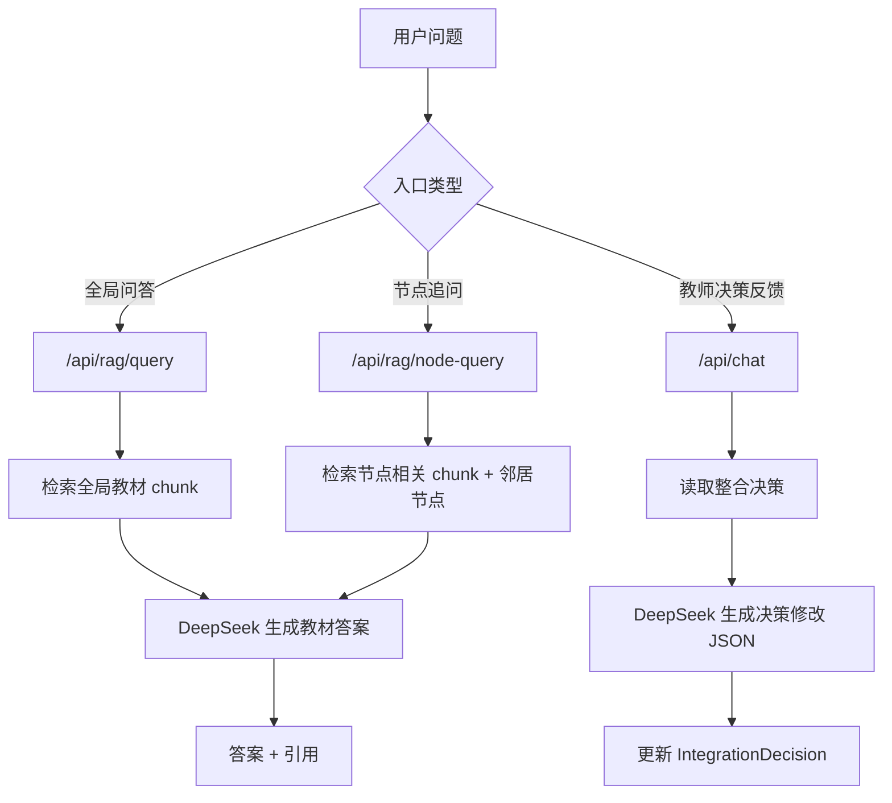

# MedEssence Agent 改进03方案：图谱抽取、布局可读性与统一 RAG 问答

> 检查时间：2026-05-10  
> 检查目录：`C:\try03`  
> 目标：解决“部分教材图谱待抽取且提取失败、图谱圆点布局混乱、RAG 构建和问答失败、节点详情内是否需要问答框、DeepSeek 与教材问答如何统一”等问题。

---

## 1. 当前项目最新体检结论

项目在改进02后已经新增了不少能力：

1. 后端新增了分层图谱字段：
   - `parent_id`
   - `display_level`
   - `node_role`
   - `created_by`
   - `source_type`
   - `relation_subtype`
   - `is_cross_textbook`
2. 后端新增了分层抽取逻辑：
   - `TOPIC_PROMPT`
   - `CONCEPT_PROMPT`
   - `extract_textbook_graph(textbook_id, force=False)`
3. 新增脚本：
   - `scripts/process_real_textbooks.py`
   - `scripts/seed_layered_demo.py`
4. 前端图谱已经有：
   - 结构视图
   - 全部核心
   - 精华视图
   - 跨教材关系
   - 粒度筛选
   - 关系筛选
   - 折叠详情
   - 只看跨教材
5. Python 编译通过，前端 `npm run build` 通过。

但是当前运行数据存在一个非常关键的问题：

```text
C:\try03\data\medessence.db 当前大小为 0 字节
数据库中没有 textbooks、chunks、knowledge_nodes 等表
```

这会直接导致：

1. 教材列表加载失败或状态异常。
2. 图谱提取失败。
3. RAG 构建失败，因为没有 `chunks` 表或没有 chunk。
4. 教师对话失败，因为没有 `integration_decisions` / `chat_history` 表。
5. ChromaDB 即使已有文件，也无法和 SQLite chunk 对齐。

所以本轮问题不只是 UI 或模型问题，而是：

> 数据库初始化、教材解析、图谱抽取、RAG 索引、问答入口之间缺少一个稳定的启动和健康检查流程。

---

## 2. 问题一：部分教材图谱状态待抽取，提取图谱失败

### 2.1 直接原因

当前最直接原因是 `data/medessence.db` 是空文件，没有表。只要后端读取这个文件，任何查询都会出现类似：

```text
sqlite3.OperationalError: no such table: textbooks
```

### 2.2 可能触发链路

项目中有两个脚本：

```text
scripts/process_real_textbooks.py
scripts/seed_layered_demo.py
```

其中 `process_real_textbooks.py --reset` 会删除所有图谱数据并重新注册教材。如果中途失败、进程被中断或没有成功 `init_db()`，就可能留下空库或半初始化库。

另外，`jobs.py` 虽然接收了 `force`：

```python
force = payload.get("force", False)
```

但解析任务调用：

```python
bg.add_task(process_textbook, job_id, textbook_id)
```

没有把 `force` 传给 `process_textbook`，而 `process_textbook()` 也没有真正实现强制重解析。这会导致用户点“重新解析”时，前端看起来支持，后端实际不一定覆盖旧数据。

### 2.3 图谱抽取失败的业务原因

图谱抽取依赖：

```text
Textbook -> Chapter -> Chunk -> KnowledgeNode / KnowledgeEdge
```

如果教材处于：

```text
parse_status=completed
graph_status=pending
chapters=0
chunks=0
```

则图谱抽取没有内容可以处理。现在 `_layered_extract()` 是按 `Chapter` 表循环：

```python
chapters = db.query(Chapter).filter(Chapter.textbook_id == book.id).all()
```

如果 `chapters` 是空，理论上会抽取 0 个节点。

### 2.4 改进建议

新增启动健康检查：

```text
GET /api/system/diagnostics
```

返回：

```json
{
  "database": {
    "path": "C:/try03/data/medessence.db",
    "exists": true,
    "size_bytes": 81920,
    "tables_ok": true
  },
  "counts": {
    "textbooks": 7,
    "chapters": 120,
    "chunks": 3500,
    "nodes": 900,
    "edges": 2200
  },
  "problems": []
}
```

如果数据库为空，前端不要继续让用户点“提取图谱”，而是提示：

```text
数据库未初始化，请先运行初始化/导入教材。
```

### 2.5 推荐修复顺序

1. 后端启动时调用 `init_db()` 后立即验证表是否存在。
2. 新增 `scripts/init_database.py`，只负责建表，不删除数据。
3. 新增 `scripts/reset_and_seed.py`，显式确认后才清空数据。
4. `process_textbook(job_id, textbook_id, force=False)` 真正支持 force。
5. 解析完成后再允许图谱抽取。
6. 图谱抽取前检查：

```text
chapters > 0
chunks > 0
```

否则直接返回清晰错误：

```text
请先解析教材并生成 chunk，再提取知识图谱。
```

---

## 3. 问题二：图谱圆点摆放不规整，不容易观看

### 3.1 当前原因

前端 `GraphCanvas.tsx` 使用的是 Cytoscape 的 `cose` 力导向布局：

```ts
const layoutOptions = {
  name: 'cose',
  animate: true,
  nodeRepulsion: () => 10000,
  idealEdgeLength: 120,
  gravity: 0.25,
}
```

力导向布局适合“探索关系网络”，但不适合“教材章节结构”。对于医学教材知识图谱，用户更需要看清：

```text
教材 -> 章节主题 -> 大类 -> 核心知识点 -> 关系
```

因此单纯小圆点随机散开会显得乱。

### 3.2 推荐改为三种布局

不要只保留一种布局。建议图谱提供三个布局模式：

| 布局模式 | 技术方案 | 用途 |
|---|---|---|
| 树状布局 | `breadthfirst` 或自定义 preset | 单本教材结构最清楚 |
| 分泳道布局 | 自定义 preset | 整合图中按教材分列展示 |
| 网络布局 | `cose` | 用于查看跨教材复杂关系 |

### 3.3 单本教材：树状布局

单本教材默认使用树状布局：

```text
章节主题
  ├── 大类 A
  │   ├── 核心节点 1
  │   ├── 核心节点 2
  │   └── 核心节点 3
  ├── 大类 B
  │   ├── 核心节点 4
  │   └── 核心节点 5
```

Cytoscape 可以先用内置：

```ts
const treeLayout = {
  name: 'breadthfirst',
  directed: true,
  roots: chapterTopicIds,
  spacingFactor: 1.4,
  animate: true,
  fit: true,
  padding: 40,
};
```

如果想更规整，建议后续引入：

```text
cytoscape-dagre
```

`dagre` 对有向无环图更适合，树状和层级关系更稳定。

### 3.4 整合图：教材泳道布局

整合图不建议简单全部混在一起。推荐按教材分列：

```text
局部解剖学 | 组织学 | 生理学 | 微生物学 | 病理学 | 传染病学 | 病理生理学
    节点       节点     节点       节点      节点      节点        节点
```

跨教材边横向连接。

好处：

1. 一眼能看出节点来自哪本书。
2. 跨教材关系更醒目。
3. 不同教材不会混成一团。

实现方式：

```text
x = textbookIndex * laneWidth
y = granularityLevel * rowHeight + localIndex * gap
```

其中：

```text
chapter_topic y=0
section_topic y=150
core_concept y=300+
```

使用 Cytoscape `preset` 布局：

```ts
layout={{ name: 'preset' }}
```

节点位置由后端或前端计算。

### 3.5 视图切换建议

在图谱工具栏新增：

```text
布局：树状 / 泳道 / 网络
```

默认策略：

| 页面 | 默认布局 |
|---|---|
| 单本图谱 | 树状 |
| 整合图谱 | 泳道 |
| 跨教材关系视图 | 网络或泳道 |

---

## 4. 问题三：RAG 构建或问答失败

### 4.1 RAG 的必要前置条件

RAG 不是只配置 DeepSeek 就能回答。它需要：

```text
教材 PDF
  -> 解析成 Chapter
    -> 切成 Chunk
      -> 向量化 Embedding
        -> 写入 ChromaDB
          -> 查询时检索 chunk
            -> DeepSeek 根据 chunk 生成回答
```

当前项目的 RAG 构建函数：

```python
chunks = db.query(Chunk).all()
if not chunks:
    return {"indexed": 0, "message": "No chunks to index"}
```

所以如果：

```text
chunks=0
```

RAG 一定无法构建。

### 4.2 当前更严重的问题

现在 `data/medessence.db` 是 0 字节，连 `chunks` 表都没有。因此不是“RAG 要不要提前加载”的问题，而是：

```text
数据库和 chunk 还没有准备好
```

### 4.3 RAG 是否要提前加载

建议分两层：

1. 系统启动时检查 RAG 是否可用。
2. 教材解析完成后自动构建或提示构建。

不建议每次用户问问题时才完整构建 RAG，因为教材很多，构建时间会比较长。

推荐流程：

```text
解析教材完成 -> 自动触发 /api/rag/index
RAG 过期 -> 顶部显示“索引需更新”
用户问问题 -> 如果未索引，明确提示并提供“一键构建”
```

### 4.4 RAG 状态要更细

当前前端只知道：

```ts
indexed: boolean
chunk_count: number
```

建议扩展为：

```json
{
  "status": "not_ready | no_chunks | building | ready | stale | error",
  "chunk_count": 3500,
  "chroma_count": 3500,
  "last_built_at": "2026-05-10T13:20:00",
  "message": "RAG 已就绪"
}
```

这样用户不会只看到“失败”，而能知道缺哪一步。

---

## 5. 问题四：教师问答输入问题失败

### 5.1 现在“教师对话”不是教材问答

当前 `TeacherChatPanel` 调用：

```ts
api.sendChatMessage(message)
```

对应后端：

```text
POST /api/chat
```

后端 `teacher_dialogue_agent.py` 的职责是：

```text
把教师自然语言反馈转换成整合决策修改
```

它不是教材内容问答。

也就是说：

| 功能 | 当前入口 | 作用 |
|---|---|---|
| RAG 问答 | RAG 问答 Tab | 根据教材 chunk 回答问题 |
| 教师对话 | 教师对话 Tab | 修改 merge/keep/remove/split 决策 |

如果你在“教师对话”里问：

```text
炎症的基本病理变化是什么？
```

系统会尝试把它解释为“整合决策反馈”，自然容易失败或答非所问。

### 5.2 推荐改名

建议把右侧 Tab 改为：

```text
教师决策反馈
```

不要叫“教师对话”或“教室问答”，否则用户会误以为这是教材问答入口。

### 5.3 如果想让教师也能问教材内容

建议统一走 RAG，而不是再写一套教师问答。

可以在教师反馈面板增加两个模式：

```text
模式一：教材问答
模式二：整合决策修改
```

但底层调用应统一：

```text
教材问答 -> /api/rag/query
决策修改 -> /api/chat
```

---

## 6. 节点详情内是否需要问答框

### 6.1 结论

建议需要，但不要单独做一套新模型。

节点详情内问答应是：

```text
RAG 的节点上下文版本
```

也就是：

```text
点击节点 -> 带着 node_id 提问 -> 检索该节点相关教材片段 -> DeepSeek 回答
```

### 6.2 为什么不是二选一

全局 RAG 和节点内问答不是二选一，而是同一个 RAG 的两个入口：

| 问答入口 | 检索范围 | 用途 |
|---|---|---|
| 全局 RAG 问答 | 全部教材 chunk | 用户自由提问 |
| 节点内问答 | 当前节点 + 邻居节点 + 同章节 chunk | 围绕某个知识点追问 |

底层应该统一用同一个：

```text
RAG 索引
DeepSeek 配置
引用格式
防幻觉规则
```

### 6.3 节点内问答的推荐接口

新增：

```text
POST /api/rag/node-query
```

请求：

```json
{
  "node_id": "book_05_ch_004_c_xxxxxx",
  "question": "这个知识点和渗出有什么关系？"
}
```

后端流程：

```text
1. 根据 node_id 找 KnowledgeNode。
2. 优先读取 node.source_chunk_id。
3. 如果没有 source_chunk_id，则取同 textbook + chapter 的 chunks。
4. 找该节点的一跳邻居：
   - prerequisite
   - parallel
   - contains
   - applies_to
5. 将节点定义、原文、邻居关系和检索 chunk 一起交给 DeepSeek。
6. 回答必须引用教材、章节、页码。
```

### 6.4 节点内 Prompt

```text
你是医学教材节点问答助手。
你只能依据当前知识节点、关联节点和检索到的教材原文回答。

当前节点：
{node_name}
定义：{node_definition}
来源：{textbook}, {chapter}, 第{page}页

关联关系：
{neighbor_edges}

教材片段：
{retrieved_chunks}

用户问题：
{question}

要求：
1. 先直接回答问题。
2. 如果涉及关系，说明是前置依赖、并列、包含还是应用。
3. 必须给引用：[教材, 章节, 第X页]。
4. 如果依据不足，回答“当前节点上下文中未找到相关信息”。
```

---

## 7. DeepSeek 配置与 RAG 的关系

DeepSeek 是生成模型，RAG 是知识检索机制。两者关系如下：

```text
RAG 负责找教材依据
DeepSeek 负责基于依据组织答案
```

如果只有 DeepSeek，没有 RAG：

1. 可能使用外部知识。
2. 不能保证引用教材页码。
3. 容易幻觉。

如果只有 RAG，没有 DeepSeek：

1. 只能返回原文片段。
2. 不能生成解释性答案。

所以正确方案是：

```text
统一 RAG 库 + DeepSeek 生成
```

不要为全局问答、节点问答、教师内容问答分别建三套模型。

---

## 8. 推荐统一问答架构



### 8.1 三个入口的边界

| 入口 | API | 是否依赖 RAG | 是否修改数据库 |
|---|---|---|---|
| 全局教材问答 | `/api/rag/query` | 是 | 否 |
| 节点内追问 | `/api/rag/node-query` | 是 | 否 |
| 教师决策反馈 | `/api/chat` | 否，主要依赖 decisions | 是 |

### 8.2 前端命名

建议：

| 当前名称 | 建议名称 |
|---|---|
| RAG 问答 | 教材问答 |
| 教师对话 | 教师决策反馈 |
| 节点详情内问答 | 围绕此节点追问 |

---

## 9. 改进03实施清单

### P0：先修数据链路

| 任务 | 位置 | 说明 |
|---|---|---|
| 增加数据库诊断接口 | `backend/api/system.py` | 检查 DB 文件、表、计数 |
| 启动时检测空库 | `backend/main.py` | 空库时返回明确提示 |
| 新增初始化脚本 | `scripts/init_database.py` | 只建表，不清数据 |
| 修复 force parse | `orchestrator.py` / `ingestion_agent.py` | 重新解析必须清章节/chunk |
| 图谱抽取前置检查 | `kg_extraction_agent.py` | 无 chapters/chunks 时拒绝抽取 |
| Job 错误写清楚 | `orchestrator.py` | 前端能看到失败原因 |

### P1：修 RAG 链路

| 任务 | 位置 | 说明 |
|---|---|---|
| RAG 状态细分 | `backend/api/rag.py` | no_chunks/building/ready/stale/error |
| 解析后自动提示重建索引 | `App.tsx` | chunk 变化后提示 |
| 构建索引前检查 chunk | `rag_agent.py` | 无 chunk 不调用 embedding |
| Chroma 与 SQLite 版本一致性 | `vector_store.py` | 记录 index version |
| 查询前检查索引 | `rag_agent.py` | 未就绪返回明确错误 |

### P2：节点内问答

| 任务 | 位置 | 说明 |
|---|---|---|
| 新增 `/api/rag/node-query` | `backend/api/rag.py` | 节点上下文问答 |
| 新增 `query_node_rag()` | `rag_agent.py` | 检索节点、邻居和同章 chunk |
| NodeDetail 增加问答框 | `NodeDetail.tsx` | “围绕此节点追问” |
| 引用仍走统一 Citation | `types/index.ts` | 不另建格式 |

### P3：图谱布局

| 任务 | 位置 | 说明 |
|---|---|---|
| 新增 layoutMode | `GraphCanvas.tsx` | tree/lane/network |
| 单本默认树状布局 | `GraphCanvas.tsx` | `breadthfirst` |
| 整合默认泳道布局 | `GraphCanvas.tsx` | `preset` 坐标 |
| 跨教材边高亮 | `graph.py` / `GraphCanvas.tsx` | 后端返回 `is_cross_textbook` |
| 后端返回 granularity/display_level | `graph.py` | 当前序列化未完整返回 |

### P4：教师反馈边界

| 任务 | 位置 | 说明 |
|---|---|---|
| Tab 改名 | `App.tsx` | 教师对话 -> 教师决策反馈 |
| 教师面板增加说明 | `TeacherChatPanel.tsx` | 告知这里用于改整合决策 |
| 教材问答统一跳 RAG | `TeacherChatPanel.tsx` 可选 | 提供“转到教材问答”按钮 |

---

## 10. 当前代码中需要特别注意的点

### 10.1 `GraphCanvas` 使用了字段，但后端没有完整返回

前端使用：

```ts
n.granularity
n.created_by
n.display_level
n.parent_id
```

但 `backend/api/graph.py` 当前 `_serialize_node()` 没有返回这些字段。

这会导致：

1. 结构视图过滤不准确。
2. 粒度筛选可能为空。
3. 节点详情里创建来源和父节点不显示。

必须补：

```python
"granularity": n.granularity,
"display_level": n.display_level,
"created_by": n.created_by,
"parent_id": n.parent_id,
"node_role": n.node_role,
```

### 10.2 `display_level` 类型不一致

数据库里：

```python
display_level = Column(String, default="normal")
```

前端类型里：

```ts
display_level?: number;
```

应改为：

```ts
display_level?: string;
```

否则虽然构建通过，但语义不对。

### 10.3 `benchmark` 返回类型和前端类型不一致

`/api/benchmark` 返回：

```json
{
  "results": [...],
  "total": 20,
  "model": "...",
  "base_url": "..."
}
```

但前端：

```ts
api.get<BenchmarkResult[]>('/benchmark')
```

这会导致 `BenchmarkPanel` 期望数组，实际拿到对象。

应改为：

```ts
api.get<{ results: BenchmarkResult[]; total: number }>('/benchmark')
```

或后端直接返回数组。

### 10.4 `process_textbook` 没有使用 force

前端已传 `force`，但后端 parse 流程没有真正处理。

需要：

```python
def process_textbook(job_id, textbook_id, force=False):
    ...
```

并在 `ingest_textbook(textbook_id, force=False)` 中清除旧章节和旧 chunk。

### 10.5 RAG 和 Chat 要明确分工

当前用户容易把 `TeacherChatPanel` 当教材问答用。建议 UI 文案直接说明：

```text
这里用于修改整合决策；教材知识问答请使用“教材问答”。
```

---

## 11. 推荐用户流程

系统应该引导用户按以下顺序操作：

```text
1. 初始化数据库
2. 导入/解析教材
3. 生成 chunks
4. 提取分层知识图谱
5. 构建 RAG 索引
6. 使用教材问答或节点内追问
7. 运行整合
8. 教师反馈修改整合决策
```

前端可以用状态灯显示：

| 状态 | 条件 |
|---|---|
| 数据库就绪 | tables ok |
| 教材已解析 | chapters > 0 |
| RAG 可构建 | chunks > 0 |
| RAG 就绪 | chroma_count ≈ chunk_count |
| 图谱就绪 | nodes > 0, edges > 0 |
| 整合就绪 | decisions > 0 |

---

## 12. 结论

本轮最重要的判断是：

1. 图谱抽取失败，优先查数据库和章节/chunk，不要先怀疑 DeepSeek。
2. RAG 构建失败，通常是 chunk 没有准备好或 Chroma 与 SQLite 不同步。
3. 教师对话不是教材问答，应该改名为“教师决策反馈”。
4. 节点内问答应该做，但必须复用统一 RAG 库，不要另起一套问答系统。
5. 图谱布局应从单一 `cose` 力导向，升级为树状、泳道、网络三种布局。
6. 当前 `data/medessence.db` 是 0 字节，这是必须先解决的 P0 问题。

最终推荐架构：

```text
统一教材数据层
  -> SQLite: textbooks / chapters / chunks / nodes / edges / decisions
  -> ChromaDB: textbook_chunks

统一 RAG 层
  -> 全局教材问答
  -> 节点内追问
  -> 引用统一
  -> DeepSeek 统一生成

独立教师反馈层
  -> 只负责解释和修改整合决策

多布局图谱层
  -> 单本树状
  -> 整合泳道
  -> 关系网络
```

这样做后，用户看到的是一个稳定的学习系统，而不是几个互相孤立的按钮。
