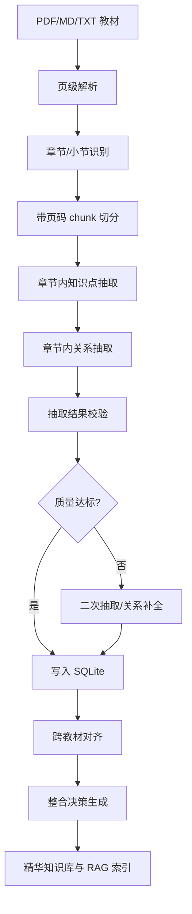

# MedEssence Agent 项目现状分析与改进方案

> 检查时间：2026-05-10-11.13am
> 检查目录：`C:\try03`  
> 目标：解决“教材知识图谱节点过少、关系类型不完整、知识点质量不足、整合决策理由不充分、DeepSeek API 接入不明确”等问题。

---

## 1. 结论摘要

当前项目已经完成了一个可演示的医学教材整合工作台雏形：前端可以上传教材、查看知识图谱、查看整合决策、进行 RAG 问答和教师对话；后端具备 FastAPI、SQLite、ChromaDB、OpenAI 兼容 LLM 调用、知识抽取、对齐、压缩、RAG 和报告模块。

但是，当前系统主要还是“演示种子数据 + 初步流水线”的状态，尚未完成 7 本教材的真实全量知识抽取。数据库里登记了 7 本教材，但实际章节数为 0、RAG chunk 只有 3 个、知识节点只有 22 个、关系边只有 20 条、整合决策只有 5 条。因此你看到“知识节点太少”是项目真实数据状态导致的，不是图谱显示问题。

DeepSeek API 目前没有实际接入。代码使用 OpenAI 兼容 SDK，并支持通过 `OPENAI_BASE_URL` 切换到 DeepSeek，但当前项目没有 `.env` 文件，运行环境中的 `OPENAI_API_KEY`、`OPENAI_BASE_URL`、`LLM_MODEL` 均为空，`.env.example` 仍指向 OpenAI 默认地址和 `gpt-4o-mini`。

---

## 2. 当前项目实测状态

### 2.1 文件结构

项目主体结构如下：

```text
C:\try03
├── backend/                 # FastAPI 后端
│   ├── agents/              # ingestion、kg_extraction、alignment、compression、rag、teacher_dialogue、report
│   ├── api/                 # textbooks、jobs、graph、rag、chat、report
│   ├── services/            # pdf_parser、chunker、embeddings、vector_store
│   ├── prompts/             # LLM Prompt
│   └── skills/              # Agent skill 说明
├── frontend/                # React + TypeScript + Vite + Ant Design + Cytoscape
├── data/                    # SQLite 与 Chroma 持久化
├── docs/                    # 设计文档
├── report/                  # 整合报告
├── 教材/                    # 7 本医学教材 PDF
└── setup_demo.py            # 当前演示数据初始化脚本
```

### 2.2 数据库真实统计

当前 `data/medessence.db` 中的数据如下：

| 指标 | 当前值 | 判断 |
|---|---:|---|
| 登记教材 | 7 本 | 已有教材元信息 |
| 章节数 | 0 | 未完成真实章节解析入库 |
| RAG chunks | 3 | 只有演示 chunk |
| 知识节点 | 22 | 明显不足 |
| 知识关系 | 20 | 明显不足，且存在重复插入风险 |
| 整合决策 | 5 | 只有演示决策 |

节点按教材分布：

| 教材 | 节点数 |
|---|---:|
| 局部解剖学 | 2 |
| 组织学与胚胎学 | 2 |
| 生理学 | 4 |
| 医学微生物学 | 3 |
| 病理学 | 5 |
| 传染病学 | 3 |
| 病理生理学 | 3 |

关系类型分布：

| 关系类型 | 数量 |
|---|---:|
| `contains` | 8 |
| `applies_to` | 6 |
| `prerequisite` | 4 |
| `parallel` | 2 |

这些关系类型正好覆盖了你要求的前置依赖、并列关系、包含关系和应用关系，但数量太少，来源主要是演示脚本，而不是从教材中真实抽取。

### 2.3 验证结果

已做的轻量验证：

| 验证项 | 结果 |
|---|---|
| Python 语法编译：`python -m compileall backend` | 通过 |
| 前端构建：`npm run build` | 通过 |
| 前端构建警告 | JS bundle 约 1.55MB，建议后续代码分包 |

---

## 3. DeepSeek API 接入结论

### 3.1 当前是否接入 DeepSeek

结论：没有实际接入。

证据：

1. 项目没有 `.env` 文件。
2. 当前运行环境变量为空：
   - `OPENAI_API_KEY=<empty>`
   - `OPENAI_BASE_URL=<empty>`
   - `LLM_MODEL=<empty>`
3. `.env.example` 中仍是：

```env
OPENAI_API_KEY=sk-your-api-key-here
OPENAI_BASE_URL=https://api.openai.com/v1
LLM_MODEL=gpt-4o-mini
```

4. 代码中只有 OpenAI 兼容调用：

```python
client = openai.OpenAI(api_key=OPENAI_API_KEY, base_url=OPENAI_BASE_URL)
```

这说明项目“具备切换到 DeepSeek 的技术入口”，但没有配置 DeepSeek。

### 3.2 推荐接入方式

DeepSeek 官方文档说明其 API 兼容 OpenAI Chat Completions，OpenAI SDK 的 `base_url` 可设为 `https://api.deepseek.com`。截至本次检查，官方文档还列出了 `deepseek-v4-flash`、`deepseek-v4-pro`，并说明旧的 `deepseek-chat`、`deepseek-reasoner` 会在 2026-07-24 后废弃。

建议把项目改为供应商无关的命名，避免变量名误导：

```env
LLM_PROVIDER=deepseek
LLM_API_KEY=你的 DeepSeek API Key
LLM_BASE_URL=https://api.deepseek.com
LLM_MODEL=deepseek-v4-flash
```

为了最小改动，也可以先沿用现有变量：

```env
OPENAI_API_KEY=你的 DeepSeek API Key
OPENAI_BASE_URL=https://api.deepseek.com
LLM_MODEL=deepseek-v4-flash
```

建议新增一个后端接口或启动日志，明确显示当前模型配置：

```json
{
  "provider": "deepseek",
  "base_url": "https://api.deepseek.com",
  "model": "deepseek-v4-flash",
  "api_key_configured": true
}
```

注意：接口不要返回完整 API Key，只返回是否已配置。

参考资料：

- DeepSeek 官方 API 文档：`https://api-docs.deepseek.com/`
- DeepSeek 官方首次调用说明：`https://api-docs.deepseek.com/zh-cn/`

---

## 4. 关键问题清单

### 4.1 教材没有真实全量解析

当前 7 本教材只是被 `setup_demo.py` 登记为已完成状态，`Textbook` 表中有页数和字符数，但 `Chapter` 表为 0。这意味着知识抽取 Agent 没有真实章节输入。

影响：

1. 图谱节点只能来自演示数据。
2. RAG 只能检索 3 个演示 chunk。
3. 整合报告中的统计不是全量教材结果。
4. “压缩到 30%”没有真实数据依据。

### 4.2 解析流水线存在递归 bug

`backend/agents/ingestion_agent.py` 中：

```python
from backend.services.chunker import chunk_textbook

def chunk_textbook(textbook_id: str) -> int:
    return chunk_textbook(textbook_id)
```

这里函数名覆盖了导入函数，调用时会递归调用自己，导致分块阶段失败。`orchestrator.process_textbook()` 调用的正是这个包装函数。

修复建议：

```python
from backend.services.chunker import chunk_textbook as chunk_textbook_service

def chunk_textbook(textbook_id: str) -> int:
    return chunk_textbook_service(textbook_id)
```

### 4.3 PDF 解析缺少页码级结构

当前 `pdf_parser.py` 会把所有页面文本拼成一个 `full_text`，再按“第X章”切分。切分后的章节页码统一是 `1`，没有真实页码范围。

影响：

1. RAG 引用页码不可靠。
2. 节点详情页码不可靠。
3. 无法按页、节、小节追踪原文证据。
4. 教师无法检查模型依据。

修复方向：

1. PDF 解析时保留 `page_no -> page_text`。
2. 章节识别时记录章节起止页。
3. chunk 必须保留 `page_start`、`page_end`。
4. source quote 必须能定位到 chunk 和页码。

### 4.4 知识抽取节点上限和兜底策略过于粗糙

当前 LLM 抽取每章最多 `MAX_CHAPTER_NODES=30`，并且只截断章节前 8000 字：

```python
content=content[:8000]
```

如果章节很长，后半部分完全不会被抽取。LLM 失败时走规则兜底，而规则兜底只是用正则抽关键词，还会生成 `related` 关系，不符合你要求的四类关系。

影响：

1. 节点少。
2. 关系少。
3. 后半章节知识缺失。
4. fallback 关系类型质量低。

### 4.5 整合决策没有真正覆盖每一项动作

数据库已有 `IntegrationDecision.reason` 字段，说明系统有“记录理由”的设计基础。但当前实现只在部分合并、保留、删除时产生简单理由，且压缩阶段生成的删除决策没有显式 `commit`，可能不会持久化。

当前缺口：

1. 不是每个保留节点都有决策理由。
2. 不是每个删除节点都有充分理由。
3. 合并后没有创建真实 merged node。
4. 决策没有记录“证据来源、备选方案、风险、是否教师覆盖”。
5. 前端 `DecisionPanel` 没有展示 `reason` 字段。

### 4.6 RAG 状态判断不准确

`/api/rag/status` 只统计 `Chunk` 表数量：

```python
return {"indexed": count > 0, "chunk_count": count}
```

这不能证明 ChromaDB 索引已建立。当前 chunk 有 3 个，所以前端可能显示“已索引”，但真实向量库集合可能不存在或不是最新。

修复方向：

1. 检查 Chroma collection 是否存在。
2. 检查 collection count 是否等于 chunks count。
3. 在 `Textbook.index_status` 或独立 `rag_index_status` 中记录索引版本。

### 4.7 前端存在若干演示与后端不一致问题

| 问题 | 位置 | 影响 |
|---|---|---|
| 上传提示支持 EPUB/DOCX，但后端只支持 PDF/MD/TXT | `TextbookPanel.tsx` | 用户会上传失败 |
| `deleteTextbook` 客户端存在，后端没有 DELETE 接口 | `client.ts` | 功能不完整 |
| Benchmark 前端调用 `/api/benchmark`，后端没有对应路由 | `BenchmarkPanel` / `client.ts` | Tab 无法获取数据 |
| 导出报告后缀写成 PDF，但后端返回 Markdown | `App.tsx` | 文件类型误导 |
| 报告压缩比用节点数/字符数粗算 | `ReportPanel.tsx` | 压缩比不可信 |
| 决策列表不显示 reason | `DecisionPanel.tsx` | 不能满足“每项决策给理由” |

---

## 5. 知识图谱改进目标

### 5.1 节点规模目标

当前 22 个节点不足以体现 7 本教材整合价值。建议分两级目标：

| 阶段 | 目标节点数 | 说明 |
|---|---:|---|
| 演示增强版 | 300-600 | 每本教材抽核心章节，每章 15-30 个节点 |
| 全量版 | 1500-3000 | 7 本教材按章节全量抽取，关键章节提高密度 |

不建议盲目追求上万节点。医学教材图谱要优先保证“可学、可查、可解释”，而不是把所有名词都塞进图谱。

### 5.2 知识点粒度标准

一个知识点节点必须满足：

1. 可独立学习：能被学生单独理解或记忆。
2. 有原文依据：必须能定位到教材 chunk、章节、页码和原文句子。
3. 有教学角色：属于结构、机制、疾病、病原体、表现、诊断、治疗、核心概念等类别。
4. 可建立关系：至少能和其他节点形成前置、包含、并列或应用关系之一。
5. 非纯噪声：不是页眉、图注残片、孤立数字、目录项或无定义名词。

### 5.3 必须支持的关系类型

根据你的要求，关系至少包含以下四类：

| 关系类型 | 中文名 | 方向 | 示例 |
|---|---|---|---|
| `prerequisite` | 前置依赖 | A 是理解 B 的基础 | 静息电位 -> 动作电位 |
| `parallel` | 并列关系 | A 与 B 同级、同类或互补 | 变质 <-> 渗出 |
| `contains` | 包含关系 | A 包含 B，或 B 是 A 的组成/阶段 | 炎症 -> 渗出 |
| `applies_to` | 应用关系 | A 被用于解释/导致/应用到 B | 结核分枝杆菌 -> 结核病 |

建议内部增加几个医学常用子类型，但前端可先折叠映射到四大类：

| 子类型 | 可映射到 | 示例 |
|---|---|---|
| `causes` | `applies_to` | 病原体导致疾病 |
| `manifests_as` | `applies_to` | 疾病表现为症状 |
| `diagnosed_by` | `applies_to` | 疾病通过检查诊断 |
| `treated_by` | `applies_to` | 疾病通过治疗方案处理 |
| `part_of` | `contains` | 组织属于器官结构 |
| `subtype_of` | `contains` | 某疾病是某类疾病亚型 |

### 5.4 关系密度目标

建议为每个知识点建立 2-5 条高质量关系，避免孤岛节点。

验收指标：

| 指标 | 目标 |
|---|---:|
| 四类核心关系覆盖 | 100% |
| 孤立节点比例 | < 15% |
| 每个核心节点平均边数 | 2-5 |
| 每章至少包含的关系类型 | >= 2 类 |
| 跨教材关系比例 | >= 20% |

---

## 6. 知识点质量控制方案

### 6.1 节点 Schema 升级

建议把 `KnowledgeNode` 扩展为：

```json
{
  "id": "node_xxx",
  "name": "炎症",
  "aliases": ["炎症反应", "inflammation"],
  "definition": "具有血管系统的活体组织对损伤因子发生的防御性反应。",
  "category": "核心概念",
  "granularity": "core_concept",
  "importance": 5,
  "quality_score": 0.91,
  "confidence": 0.88,
  "textbook_id": "book_05",
  "textbook_title": "病理学",
  "chapter_title": "第四章 炎症",
  "page_start": 78,
  "page_end": 82,
  "source_chunk_id": "book_05_ch_004_chunk_002",
  "source_quote": "炎症是具有血管系统的活体组织...",
  "source_sentences": ["..."],
  "learning_objective": "理解炎症的定义、基本病理变化及其机制",
  "quality_flags": []
}
```

需要新增或补齐的字段：

| 字段 | 目的 |
|---|---|
| `quality_score` | 量化知识点质量 |
| `confidence` | 模型抽取置信度 |
| `granularity` | 控制节点粒度 |
| `page_start/page_end` | 保证引用可信 |
| `learning_objective` | 说明教学意义 |
| `quality_flags` | 标记低质量、缺来源、过泛化等问题 |

### 6.2 质量评分公式

建议节点质量评分：

```text
quality_score =
  0.30 * source_grounding
+ 0.20 * definition_clarity
+ 0.15 * medical_relevance
+ 0.15 * relation_connectivity
+ 0.10 * granularity_fit
+ 0.10 * cross_textbook_value
```

各项定义：

| 维度 | 判断标准 |
|---|---|
| source_grounding | 是否有明确原文句子、页码、chunk |
| definition_clarity | 定义是否完整、非残句 |
| medical_relevance | 是否是医学教学知识点 |
| relation_connectivity | 是否与其他节点有合理关系 |
| granularity_fit | 是否过粗或过细 |
| cross_textbook_value | 是否有跨教材整合价值 |

低于 `0.65` 的节点进入人工复核或二次抽取。

### 6.3 抽取后校验规则

每章抽取后必须校验：

1. `nodes.length >= min_nodes_per_chapter`，否则自动降低阈值或重试。
2. 每个节点必须有 `name`、`definition`、`source_quote`。
3. 每个 `source_quote` 必须能在原文 chunk 中找到或近似匹配。
4. relation_type 必须属于白名单。
5. 边的 `source` 和 `target` 必须能映射到本批或全局节点。
6. 每章至少产生 2 类关系。
7. 孤立节点过多时，触发“关系补全”二次提示。

---

## 7. 全量知识抽取流水线

### 7.1 推荐流程



### 7.2 分块策略

建议从当前固定字符滑窗升级为“章节结构 + 页码 + 语义边界”的混合分块：

| 场景 | chunk 策略 |
|---|---|
| 普通正文 | 600-900 中文字符，重叠 80-120 |
| 表格/列表 | 尽量完整保留在一个 chunk |
| 定义密集段落 | 缩短到 300-500 字 |
| 机制长段落 | 保留前后因果句，避免截断 |

每个 chunk 必须保存：

```json
{
  "id": "book_05_ch_004_p078_chunk_002",
  "textbook_id": "book_05",
  "textbook_title": "病理学",
  "chapter_title": "第四章 炎症",
  "section_title": "炎症的基本病理变化",
  "page_start": 78,
  "page_end": 79,
  "content": "...",
  "char_count": 782
}
```

### 7.3 抽取 Prompt 改进

建议把当前 `KG_EXTRACTION_PROMPT` 改为强约束 JSON Schema，并明确“数量、质量、关系”。

```text
你是医学教材知识图谱抽取 Agent。
你只能依据给定教材原文抽取知识点，不允许补充外部知识。

任务：
1. 从原文中抽取适合教学的核心知识点。
2. 为知识点建立关系，关系类型必须来自：
   prerequisite, parallel, contains, applies_to。
3. 每个知识点必须给出原文依据句子。
4. 不要抽取目录项、页眉页脚、孤立数字、无定义名词。

数量要求：
- 当前 chunk 至少抽取 5 个知识点，除非原文不足。
- 当前 chunk 最多抽取 20 个知识点。
- 每个核心知识点至少尝试建立 1 条关系。

输出 JSON：
{
  "nodes": [
    {
      "local_id": "n1",
      "name": "...",
      "aliases": [],
      "definition": "...",
      "category": "核心概念|结构|机制|疾病|病原体|表现|诊断|治疗",
      "importance": 1-5,
      "granularity": "chapter_topic|core_concept|detail_fact",
      "source_quote": "必须来自原文",
      "quality_reason": "为什么这是合格知识点",
      "confidence": 0.0-1.0
    }
  ],
  "edges": [
    {
      "source": "n1",
      "target": "n2",
      "relation_type": "prerequisite|parallel|contains|applies_to",
      "description": "关系说明",
      "source_quote": "支持该关系的原文或推断依据",
      "confidence": 0.0-1.0
    }
  ]
}
```

---

## 8. 跨教材整合与决策理由方案

### 8.1 整合决策类型

建议保留当前 `merge / keep / remove / split`，但细化含义：

| action | 含义 | 何时使用 |
|---|---|---|
| `merge` | 合并为一个统一知识点 | 定义等价、教学角色一致 |
| `keep` | 保持独立但保留 | 互补、上下位、并列、不可合并 |
| `remove` | 从精华知识库中删除或降权 | 重复低价值、无来源、过细节 |
| `split` | 拆分误合并节点 | 教师或系统发现概念不同 |

### 8.2 每项决策必须给出的理由字段

建议升级 `IntegrationDecision`：

```json
{
  "id": "dec_xxx",
  "action": "merge",
  "affected_nodes": ["node_a", "node_b"],
  "result_node": "merged_xxx",
  "result_name": "炎症",
  "reason": "两本教材对炎症的定义对象和边界一致，均指具有血管系统的活体组织对损伤因子的防御性反应。",
  "evidence": [
    {
      "textbook": "病理学",
      "chapter": "第四章 炎症",
      "page": 78,
      "quote": "炎症是..."
    }
  ],
  "alternatives_considered": ["keep_as_parallel"],
  "rejected_alternatives_reason": "若保留为并列，会造成同一概念重复学习。",
  "risk": "生理学中炎症反应偏向机体反应机制，合并后需保留机制补充。",
  "confidence": 0.92,
  "teacher_override": false,
  "created_by": "alignment_agent"
}
```

### 8.3 决策理由模板

每个决策都按固定模板生成，保证可解释：

```text
决策：{action}
涉及知识点：{nodes}
判断依据：
1. 名称/别名相似度：{name_similarity}
2. 定义相似度：{definition_similarity}
3. 教学角色：{teaching_role}
4. 原文证据：{source_quotes}
5. 图谱关系：{relations}
选择理由：{reason}
没有选择其他方案的原因：{alternative_reason}
风险与补救：{risk_and_mitigation}
置信度：{confidence}
```

### 8.4 整合算法建议

```text
1. 先按名称、别名、embedding 召回候选 pairs。
2. 对候选 pairs 做规则过滤：
   - 同义/定义等价 -> merge 候选
   - 上下位 -> keep + contains
   - 同级互补 -> keep + parallel
   - 病原体到疾病/机制到表现 -> keep + applies_to
3. 边界案例调用 LLM 复核。
4. 为每个候选 pair 生成 IntegrationDecision。
5. 对没有进入候选 pair 但被保留/删除的节点，也生成 keep/remove 理由。
6. 教师修改后保留 override 记录，并重新计算压缩比。
```

---

## 9. 压缩与精华知识库方案

### 9.1 当前压缩问题

当前 `compress_knowledge()` 只在内存里得到 `selected`，没有持久化“哪些节点进入精华库”。也没有真实的 `EssenceNode` 表或 `is_selected` 字段。

建议新增：

1. `KnowledgeNode.is_essence`
2. `KnowledgeNode.essence_reason`
3. `KnowledgeNode.essence_score`
4. 或独立表 `essence_nodes`

### 9.2 精华保留评分

建议使用：

```text
essence_score =
  0.25 * importance
+ 0.20 * source_quality
+ 0.20 * graph_centrality
+ 0.15 * prerequisite_value
+ 0.10 * cross_textbook_frequency
+ 0.10 * teacher_priority
```

### 9.3 30% 压缩计算口径

主指标：

```text
压缩比 = 精华知识库正文字符数 / 原始教材正文字符数
```

精华知识库正文包括：

1. 合并后定义。
2. 必要机制解释。
3. 教学桥接说明。
4. 关键分类、表现、诊断、治疗概括。

不计入：

1. 原文证据 quote。
2. 页码、章节名、JSON 字段。
3. UI 文案。

### 9.4 压缩保护规则

1. 被教师锁定的节点永不删除。
2. 被保留节点的 `prerequisite` 不得删除。
3. 每本教材至少保留一定比例的核心节点。
4. 每个核心章节至少保留若干节点。
5. 删除低价值节点也必须记录删除理由。

---

## 10. 后端改造清单

### P0：必须先修

| 任务 | 文件 | 说明 |
|---|---|---|
| 修复 chunk 递归 bug | `backend/agents/ingestion_agent.py` | 否则解析任务无法稳定完成 |
| 增加 `.env` DeepSeek 配置 | `.env.example` / `backend/config.py` | 明确当前模型供应商 |
| 区分 demo 数据和真实数据 | `setup_demo.py` / README | 防止演示数据伪装为全量结果 |
| 页级 PDF 解析 | `backend/services/pdf_parser.py` | 保证引用页码可信 |
| chunk 写入教材标题 | `backend/services/chunker.py` | 当前 `textbook_title` 为空 |
| RAG status 检查 Chroma | `backend/api/rag.py` | 不再只看 chunk 数 |
| 压缩决策 commit | `backend/agents/compression_agent.py` | 删除/保留理由要入库 |
| 前端展示决策 reason | `DecisionPanel.tsx` | 满足可解释需求 |

### P1：知识图谱质量

| 任务 | 文件 | 说明 |
|---|---|---|
| 支持 chunk 级抽取 | `kg_extraction_agent.py` | 不再只截章节前 8000 字 |
| 严格 JSON Schema 校验 | `kg_extraction_agent.py` | 防止坏数据入库 |
| fallback 关系改为四大类 | `kg_extraction_agent.py` | 禁止 `related` 作为核心关系 |
| 节点质量评分 | 新增 `quality.py` | 标记低质量知识点 |
| 关系补全二次 Agent | 新增或扩展 extraction | 降低孤立节点比例 |
| 重复边去重 | `KnowledgeEdge` 写入逻辑 | 避免反复运行产生重复边 |

### P2：产品体验

| 任务 | 文件 | 说明 |
|---|---|---|
| 图谱按关系类型筛选 | `GraphCanvas.tsx` | 用户能看前置/包含/应用关系 |
| 节点详情展示整合理由 | `NodeDetail.tsx` | 点击节点可看到为什么保留/合并 |
| Benchmark 后端接口 | 新增 `backend/api/benchmark.py` | 支撑前端 Tab |
| 报告导出后缀改为 `.md` 或真正生成 PDF | `App.tsx` / `report_agent.py` | 避免格式错误 |
| 上传格式提示与后端一致 | `TextbookPanel.tsx` | 避免 DOCX/EPUB 误导 |

---

## 11. 前端改进方案

### 11.1 图谱页面

新增控件：

1. 关系类型筛选：前置依赖、并列、包含、应用。
2. 教材来源筛选。
3. 重要度筛选。
4. 只看跨教材关系。
5. 隐藏低置信度边。
6. 显示孤立节点。

节点详情新增：

1. 原文证据。
2. 质量评分。
3. 关联的整合决策。
4. 合并来源列表。
5. 保留/删除/合并理由。

### 11.2 整合决策面板

当前只显示概念、涉及节点、动作、置信度和按钮。必须新增：

| 字段 | 展示方式 |
|---|---|
| `reason` | 表格展开行或 Tooltip |
| `evidence` | 点击查看原文证据 |
| `risk` | 低置信度时显示黄色提示 |
| `alternatives_considered` | 展开详情 |
| `teacher_feedback` | 教师覆盖后显示 |

### 11.3 报告面板

压缩比不能用节点数除以字符数。应后端返回：

```json
{
  "original_chars": 5134000,
  "essence_chars": 1420000,
  "compression_ratio": 0.2765,
  "within_target": true
}
```

前端直接展示后端计算结果。

---

## 12. API 改进方案

建议新增或调整接口：

| 方法 | 路径 | 作用 |
|---|---|---|
| GET | `/api/model/status` | 查看 LLM provider、base_url、model、key 是否配置 |
| POST | `/api/jobs/extract-graph` | 支持 `mode=demo|sample|full` |
| GET | `/api/graph/book/{id}?relation_type=...` | 图谱按关系类型过滤 |
| GET | `/api/nodes/{id}/decisions` | 查看节点相关整合决策 |
| GET | `/api/decisions/{id}` | 查看单条决策完整理由 |
| POST | `/api/benchmark/run` | 运行 RAG benchmark |
| GET | `/api/benchmark` | 获取 benchmark 结果 |
| DELETE | `/api/textbooks/{id}` | 删除教材及相关数据 |

---

## 13. 数据库改进方案

### 13.1 KnowledgeNode 扩展

建议新增字段：

```text
quality_score FLOAT
confidence FLOAT
granularity STRING
learning_objective TEXT
page_start INTEGER
page_end INTEGER
is_essence BOOLEAN
essence_score FLOAT
essence_reason TEXT
quality_flags JSON
```

### 13.2 KnowledgeEdge 扩展

建议新增字段：

```text
source_quote TEXT
source_chunk_id STRING
evidence JSON
created_by STRING
```

并增加逻辑唯一约束：

```text
unique(source, target, relation_type, source_chunk_id)
```

### 13.3 IntegrationDecision 扩展

建议新增字段：

```text
decision_type STRING
evidence JSON
alternatives_considered JSON
rejected_alternatives_reason TEXT
risk TEXT
created_by STRING
model_name STRING
input_snapshot JSON
```

---

## 14. 推荐实施路线

### 第 1 阶段：让真实教材跑通

目标：从 demo 数据转向真实教材数据。

任务：

1. 修复 chunk 递归 bug。
2. 改页级 PDF 解析。
3. 真实生成 chapters 和 chunks。
4. 清晰标记 demo 数据与真实数据。
5. RAG 能对真实 chunk 回答。

验收：

1. `Chapter` 表不再为 0。
2. 每本教材至少有章节和 chunk。
3. RAG 引用真实教材页码。

### 第 2 阶段：扩大知识图谱

目标：解决节点少。

任务：

1. 从章节级抽取改为 chunk 级抽取。
2. 每章设置最小节点数。
3. 关系补全。
4. 节点质量评分。
5. 去重和规范化。

验收：

1. 演示增强版节点数达到 300-600。
2. 四类关系都有足够样例。
3. 孤立节点比例 < 15%。

### 第 3 阶段：可解释整合

目标：每一项整合决策都有理由。

任务：

1. 重写 alignment decision schema。
2. 保留/删除/合并/拆分均生成理由。
3. 决策理由展示到前端。
4. 教师反馈能覆盖决策并保留历史。

验收：

1. 每条决策都有 `reason`。
2. 每条高风险决策都有 `risk`。
3. 前端能查看证据和理由。

### 第 4 阶段：压缩与报告可信化

目标：30% 压缩比可计算、可解释、可导出。

任务：

1. 持久化精华知识库。
2. 后端计算真实压缩比。
3. 报告填入真实统计。
4. 输出重点整合案例。

验收：

1. 报告不再出现“待系统统计”。
2. 压缩比来自后端真实字段。
3. 每个案例有原文证据。

### 第 5 阶段：DeepSeek 正式接入与稳定性

目标：明确模型供应商并保证可运行。

任务：

1. 配置 DeepSeek `.env`。
2. 增加模型状态接口。
3. LLM 调用支持 JSON response_format 或强校验重试。
4. 增加失败降级策略。

验收：

1. `/api/model/status` 显示 DeepSeek 已配置。
2. 知识抽取、对齐、RAG 都调用同一模型配置。
3. LLM 调用失败时系统不会静默生成低质量图谱。

---

## 15. 最小可落地改动清单

如果时间紧，建议按这个顺序做：

1. 修复 `ingestion_agent.chunk_textbook()` 递归 bug。
2. 配置 DeepSeek `.env`，并新增模型状态显示。
3. 将真实 PDF 解析成 chapters/chunks。
4. 把 KG 抽取改为按 chunk 或章节多窗口抽取，节点数提高到至少 300。
5. fallback 关系类型改为 `prerequisite/parallel/contains/applies_to`。
6. 每条 IntegrationDecision 强制写入 `reason`。
7. 前端 DecisionPanel 展示 `reason`。
8. 报告导出使用真实统计。

---

## 16. 验收标准

### 数据验收

| 项目 | 目标 |
|---|---:|
| 教材登记 | 7 本 |
| 章节数 | > 50 |
| chunks | > 1000 |
| 知识节点 | 演示版 > 300，全量版 > 1500 |
| 关系边 | 节点数的 2-5 倍 |
| 四类关系覆盖 | 100% |
| 决策理由覆盖率 | 100% |
| 节点来源引用覆盖率 | > 95% |
| 孤立节点比例 | < 15% |

### 产品验收

1. 点击任意核心节点，能看到定义、教材、章节、页码、原文证据。
2. 关系边能区分前置依赖、并列、包含、应用。
3. 整合决策列表能看到每条理由。
4. 教师能用自然语言修改合并/保留/删除/拆分决策。
5. RAG 回答必须带引用。
6. 报告中的压缩比、节点数、关系数来自真实数据库。
7. 系统能明确显示当前是否接入 DeepSeek。

---

## 17. 最终建议

这个项目现在的方向是对的：医学教材整合、知识图谱、RAG、教师反馈和报告都已经有雏形。下一步不要继续堆演示文案，而要把“真实教材数据进入系统”的链路打通。

优先级最高的是三件事：

1. 真实解析 7 本教材，生成章节和 chunk。
2. 扩大并校验知识图谱，让节点和关系来自教材原文。
3. 把每条整合决策的理由、证据和风险展示出来。

DeepSeek 接入不是架构难点，因为项目已经使用 OpenAI 兼容 SDK。真正需要补的是配置、状态可见性和 JSON 输出稳定性。只要 `.env` 配好，并把模型状态暴露给系统，就可以从“理论支持 DeepSeek”变成“实际接入 DeepSeek”。
